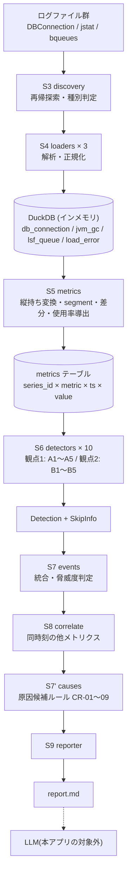
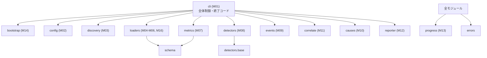

# ArchitectureHandbook.md

本書は s_anomaly の技術的側面をまとめたハンドブックである。後続の実装担当 Agent・修正担当 Agent が、設計書一式を読み直さなくても全体像を把握できることを目的とする。

* 決定の**理由**は `docs/ADR.md` にある。本書は決定の**内容と構造**を扱う。
* 個々の仕様の詳細は各設計書にある。本書はそこへの入口である。

---

## 1. アプリケーション概要

膨大な量の運用ログを読み込み、統計的手法で異常箇所を自動抽出して、**後段の LLM に読ませる前提の Markdown レポート群**を生成する CLI アプリケーションである。

| 項目 | 内容 |
| --- | --- |
| 利用者 | アプリケーションの運用者 |
| 解決すること | 膨大なログから異常箇所を見つける一次スクリーニング |
| 解決しないこと | 異常の原因を確定すること(候補の提示までを行う) |
| 実行形態 | 運用者が手動で単発実行する CLI。常駐しない |
| 実行環境 | **インターネットに接続されていない閉域環境**。Linux / Windows の両方 |
| 入力 | ログのディレクトリ 1 つ(再帰探索)。**4 種別**: DB コネクション / JVM GC(jstat)/ LSF キュー(bqueues)/ **OS 資源(sar。※CR-010。※CR-011 で NFS / NFSD を含む 10 活動)** |
| 出力 | カレントディレクトリの **`report_{ホスト名}_{年月}.md` / `report_summary_{年月}.md` / `charts/*.svg`**、および標準出力・標準エラーの進捗ログ(※CR-001 / CR-004 / CR-009) |

**本アプリ自身は LLM を呼び出さない。** レポートを LLM に読ませるのは、本アプリの実行後に人間が行う工程である(ADR-007)。

---

## 2. 全体構成図



**実行順序 S7 → S7' → S8 → S8'' は本アプリで最も間違えやすい箇所である**(ADR-010)。原因候補のルール 4 件が**同時に発生したアノマリー**を条件に含むため、順序を逆にすると無言で発火しなくなる。★訂正 2026-09-06 / CR-002・CR-003・CR-009★ 採番を突き合わせより前に行い、チャート生成(S8'')をレポートより前に行う。

---

## 3. 技術スタック

| 区分 | 採用 | 根拠 |
| --- | --- | --- |
| 言語 | Python **3.9 以上**(CPython) | ADR-009。検証環境は Windows 3.14.2 / Linux(WSL2) 3.10.12 |
| データストア | **DuckDB(インメモリ)** 1.5.5 | ADR-001。`vendor/` に展開同梱して閉域配布する |
| 外部パッケージ | **DuckDB のみ** | ADR-002。numpy / pandas / scipy / scikit-learn / statsmodels / pytest を使わない |
| 引数解析 | `argparse`(標準) | — |
| 設定ファイル | `configparser`(標準)、INI 形式 | 拡張子は `.properties` だが Java の properties 形式ではない |
| 進捗ログ | `logging`(標準) | 標準出力=INFO、標準エラー=WARNING 以上 |
| 統計計算 | DuckDB の SQL 窓関数を第一選択、`statistics` / `math` で補う | ADR-002 |
| 帳票生成 | 文字列整形(テンプレートエンジンなし) | 出力が Markdown 1 ファイルのみのため |
| テスト | `unittest`(標準) | ADR-002 |
| 永続化 | **行わない** | 1 回の分析で読み込んだデータは実行終了時に破棄する |

### 3.1 使ってはいけないもの

実装時に特に注意すべき禁止事項。

* `duckdb` 以外の外部パッケージ(ADR-002)
* `socket` / `urllib` / `http` / `requests` などネットワーク関連モジュール(NFR-008)
* `subprocess` / `os.system` / `multiprocessing`(`app/src/` と `app/tools/` において。テストコードは除く)
* Python 3.10 以降でしか動かない構文: 実行時評価される `X | None` 型注釈、`match` 文、`tomllib`、`itertools.pairwise`、`dataclasses` の `slots=True`(ADR-009)
* 乱数(テストデータ生成ツールを除く。NFR-009)

---

## 4. ディレクトリ構成の方針

コードの格納先は **`app/`** 単一である(単一アプリ構成)。配布時は `app/` の中身一式をコピーする。

```
app/
├── s_anomaly.py        エントリポイント(sys.path 設定 + cli.main 呼び出しのみ)
├── settings.properties 既定の設定
├── VERSION / INDEX.md    ※README.md はリポジトリ直下に 1 つだけ置く
├── src/s_anomaly/      アプリケーション本体(下記 4.1)
├── vendor/             DuckDB を展開同梱する場所
├── tools/              gen_testdata.py
└── tests/              unit / integration / acceptance / fixtures / _work
```

### 4.1 モジュールの責務と依存の向き

**依存は一方向とし、循環を作らない。**



| モジュール | 責務 |
| --- | --- |
| `bootstrap` | `vendor/` の解決と DuckDB の初期化。終了コード 7 の発生源 |
| `cli` | 引数解析、S1〜S9 の全体制御、**終了コードの決定(1 箇所に集約)** |
| `config` | `settings.properties` の読み込みと検証。表を宣言的に持つ |
| `discovery` | 再帰探索とファイル種別の判定 |
| `loaders/*` | **4 形式**の解析と正規化 ※CR-010。**行の解析失敗は例外にせず理由コードで返す** |
| `schema` | DuckDB の DDL と論理 PK の定義 |
| `metrics` | **4 テーブル** → 統一ビュー `metrics` ※CR-010。segment 分割・差分・使用率導出。**`DETECTABLE_METRICS` は許可リストであり、漏れると無言で検知されない** |
| `detectors/*` | **11 個**のアルゴリズム。`metrics` のみを入力とし、`events` 以降を知らない |
| `events` | 検知点の統合と脅威度判定、イベント ID の採番 |
| `correlate` | 同時刻の他メトリクスの収集 |
| `causes` | 原因候補のルール判定(**同時に発生したアノマリーが入力**。※CR-002 で相関から変更) |
| `reporter` | `report.md` の生成と書き込み |
| `progress` | 進捗ログ |
| `errors` | 例外クラス群と終了コードの対応 |

### 4.2 設計上の原則

* **終了コードは `cli.main()` の 1 箇所で決める。** 各モジュールは例外か戻り値で失敗を伝え、自分で `sys.exit` しない(テスト容易性)。
* **関数の内部で `datetime.now()` を暗黙に呼ばない。** 現在時刻は引数で受け取る(テストで固定するため)。
* **順序が結果に影響する箇所は必ず安定ソートにする。** タイブレーク用のキーを含める(NFR-009)。

---

## 5. データモデルの要点

**永続化しない。** プロセスごとにインメモリの DuckDB を作り、終了時に破棄する。したがってマイグレーションは自明に冪等であり、バージョン管理テーブルを持たない。

| テーブル | 論理 PK | 役割 |
| --- | --- | --- |
| `db_connection` | `ts, host, port, datasource` | DB コネクションログの正規化結果 |
| `jvm_gc` | `ts, container, host` | jstat の正規化結果。**2 形式を 1 テーブルに統合**し `gc_format` で区別する |
| `lsf_queue` | `ts, host, queue` | bqueues の正規化結果(横持ち → 縦持ち) |
| `load_error` | — | 読み飛ばした行の集計。`report.md` 4.1 節の出力元 |
| `metrics` | `series_id, metric, ts` | **11 アルゴリズムの唯一の入力。** VIEW ではなく TABLE として物理化する |

### 5.1 `metrics` が持つもの

| 列 | 意味 |
| --- | --- |
| `series_id` | 系列の一意キー。3 形式それぞれに固定の書式を持つ(下記) |
| `metric` | **50 種** ※CR-011(既存 14 + sar 36)。うち**検知対象は 47 種**(導出の `*_pct` 3 種のみ除く) |
| `segment` | JVM 再起動などによる系列の分割番号。窓関数はすべて segment で PARTITION する |
| `value` | NULL の行は `metrics` に入れない |

`series_id` の書式(**変更してはならない**。`expected.json` と相関先のホスト抽出が依存する)。

```
db_connection/{host}:{port}/{datasource}
jvm_gc/{container}@{host}
lsf_queue/{host}/{queue}
sar/{host}/{activity}/{device}          ※CR-010。デバイスを持たない活動は "-"
```

### 5.2 単位の扱い

`-gc` 形式は KB、`-gcutil` 形式は % を出力する。この差は **`*_pct` の導出**で吸収する(ADR-005)。

* 検知は常に `ou` / `eu` / `mu` に対して行う(単位に依存しない「形状」を見る)
* SEVERE の判定と原因候補 CR-06 のみが `*_pct` を参照する
* `*_pct` が NULL(`-gc` 形式で容量列が取れない)なら SEVERE にしない

### 5.2a **★接頭 `pct_` と接尾 `_pct` は別物である** ※CR-010

**取り違えると検知が無言で消える。** 最初にここを読むこと。

| 記法 | 例 | 出どころ | 検知対象か |
| --- | --- | --- | --- |
| **接尾 `*_pct`** | `ou_pct` / `eu_pct` / `mu_pct` | **本アプリが導出した**使用率(ADR-005) | **対象外。** 脅威度判定と原因候補の材料としてのみ使う |
| **接頭 `pct_*`** | `pct_memused` / `pct_util` / `pct_idle` | **sar が直接出力する**比率 | **一次の検知対象。** 他のメトリクスと同じく 11 アルゴリズムを適用する |

**`metrics.DETECTABLE_METRICS` はハードコードの許可リストである。**
sar の `pct_*` をここに入れず `RATIO_METRICS` 側に入れると、
**取り込みも `metrics` 構築も成功したまま、検知だけが 1 件も起きずに正常終了する。**
`app/tests/acceptance/test_a014_sar.py` が件数を数えてこれを防いでいる。

### 5.3 累積値の扱い

`ygc` / `ygct` / `fgc` / `fgct` / `gct` は累積値であり、そのままでは常に単調増加する。**区間差分**(`fgc_delta` / `fgct_delta` / `ygct_delta`)を導出して検知対象とする。JVM 再起動をまたぐ点と値が減少した点では差分を NULL にする。

---

## 6. コマンドと出力の要点

本アプリは画面も HTTP API も持たない。外部から観測できる契約は次の 4 つである。

| 契約 | 要点 |
| --- | --- |
| **コマンド** | `python s_anomaly.py <dir>` の 1 つのみ。オプションは無い(`--from` / `--to` / `--output` / `--config` は意図的に実装しない) |
| **設定ファイル** | `settings.properties`(INI 形式)。**11 アルゴリズム**の ON/OFF と約 32 個のパラメータ。無ければ既定値で動作する |
| **`report.md`** | 4 章構成。**検知 0 件でも章を省略しない。** 各イベントは 9 項目を必ず出力する(値が無くても定型文を書く) |
| **終了コード** | 9 種(0,1,2,3,4,5,6,7,99)。運用者がスクリプトの成否を判定する唯一の契約 |

### 6.1 レポート群の構造(後段の LLM が読む)

★訂正 2026-09-06★ **CR-001 / CR-004 で単一の `report.md` からレポート群に変わった。**
**「列挙」と「集計」の 2 層**にしてあり、4K トークンのローカル LLM はサマリだけを読む。

```
report_summary_{年月}.md                     全ホスト横断の集計。1 ファイル 4,000 バイト以内
  ## 1. 全体の集計 / 2. ホスト別 / 3. 日別 / 4. 複数ホストで同時発生 / 5. 実行時の注意事項
    ※ 2〜4 はすべて行数上限つき(規模が伸びても大きくならない)

report_{ホスト名}_{年月}.md                   そのホストのイベント本文
  ## 1. このホストの集計       ← ここまでで約 400 token
  ## 2. 実行サマリ
  ## 3. 適用したアルゴリズム    11 個すべて(無効なものも「無効」として載せる。※CR-005)
  ## 4. 検知イベント           脅威度降順・開始時刻昇順
     # イベントID( EVT-YYYYMMDD-{ホスト名}-NNN )        ※CR-003
     * イベント種別 / 脅威度 / データ / 値 / 開始 / 終了 / 現象 / 説明 / 原因候補
       / 同時に発生したアノマリー                        ※CR-002
                         ※CR-009
  ## 5. 実行時の注意事項

charts/{イベントID}.svg                       折れ線 + 同時アノマリーの重ね合わせ ※CR-009
charts/no-chart.svg                          チャートが無いイベント用。全体で 1 ファイル
```

**項目の省略は仕様違反である。** 後段の LLM が項目の欠落を「異常がない」と誤読するため、値が得られない場合も定型文(`該当する候補なし (確度: —)` 等)を書く。

---

## 7. 実装・テストの単位

### 7.1 スプリント

**10 スプリント**を番号順に実行する ※CR-005〜007 で U009、※CR-010 で U010 を追加。詳細は `docs/P007-impl-direction.md`。

| スプリント | 内容 | 難易度 |
| --- | --- | --- |
| U001 foundation | bootstrap / progress / config / cli 骨格 / schema / errors | 高 |
| U002 ingest | discovery / 3 ローダ / 重複排除 | 高 |
| U003 testdata | `gen_testdata.py` と `expected.json` | 中 |
| U004 metrics | 統一ビューの構築 | 中 |
| U005 detectors-a | base + ALG-A1〜A5 | 高 |
| U006 detectors-b | ALG-B1〜B5 | 高 |
| U007 events | events / causes / correlate | 高 |
| U008 report | reporter + 全体結線 | 中 |
| U009 detectors-c | ALG-C1・系列キャッシュ・S6 の並列化 ※CR-005〜007 | 高 |
| **U010 sar** | **`loaders/sar.py` と各所への追記** ※CR-010。**※CR-011 で NFS / NFSD を追加(活動 8 → 10)** | 中 |

**U003(テストデータ生成)を U004 の前に置いている。** 正解の分かっているデータが無いと、U004 以降のスプリントで「検知できているか」を確認できないためである。

### 7.2 テスト

| レベル | 件数 | 実行 |
| --- | --- | --- |
| 単体テスト | 各スプリント内 | `python -m unittest discover -s app/tests/unit -t app -v` |
| 結合テスト | T001〜**T009** ※CR-010 | `python -m unittest discover -s app/tests/integration -t app -v` |
| 受け入れ・システム | A001〜**A014**(A012 ※CR-008 / A013 ※CR-009 / **A014 ※CR-010**) | `python -m unittest discover -s app/tests/acceptance -t app -v` |

**`-t app` を省略しないこと。** 省略すると `tests` パッケージを import できず、テストが 0 件で静かに成功する。

テストデータのベースラインは**スイート単位で 1 回だけ**復元する(`app/tests/integration/_setup_baseline.py`)。各テストは `tempfile.TemporaryDirectory` で自分専用の作業ディレクトリを持ち、`app/tests/_work/` は読み取り専用として扱う。

---

## 8. 横断的関心事

| 関心事 | 方針 |
| --- | --- |
| **エラー処理** | 行の解析失敗は例外にせず理由コード(4 種)で返す。1 行の破損で実行全体を失敗させない。有効レコードが 1 件でもあれば終了コード 0 |
| **アルゴリズムの失敗耐性** | 1 つの検知器が例外を投げても、他の検知器・他の系列の処理は継続する。失敗は WARNING と `report.md` 4.3 節に記録する |
| **認証・認可** | 無し。ローカル実行の CLI である |
| **ログ** | 標準出力(INFO)と標準エラー(WARNING 以上)のみ。ログファイルを作らない。長時間動作するため、S4 は 1 ファイルごと、S6 はアルゴリズムごとに進捗を出す |
| **文字コード** | 入力は `utf-8-sig` で開き、失敗したら `cp932` で再試行。出力は BOM なし UTF-8 |
| **改行** | 出力は **Windows でも LF**(`newline="\n"` を明示) |
| **再現性** | 乱数を使わない。順序に依存する箇所は安定ソートにする。同一入力で `report.md` が完全一致すること |
| **ファイル書き込み** | 一時ファイルへ書いてから `os.replace` で置換する。失敗時は `report.md.tmp` を必ず削除する |
| **性能** | 挿入は 10,000 行のバッチ。`metrics` は物理化する。O(n²) のアルゴリズム(Mann-Kendall)は集約と間引きで抑える。**同一系列は検知器の数だけ読み直さない**(ADR-017)。**S6 は系列ごとにスレッド並列**(ADR-018) |
| **メモリ** | DuckDB の `memory_limit` と `temp_directory` を設定値から適用し、超過分は退避させる |
| **セキュリティ** | ネットワーク通信を行わない。外部プロセスを起動しない。書き込むのはカレントディレクトリと `temp_directory` のみ |

### 8.1 誤検知を抑える仕組み(本アプリで最も重要な横断的関心事)

運用ログには「小さな整数でほとんど一定」の系列が多く、素朴な `|x − μ| / σ` は発散して誤検知を量産する。次の 3 つで抑える。

1. **`effective_sigma`**(ADR-003): 全アルゴリズム共通の分散の下限。`max(σ, 0.02×|μ|, 0.5)`
2. **ALG-A3 の 5% ルール**: 検知点が系列全長の 5% を超えたら、その系列の A3 結果を全破棄する(周期性の強い系列への誤適用を防ぐ)
3. **観点2 の総増加量条件**: ALG-B3 / ALG-B5 は「傾向がある」だけでなく「実際に `effective_sigma` を超えて増えた」ことを要求する

---

## 9. 既知の制約・技術的負債

本節は、検討のうえ意識的に受け入れた制約(★ACCEPTED★)と、人間の確認を要する未解決事項(★FIXME★)を集めたものである。各項目は「何を検討したか」「なぜ採らなかったか」「残存リスク」を自己完結して含む。

### 9.1 意識的に受け入れた制約

| # | 制約 | 内容 |
| --- | --- | --- |
| 1 | **多変量の異常検知ができない** | ★ACCEPTED★ 検討: scikit-learn の Isolation Forest / One-Class SVM / LOF。**不採用**: 依存ツリーが大きく閉域配布のコストが DuckDB 1 つの比ではないため(ADR-002)。**残存リスク**: 複数メトリクス間の相関崩れ(単体では正常だが組み合わせが異常)を検知できない。**同時に発生したアノマリーの提示**(CR-002)と**重ね合わせチャート**(CR-009)までは行うため、判断は後段の LLM と人間に委ねられる |
| 2 | **複雑な季節性に対応できない** | ★ACCEPTED★ 検討: statsmodels の STL 分解。**不採用**: 同上。ALG-A5(曜日 × 時刻のベースライン)で簡易的に代替する。**残存リスク**: 月次・四半期など複数周期が重畳する系列では、周期成分を異常として拾う可能性がある |
| 3 | **配布物が 50〜80MB 増え、Python 版に縛られる** | ★ACCEPTED★ 検討: 標準ライブラリの `sqlite3` へ切り替える。**不採用**: `quantile_cont` を失って ALG-A3 が手書きになり、集計性能も落ちる。人間の判断を得て DuckDB を維持した(ADR-001)。**残存リスク**: 配布先の Python マイナーバージョンが変わるたびに `vendor/` の差し替えが必要 |
| 4 | **`vendor/` からの読み込み経路が未実証のまま** | ★ACCEPTED★ 検討: 実装フェーズで `vendor/` を整備して実証する。**不採用**: 配布先の Python 版が未確認であり、どの wheel を入れるべきか決まらないため。開発中は環境の DuckDB へのフォールバック経路で動かす。**残存リスク**: 閉域環境での初回実行時に初めて `vendor/` 経路が試される。**P302 の実行前チェックで必ず確認する** |
| 5 | **行カバレッジの数値を示せない** | ★ACCEPTED★ 検討: `coverage.py` を開発時のみの依存として導入する。**不採用**: 「配布資産をコピーすればテストも走る」状態を保つため(ADR-002)。**残存リスク**: 網羅性の客観的な数値が無い。代わりに「対象の一覧(11 アルゴリズム / 9 終了コード / 9 原因候補ルール / 全設定キー / 4 理由コード)に対する 1 対 1 のテスト」で担保する |
| 6 | **`-gc` 形式でヒープ最大量が変わると傾向がずれる** | ★ACCEPTED★ 検討: 形式ごとに検知対象メトリクスを切り替える。**不採用**: テストの期待値が形式で分岐して複雑になるため(ADR-005)。**残存リスク**: `-gc` 形式のホストで、ヒープ最大量の変更をまたぐ期間の `ou`(KB)の傾向が実態とずれる。`ou_pct` のほうが正しいが検知は `ou` で行われる |
| 7 | **ネットワーク非通信を実環境で検証していない** | ★ACCEPTED★ 検討: 通信を遮断した環境で実行して確認する。**不採用**: 検証環境で恒久的にネットワークを遮断すると他の作業に支障が出るため。静的な import 確認と DuckDB の設定確認で代替する。**残存リスク**: DuckDB 内部が拡張以外の経路で通信する場合は見逃す。閉域環境での初回実行時に人間が確認する |
| 8 | **Python 3.9 実機での検証ができない** | ★ACCEPTED★ 検討: 3.9 環境を用意して実行する。**不採用**: 検証環境に 3.9 が無いため。**残存リスク**: 3.9 互換性は構文レベルの制約遵守のみで担保される。3.10 と 3.14 での動作は A005 で確認するが、3.9 は保証できない |
| 9 | **`report.md` の書式変更でテストが壊れやすい** | ★ACCEPTED★ 検討: 内部の `Event` オブジェクトを直接検証する。**不採用**: それでは「レポートに正しく出ているか」を確認できず、最終成果物の品質を保証できないため。**残存リスク**: レポート書式を変えたら `report_parser.py` も同時に直す必要がある。この依存を P008 T006 に明記した |
| 10 | **ディレクトリ構造を保ってコピーする必要がある** | ★ACCEPTED★ 検討: 全体を 1 ファイルの巨大スクリプトにする(「スクリプトそのまま」の最も素朴な解釈)。**不採用**: 11 アルゴリズム + 3 ローダで数千行になり、単体テストの対象を切り出せなくなるため。**残存リスク**: 単一ファイルのコピーでは済まない。README(P302)に明記する |
| 16 | **チャートの折れ線に極値が出ないことがある**(2026-09-08 追記) | ★ACCEPTED★ `charts.thin_out` は 360 点への等間隔の添字選択であり極値を保持しない。5 分間隔のデータでは**イベント長が約 18〜20 時間を超えたときだけ**働く(実測: `docs/report-samples/normal-30d` の 2430 枚中 37 枚)。**検討**: min/max デシメーション。**不採用**: 間引きが働くのは長期傾向のイベントだけであり、そこでの読み取り対象は個々の極値ではなく水準の推移であるため(人間の判断。`docs/ADR.md` **ADR-021**)。**残存リスク**: 長期傾向の図に同居した短いスパイクは線に出ない(そのスパイク自体は別イベントとして検知され別の図になる)。間引きが起きた図では縦軸目盛り・凡例の実測レンジが本文の数値と一致しないことがある。**採取間隔が 5 分より細かくなったら ADR-021 を読み直すこと** |

| 17 | **sar を導入すると既存イベントの ID の連番がずれる**(※CR-010) | ★ACCEPTED★ 連番は「日 × ホスト」ごとに 1 から振る(CR-003)。同じ日・同じホストに sar のイベントが増えると、その後ろの番号が繰り上がる。**検討**: 連番を種別ごとに分ける案。**不採用**: CR-003 が定めた体系を変えることになり、既存レポートとの互換が切れる。**残存リスク**: 過去のレポートと ID で突き合わせている運用があると食い違う。内容そのものは変わらない。`README.md` 8章 #12 に明記した |
| 18 | **sar は系列数を大きく増やす**(※CR-010) | ★ACCEPTED★ `disk` と `network` はデバイス・インタフェース単位で系列になる(14 日分のテストデータで 30 → 117 系列)。S6 の所要時間は系列数にほぼ比例する(ADR-018)。**検討**: 既定でデバイス単位の 2 種別を外す案。**不採用**: 依頼者が「まず 8 種類すべて、量を見て絞る」と明示した(2026-09-08)。**A006 で実測した結果、大規模 90 日は 302.4s → 359.3s(+19%)であり、NFR-002(600 秒)に 40% の余裕がある。** **残存リスク**: sar を採取するホストが増えれば比例して伸びる(A006 の `SAR_HOSTS` は 3 台固定であり、その規模は測れていない ★FIXME★)。**運用側は `[sar] activities` で絞れる**(README 4.6) |
| 19 | **sar の原因候補ルールが無い**(※CR-010) | ★ACCEPTED★ 既存 9 ルールはアプリ層の指標だけで完結している。**検討**: 「CPU が飽和」「スワップが発生」を根拠に持つルールの新設。**不採用**: ルールの前提が 2 層にまたがり、CR-010 の要求(分析対象に加える)に含まれない。**残存リスク**: sar の異常は「同時に発生したアノマリー」と重ね合わせチャートには現れるが、**原因候補の文面には現れない**。突き合わせは人間または後段の LLM が行う。**次の CR の候補である** |
| 20 | ~~**sar の NFS / NFSD 統計を取り込まない**(※CR-010)~~ **→ ※CR-011 で解消(2026-09-08)** | **`nfs` / `nfsd` を分析対象に加えた。** 活動種別が 8 → 10 になり、14 メトリクスが増えた。**`sar` テーブルは縦持ちであるため、テーブル定義は変更していない**(ADR-023 の利点)。**残存リスク**: `-n NFSD` の `packet_s` / `udp_s` / `tcp_s` は取り込んでいない ★FIXME★(実データでの確認が要る)。`nfsd` は NFS サーバでないホストでは全て 0 になる(検知は出ない) |

### 9.1a 性能・メモリ・再現性に関する実測記録(2026-09-04 / P203)

★訂正 2026-09-04 / P203 F003★ **本節の制約 #11・#12 は F003 で解消した。** 下表は解消後の状態である。**未解消は #13(出力量)と #15(再現性)である。**

| # | 制約 | 内容 |
| --- | --- | --- |
| 11 | ~~S8(相関の集計)が既定の `max_memory = 4GB` で異常終了する~~ **解消済み(F003)** | ★ACCEPTED★ `correlate.py` の集計を `EVENT_BATCH`(既定 500)件ずつのバッチに分割し、中間結果を有界にした(`docs/ADR.md` **ADR-014**)。**既定の 4GB のまま、通常 30 日分が 151.3 秒、大規模 90 日分が 513.0 秒で完走する。** 検討: `max_memory` の既定値を引き上げる案。**不採用**: 回避策にすぎず、中間結果が青天井である以上、規模が伸びれば再発するため。**残存リスク**: 今後、イベント数・検知点数に比例して伸びる集計を追加すると同じ問題が起きる。ADR-014 に従うこと |
| 12 | ~~確定規模で NFR-002(10 分)に届かない~~ **解消済み(F001 + F003)** | ★ACCEPTED★ 大規模 90 日分(テーブル 2,851,200 行)は、**既定の 4GB のまま 513.0 秒**で完走する(目標 600 秒)。内訳は S4 取り込み 81s / S6 検知 129s / S8 相関 299s。**ただし余裕は 15% 程度であり、系列数が増えれば超過しうる。** なお NFR-002 の「1,000 万レコードで 10 分以内」は ★FIXME★ 付きの想定値であり、**確定した期間(90 日)ではテーブル 285 万行にしかならず、前提そのものが実態と合っていない。目標値の妥当性そのものは依然として人間の確認を要する** |
| 13 | ~~`report.md` が大きすぎる~~ **CR-001・CR-004 により対応中(2026-09-05)** | ★ACCEPTED★ レポートを**「列挙」と「集計」の 2 層**に分け、列挙側を**ホスト × 年月**に分割した(`docs/ADR.md` **ADR-015**)。4K トークンの LLM は `report_summary_{yyyymm}.md`(実測 約 2,211 token)と、各ホスト別ファイルの「1. このホストの集計」(実測 195〜409 token)を読む。**イベント本文の総量そのものは減っていない**(1 イベント約 728 バイト ≒ 582 token)。検討: 脅威度で絞って出力する案。**不採用**: 実測で 113 倍残るうえ、検知したものを出力段階で捨てるのは目的に反するため。**残存リスク**: 4K の判定をバイト数で代用している |
| 14 | ~~**`threads` を設定で絞れない**~~ **一部解消(CR-007)** — **S6 のスレッド数は `common.detect_threads` で設定できるようになった。** ただしこれはアプリ側のスレッド数であり、**DuckDB 内部の `threads` は依然として設定できない。** 以下は後者についての記録である | ★ACCEPTED★ DuckDB は OOM 時の対処として `SET threads = X` を提案するが、`threads` は `config.py` の `PARAMS` に無く、`settings.properties` に書いても「未知のキーを無視しました」となる。**検討**: 設定キーを追加する。**現時点で採らない**: 制約 11 の本質的な解決にはならず(中間結果の大きさ自体は変わらない)、設定項目を増やす判断は人間に委ねるべきであるため。**残存リスク**: DuckDB が提示する 3 つの対処のうち 1 つを使えない |
| 15 | ~~**NFR-009(再現性)を満たしていない**~~ **解消(CR-002 + CR-007。2026-09-05)** — **30 日規模で、スレッド数 1 と 8 の出力が「実行日時」の行を除いて全 18 ファイル完全一致することを確認した**(`TestA003ThreadCountDoesNotChangeOutput`)。**14 日規模でしか確認していないという積み残しも解消した。** 以下は解消前の記録である | ★FIXME★ 同一入力・同一設定で 2 回実行しても `report.md` が一致しなかった(30 日分で 34 行差)。原因は `correlate.py` の `rank()` が、比例するメトリクス(`mu` と `mu_pct` など)の数学的に同値な変化率を、DuckDB の並列集計由来の浮動小数点の下位ビットで比較していたことである。**CR-002 で相関の算出そのものを廃止し、同時アノマリーの並び順は第 4 キーにイベント ID を置いて決定的にした**(`docs/P003-backend-spec.md` DS-11-05)ため、**この原因は取り除かれる**。**ただし A003(再現性)は 14 日規模でしか確認しておらず、解消を確認できるテストがまだ無い**(`docs/P009-acceptance-direction/A003-reproducibility.md` の ★FIXME★) |

**F001(ALG-B4 の全走査)・F003(S8 の非有界な中間結果)はいずれも解消済みである。**

* F001: 修正前は ALG-B4 が S6 の 75% を占めていたが、現在は S6 45 秒のうち 6.3 秒(14%)であり支配要因ではない(`docs/ADR.md` ADR-013)。
* F003: S8 は大規模 90 日分で 635 秒(16GB 時)から **299 秒(4GB)**になった(`docs/ADR.md` ADR-014)。

**現在の確定規模での実測(既定の `max_memory = 4GB`)**

★訂正 2026-09-08 / CR-010★ **下表に 0.6.0(CR-010)の実測値を足した。**

| ケース | テーブル行 | ファイル | 0.4.0 | 0.5.0 | 0.6.0 | **0.7.0** | うち S6 |
| --- | --- | --- | --- | --- | --- | --- | --- |
| 通常 30 日 | **1,926,720** | **210** | 53.1s | 95.3s | 132.1s | **141.6s** | **36.5s** |
| 大規模 90 日 | **5,780,160** | **630** | 162.8s | 302.4s | 359.3s | **367.3s** | **106.1s** |

**0.5.0 で所要が増えたのは CR-009 のチャート生成による**(30 日で +80%)。
2,430 枚の SVG を書き出している。`[chart]` の上限で調整できる。

**※CR-010(0.6.0)で sar が加わり、テーブル行が 79% 増えた。**
**それでも所要は 19% しか増えていない**(90 日で 302.4s → 359.3s)。
sar は格納時点で既に縦持ちであり、`metrics` への合流に導出も単位変換も
要らないためである(P003 DS-07-07a)。

**※CR-011(0.7.0)で NFS / NFSD が加わり、行がさらに 13% 増えた。**
**所要の増加は 2% にとどまる**(359.3s → 367.3s)。
**NFS はホスト単位の系列であり(デバイス単位ではない)、1 ホストあたり
14 系列しか増えない**ためである。
**NFR-002(600 秒)には収まっている**(90 日で 367 秒 / **余裕 39%**)が、
**チャートの上限を上げるほど、また sar を採るホストが増えるほど余裕が減る。**
★FIXME★ **A006 の `SAR_HOSTS` は 3 台固定であり、「全ホストで sar を採ったときの規模」は測れていない。**

**0.2.0 → 0.3.0 の改善の主因は S6 である**(48.0s → 24.5s。-49%)。
**同一系列のデータを検知器の数だけ読み直していた**のを止めた(`docs/ADR.md` ADR-017)。
S6 の系列あたり単価は **1.2 秒 → 0.16 秒**になり、**500 系列でも約 80 秒**で収まる見込みである
(依頼者が予告した監視対象の増加・sar の追加に対する備え)。

### 9.1b S6 を触るときに読むもの(2026-09-05 / CR-006・CR-007)

**S6 を速くしようとする人が必ず辿り着く 2 つの落とし穴を、実測つきで記録してある。**

| # | 落とし穴 | 読むもの |
| --- | --- | --- |
| 1 | 「SQL の窓関数へ移せば速くなるはず」 | **ADR-017。系列単位では純 Python より 1.9 倍遅い**(実装して確認済み) |
| 2 | 「スレッドを共有接続で回せばよい」 | **ADR-018。共有接続だと 5 分の 1 の並列度になる**(動いてしまうので気付かない) |

**まだ残っている余地**: 全系列を 1 クエリで処理すれば SQL が最速である
(0.88s / 純 Python 1.54s)。ただし ADR-018 の設計と衝突し、メモリ影響の実測が要る。
`docs/P903-cr-records/CR-006.md` 4章に条件を書いてある。

### 9.2 人間の確認を要する未解決事項(★FIXME★)

**設計書全体に約 50 箇所の ★FIXME★ が残っている。** `docs/.mode` が `一気通貫` であるため、これらは納品(P302)まで解消されず、**P302 が一覧化して CR の起票候補として人間に引き渡す**。特に影響の大きいものは次のとおり。

| # | 未解決事項 | 影響 |
| --- | --- | --- |
| 1 | **配布先の Python 版が未確認** | `vendor/` の中身を確定できない |
| 2 | **アルゴリズムのパラメータ既定値が実データ未検証** | 誤検知・見逃しの量が実運用で初めて分かる。最初に調整すべき箇所 |
| 3 | **脅威度の判定規則(SEVERE の条件、`severe_pct`=90、末尾 10%)が Agent の想定** | 運用上の重み付けであり人間の判断が必要 |
| 4 | **原因候補のルール表が一般的な運用知識のみ** | 対象システム固有の事情(特定バッチ、定例メンテナンス)を反映していない |
| 5 | **jstat の見出しとデータの食い違いの原因が未確認** | 実ファイルが本当に「見出しだけ `-gc`」なのか、P000 への転記時の混在なのかで正しい扱いが変わる |
| 6 | **非機能要件の数値(1 万ファイル / 1 億レコード / 10 分)が Agent の想定** | 未達時に実装の問題か目標値の問題かの切り分けが必要 |
| 7 | **進捗ログの出力先振り分けが Agent の想定** | P000 は標準出力・標準エラーの双方に「動作ログを出力」と記載しており、重大度で振り分ける解釈は確認が必要 |
| 8 | **ALG-B2 が増加傾向のみを検知する** | P000 の観点2 に忠実だが、急減も運用上は異常でありうる |
| 9 | **入力の文字コードが UTF-8 想定** | 日本語のホスト名・データソース名が含まれる場合、Shift_JIS の可能性がある |
| 10 | **タイムゾーンの扱いを考慮していない** | 複数タイムゾーンにまたがるホストが混在する場合は要検討 |

### 9.3 要求に無いが実装する事項(過剰実装の記録)

`docs/P004-traceability-matrix.md` 5章に記録した 2 件。**削除の判断は人間に委ねる。**

| # | 内容 | 理由 |
| --- | --- | --- |
| 1 | `vendor/` が無い場合に環境の DuckDB へフォールバックする経路 | 要求(FR-002)には無いが、これが無いと開発・CI でテストが実行できない |
| 2 | アルゴリズム ID に似た未知キーへの、より強い WARNING 文言 | FR-083 の範囲内とも読める。設定ミスの事故を防ぐ効果があり実装コストが小さい |

---

## 10. 関連ドキュメントへのリンク

| 知りたいこと | 参照先 |
| --- | --- |
| なぜこの設計なのか | `docs/ADR.md`(ADR-001〜ADR-010) |
| 何を作るのか(要求) | `docs/P001-requirement.md` |
| 外部から見える契約 | `docs/P002-frontend-spec.md` |
| 内部の作り | `docs/P003-backend-spec.md` |
| 要求が満たされているか | `docs/P004-traceability-matrix.md` |
| 実装の順序と単位 | `docs/P005-impl-plan.md` |
| テストの方針 | `docs/P006-test-plan.md` |
| **実装の具体的な指示** | `docs/P007-impl-direction.md` と `docs/P007-impl-direction/U00N-*.md` |
| 結合テストの指示 | `docs/P008-test-direction.md` と `docs/P008-test-direction/T00N-*.md` |
| 受け入れテストの指示 | `docs/P009-acceptance-direction.md` と `docs/P009-acceptance-direction/A0NN-*.md` |
| 設計の矛盾チェック結果 | `docs/P010-design-review.md`(1 回目)、`docs/P010-design-review-2.md`(2 回目) |
| ソースツリーの目次 | `app/INDEX.md` |
| 人間が書いた要求の原文 | `docs/P000-concept-analysis.md` |
