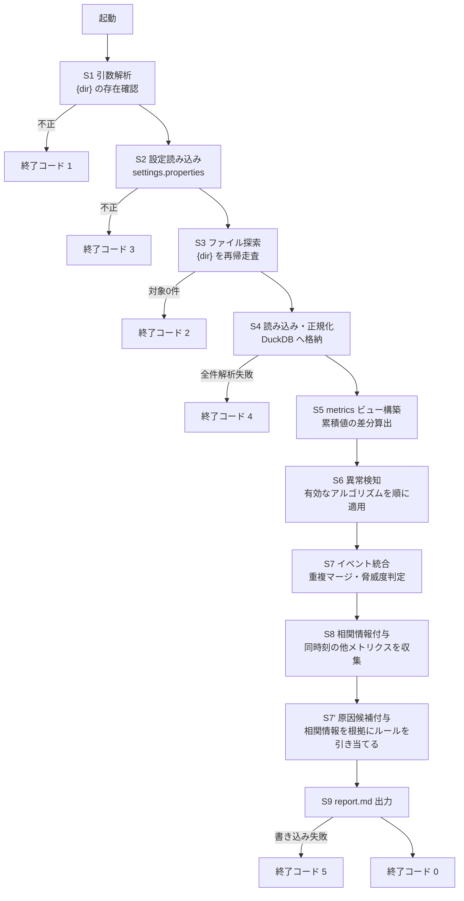

> **この文書は無効です。** CR-003 対応前の原本(2026-09-05時点)です。
> 現在有効なシステム要件定義は `docs/P001-requirement.md` です。
>
> なお CR-001〜CR-004 は 1 回の P902 実行でまとめて適用したため、4 つの退避ファイルの本文は同一である。

# P001 システム要件定義書 — アプリケーション環境分析アプリ (s_anomaly)

* 版: 初版
* 入力: `docs/P000-concept-analysis.md` (人間が記入した要求原文)
* 対象フェーズ: P001

> **本書の読み替えについて** ★ACCEPTED★
> `SKILL-P001-requirement.md` が定めるアウトプット項目は GUI アプリを前提とした語彙(画面一覧・画面遷移図・フロントエンド/バックエンド技術・バックエンドAPI一覧)で書かれている。本アプリは CLI アプリであるため、`TEMPLATE-P000-concept-analysis-cli.md` 冒頭の指示(「近い方をベースに章を読み替えて使う」)に従い、次のとおり読み替えて記載する。形態別に節構成を作り分ける案は採らなかった。章立ての大半(概要・技術・データ・非機能・テスト方針)は形態によらず共通であり、差分は「画面と遷移」か「コマンドと処理フロー」かに集約されるため。残る制約として、後続の P002(ユーザインタフェース設計)は画面設計書ではなく CLI インタフェース設計書として作成される。
>
> | SKILL の項目 | 本書での読み替え先 |
> | --- | --- |
> | 画面一覧 | 6. コマンド一覧 |
> | 画面遷移図 | 7. 処理フロー |
> | 各画面の入出力項目 | 8. コマンドの入出力項目 |
> | フロントエンドで使う技術 | 3.1 CLI 層の技術 |
> | バックエンドで使う技術 | 3.2 分析エンジン層の技術 |
> | バックエンドAPI一覧 | 9. 内部モジュールインタフェース一覧 |

---

## 1. アプリケーションの概要

膨大な量の運用ログ(DB コネクション数・JavaEE サーバの GC 統計・LSF 計算グリッドのキュー状態)を読み込み、統計的手法で異常箇所を自動的に抽出して、LLM に読ませる前提の Markdown レポート `report.md` を生成する CLI アプリケーションである。★FIXME★ (P000 第1章の「何をするアプリか」欄が未記入であったため、同章の「誰が使うか」「何を解決するか」および第4・5章の記述から Agent が要約した)

| 項目 | 内容 |
| --- | --- |
| 誰が使うか | アプリケーションの運用者 |
| 何を解決するか | 膨大な量のログから異常な箇所を見つける。人手で全ログを見る運用を、機械的な一次スクリーニングに置き換える |
| 何を解決しないか | 異常の原因を確定すること。本アプリは候補の提示までを行い、最終的な原因判断は後段の LLM と人間が行う |

### 1.1 位置づけ (処理の全体像)

本アプリは「一次スクリーニング」を担当し、レポートの文章化は後段の LLM が担当する。**本アプリ自身は LLM を呼び出さない**(実行環境がインターネット非接続であるため)。


### 1.2 要求 ID の体系

本書の各要求には `FR-`(機能要件) / `NFR-`(非機能要件) / `ALG-`(アルゴリズム要件) の ID を付す。P004 要求トレーサビリティマトリクスは、この ID を軸に P002・P003 の充足を検証する。

---

## 2. システムの前提

| 項目 | 内容 | 出典 |
| --- | --- | --- |
| 利用者数・同時実行 | 運用者が手動で単発実行する。同時実行は考慮しない ★FIXME★ (P000 第7章「同時実行」欄が未記入のため Agent が想定。複数の運用者が同一ディレクトリで同時に実行し `report.md` が衝突する運用があるなら要見直し) | 想定 |
| デプロイ先 | Linux および Windows の両方。**インターネットに接続されていない閉域環境** | P000 2章 |
| 配布形態 | 「スクリプトそのまま」。配布資産一式をコピーすれば動作すること。ネットワーク経由の `pip install` は実行できない | P000 2章 |
| 認証 | 不要(ローカル実行の CLI であり、認証機構を持たない) ★FIXME★ (P000 に記載がないため Agent が想定) | 想定 |
| 連携する既存システム | なし | P000 3章 |
| データの永続化 | 行わない。1 回の分析で読み込んだデータは実行終了時に破棄してよい | P000 2章 |

### 2.1 前提から導かれる最重要の制約 — オフライン配布と DuckDB の両立

**FR-001**: 本アプリは、インターネット非接続の環境に配布資産一式をコピーするだけで動作しなければならない。

一方で P000 第2章はデータストアとして DuckDB を指定している。DuckDB は純 Python ではなく **C++ で書かれたネイティブ拡張**であり、「スクリプトそのまま」では動作しない。両立させるには、依存パッケージを配布資産に同梱する必要がある。

**FR-002**: 配布資産は次の構成とし、実行時にネットワークアクセスを行わない。

* `vendor/` ディレクトリに、DuckDB の Python パッケージを**実行環境に対応したプラットフォーム別に展開済みの状態で**同梱する。
* 起動時に `sys.path` の先頭へ `vendor/{platform}/` を追加してから `import duckdb` する。実行時に `pip install` を行わない。
* ★FIXME★ 次の点は人間の確認が必要である。Agent は下記を想定して設計を進める。
  * 同梱が必要なプラットフォームは **Linux(x86_64, manylinux) と Windows(AMD64) の 2 種類**と想定する。**対象の Python マイナーバージョンは配布先の環境に合わせて決める**(3.1 のとおりコード自体は 3.9 以上で動くが、DuckDB の wheel は Python マイナーバージョンごと・OS ごとに別物であるため、`vendor/` の中身は配布先の版と 1 対 1 で対応させる必要がある)。他のアーキテクチャ(aarch64 など)が混在する場合は同梱物を増やす。
  * 閉域環境へ持ち込む配布物のサイズ(DuckDB は展開後 50〜80MB 程度)が運用上許容されるか。
  * wheel の入手(インターネット接続のある別環境でのダウンロード)は人間の作業とする。取得・展開手順は P302 が文書化する。
* ★ACCEPTED★ 検討: 標準ライブラリの `sqlite3` に切り替える案(同梱物ゼロで「スクリプトそのまま」を完全に満たせる)。**不採用**。人間に判断を求めたところ「DuckDB を同梱する(P000 の指定どおり)」との回答を得たため(P001 完了時の確認、2026-09-02)。DuckDB が持つ分析向け窓関数・`quantile_cont`・列指向の集計性能を失うと、10章のアルゴリズムのうち分位数を用いるもの(ALG-A3)の実装が手書きになり、大規模データの集計性能も落ちるという判断による。残存リスク: 配布物が 50〜80MB 増え、実行環境の Python マイナーバージョンとアーキテクチャに配布物が縛られる(下記 FR-002 の ★FIXME★ が残る)。

**FR-003**: DuckDB 以外の外部パッケージ(numpy / pandas / scipy / scikit-learn / statsmodels など)には依存しない。10章のすべてのアルゴリズムは、**DuckDB の SQL 窓関数と Python 標準ライブラリのみ**で実装できる範囲から選定する。★ACCEPTED★ 検討: scikit-learn の Isolation Forest や statsmodels の STL 分解を使う案。不採用の理由: いずれもネイティブ拡張または大規模な依存ツリーを持ち、閉域環境への同梱コストが DuckDB 1 つの比ではなくなるため。残存リスク: 多変量の異常検知(複数メトリクスの相関崩れ)は本アプリの範囲外となる(17章「対象外」参照)。

---

## 3. 技術選定

### 3.1 CLI 層の技術 (SKILL でいう「フロントエンド」)

| 区分 | 選定 | 理由 |
| --- | --- | --- |
| 言語 | Python **3.9 以上** (CPython) | P000 第2章の指定「Python3」による。**コードは 3.9 で動く範囲の構文・標準ライブラリのみを使う**。実行時に評価される `X \| None` 形式の型注釈(`typing.Optional` を使う)、`match` 文、`tomllib` を使わない。下限を 3.9 に置く理由は P004 4章参照。ただし FR-002 の同梱 wheel は Python マイナーバージョンごとに別物であるため、**配布物は実行環境の版に合わせて用意する必要がある** ★FIXME★ (配布先の閉域環境の Python 版が未確認。vendor/ の中身は配布先の版に合わせて差し替える必要がある) |
| 検証環境 | Windows: Python 3.14.2 / Linux: Ubuntu(WSL2) Python 3.10.12。いずれも DuckDB 1.5.5 | NFR-006(Linux/Windows 両対応)を実機で確認するため。両環境の Python 版が異なることが、上記の下限を 3.9 に置く動機の 1 つである |
| 引数解析 | 標準ライブラリ `argparse` | 追加依存が不要で FR-003 を満たす |
| 進捗表示 | 標準ライブラリ `logging` | P000 第5章「長期に動くので、どこまで進んでいるか、今何をしているのか分かるようにしてください」に対応。標準出力・標準エラー出力の双方へ出す(8章参照) |
| 設定ファイル読み込み | 標準ライブラリ `configparser` | P000 第6章の `settings.properties` に対応。13章参照 |
| OS 差異の吸収 | 標準ライブラリ `pathlib` | Linux / Windows 両対応(NFR-006) |

### 3.2 分析エンジン層の技術 (SKILL でいう「バックエンド」)

| 区分 | 選定 | 理由 |
| --- | --- | --- |
| データストア | DuckDB (インメモリ) | P000 第2章の明示指定。列指向で集計が速く、窓関数(`avg` / `stddev_samp` / `median` / `quantile_cont` / `regr_slope`)が揃っており、10章のアルゴリズムの大半を SQL 1 本で表現できる |
| メモリ超過時 | DuckDB の一時ファイル退避 (`SET temp_directory`, `SET max_memory`) | P000 第2章「メモリからあふれたら temp ファイルを使う」に対応 |
| 統計計算 | DuckDB の SQL 窓関数を第一選択とし、SQL で表現しにくいもの(順位相関など)のみ Python 標準ライブラリ `statistics` / `math` | FR-003 を満たしつつ、大量データの走査を DuckDB 側へ寄せる |
| 帳票生成 | Python の文字列整形(テンプレートエンジンを使わない) | 出力は Markdown 1 ファイルのみであり、テンプレートエンジンを同梱する必要がない |

---

## 4. 入力データ仕様

**FR-010**: コマンド引数で指定されたディレクトリ `{dir}` を**再帰的に**たどり、ファイル名パターンに一致するログファイルをすべて読み込む。

| # | 種別 | ファイル名パターン | 形式 | 出典 |
| --- | --- | --- | --- | --- |
| ① | DB コネクションログ | `DBConnection_{yyyymmdd}.csv` | CSV、1行目が見出し | P000 3章 |
| ② | JavaEE サーバの GC 統計 | `{コンテナ名}_gc_{ホスト名}_{yyyymmdd}.txt` | 空白区切り、1行目が見出し | P000 3章 |
| ③ | LSF キュー状態 | `bqueues_{ホスト名}_{yyyymmdd}.txt` | CSV、1行目が見出し | P000 3章 |

**FR-011**: いずれのパターンにも一致しないファイルは黙って読み飛ばす(エラーとしない)。読み飛ばした件数は進捗ログに出す。

### 4.1 ① DB コネクションログ

```
日付,ホスト名,ポート番号,データソース,activeConnectionsCurrentCount
2026/06/01 00:00:01,host01,7003,OraclePool_2,0
2026/06/01 00:00:01,host01,7003,OraclePool_1,4
```

* 日付書式: `yyyy/MM/dd HH:mm:ss`
* 系列を一意に識別するキー(以下「系列キー」): `(ホスト名, ポート番号, データソース)`
* 監視対象の数値: `activeConnectionsCurrentCount`

### 4.2 ② JavaEE サーバの GC 統計 (jstat)

**FR-012**: jstat の出力形式は 2 種類あり、見出し行から判別して両方を受け付ける。

P000 第3章に記載された見出し行と、その直下のデータ行は**列数が一致していない**。

* 見出し行: `time Timestamp SOC SIC SOU SIU EC EU OC OU MC MU CCSC YGC YGCT FGC FGCT GCT` (時刻を除いて 17 列。`jstat -gc` 系の列名)
* データ行: `2026/06/01 00:00:01 3019.0 63.30 74.99 100.00 53.52 96.26 86.35 753 414.206 25 581.636 995.842` (時刻を除いて 12 列。値が 100.00 を上限とする百分率であることから `jstat -gcutil` の出力)

★FIXME★ **この不一致は人間の確認が必要である。** Agent は「実際に採取されているのは `-gcutil` であり、見出し行には `-gc` のものが混在して記載された」と解釈し、**両形式を見出し行の列名で自動判別して受け付ける**設計とする(どちらか一方に決め打ちすると、実環境のファイルを読めなくなる危険があるため)。

| 形式 | 見出しに現れる列 | 値の意味 |
| --- | --- | --- |
| `-gcutil` | `S0 S1 E O M CCS YGC YGCT FGC FGCT GCT` | 各世代の**使用率(%)** |
| `-gc` | `S0C S1C S0U S1U EC EU OC OU MC MU CCSC CCSU YGC YGCT FGC FGCT GCT` | 各世代の**容量・使用量(KB)** |

P000 に記載された列名 `SOC SIC SOU SIU` は、英字の O・I ではなく数字の 0・1 を用いた `S0C S1C S0U S1U`(Survivor 0/1 の Capacity / Used)の誤記である。**人間に確認済み**(20章参照)。

* 時刻: 先頭の `time` 列(jstat 実行時刻。書式 `yyyy/MM/dd HH:mm:ss`)を用いる。`Timestamp` 列(JVM 起動からの経過秒)は時刻軸としては使わないが、**JVM の再起動を検出する**ために保持する(値が減少した点を再起動とみなし、系列を分割する。ALG-B3 で使う) ★FIXME★ (再起動検出に Timestamp の減少を用いるのは Agent の想定)
* コンテナ名・ホスト名: ファイル名 `{コンテナ名}_gc_{ホスト名}_{yyyymmdd}.txt` から取得する
* 系列キー: `(コンテナ名, ホスト名)`

### 4.3 ③ LSF キュー状態 (bqueues)

```
time,{QUEUE}_NJOBS,{QUEUE}_PEND,{QUEUE}_RUN,{QUEUE}_SUSP,...
2026-06-01 00:00:00:02,0,0,0,0,...
```

* **横持ち(wide)形式**である。QUEUE の数だけ 4 列 (`NJOBS` / `PEND` / `RUN` / `SUSP`) が繰り返される。見出し行を解析して QUEUE 名を動的に抽出し、縦持ち(long)に変換して格納する(5.3 参照)。
* ホスト名: ファイル名 `bqueues_{ホスト名}_{yyyymmdd}.txt` から取得する
* 系列キー: `(ホスト名, QUEUE)`
* 日付書式 `2026-06-01 00:00:00:02` の末尾 `02` は **1/100 秒**である(`yyyy-MM-dd HH:mm:ss:SS`)。**人間に確認済み**(20章参照)。実装は**末尾要素を無視して秒精度まで読む**(本アプリの分析はすべて秒精度以上の粒度で行うため、1/100 秒の情報を保持する必要がない)。
* P000 第3章の説明文にある `NJOBUS(Number of Jobs)` / `SUS(Number of Suspened Jobs)` は、同章の見出し行にある `NJOBS` / `SUSP` の誤記である。**人間に確認済み**(20章参照)。

### 4.4 入力の共通仕様

**FR-013**: 同一系列に同一時刻のレコードが重複して存在する場合(ファイルの重複配置など)は、**先に読み込んだ 1 件を採用して残りを捨てる**。捨てた件数を進捗ログに出す。★FIXME★ (重複時の扱いは P000 に記載がないため Agent が想定。「最後の 1 件を採用」「平均をとる」も選択肢である)

**FR-014**: 解析できない行(列数不一致、数値に変換できない、日付書式が不正)は**その行だけを読み飛ばし**、ファイル単位・理由単位で件数を集計して進捗ログと `report.md` の末尾(12.3 参照)に出す。1 行の破損で実行全体を失敗させない。

**FR-015**: 数値列が `-`(jstat が未対応の列に出力することがある)や空文字の場合は NULL として格納し、アルゴリズムの計算対象から除外する。

---

## 5. 内部データモデル (DuckDB)

**FR-020**: 読み込んだログは、種別ごとに次のテーブルへ正規化して格納する。P000 第5章「次の項目のテーブルに解釈しなおして格納する」に対応する。

### 5.1 `db_connection`

| 列 | 型 | 備考 |
| --- | --- | --- |
| `ts` | TIMESTAMP | 日付列 |
| `host` | VARCHAR | ホスト名 |
| `port` | INTEGER | ポート番号 |
| `datasource` | VARCHAR | データソース |
| `active_connections` | BIGINT | activeConnectionsCurrentCount |

### 5.2 `jvm_gc`

P000 第5章の指定「`time コンテナ名 ホスト名 SOC SIC SOU SIU EC EU OC OU MC MU CCSC YGC YGCT FGC FGCT GCT`」に対応する。`-gcutil` 形式にしか存在しない列と `-gc` 形式にしか存在しない列があるため、**すべての数値列を NULL 許容**とし、どちらの形式で採取されたかを `gc_format` 列に保持する。★FIXME★ (2 形式を 1 テーブルに統合するのは Agent の想定。形式ごとにテーブルを分ける設計もありうるが、10章のアルゴリズムを系列単位で一様に適用できる本設計を採る)

| 列 | 型 | 備考 |
| --- | --- | --- |
| `ts` | TIMESTAMP | time 列 |
| `container` | VARCHAR | ファイル名から取得 |
| `host` | VARCHAR | ファイル名から取得 |
| `jvm_uptime_sec` | DOUBLE | Timestamp 列。再起動検出に使う |
| `gc_format` | VARCHAR | `gc` または `gcutil` |
| `s0c`,`s1c`,`s0u`,`s1u`,`ec`,`eu`,`oc`,`ou`,`mc`,`mu`,`ccsc`,`ccsu` | DOUBLE | `-gc` 形式のとき容量・使用量(KB)。`-gcutil` 形式のときは使用率(%)を `s0u`,`s1u`,`eu`,`ou`,`mu`,`ccsu` に格納し、容量列は NULL |
| `ygc` | BIGINT | Young GC 回数(累積) |
| `ygct` | DOUBLE | Young GC 時間(累積秒) |
| `fgc` | BIGINT | Full GC 回数(累積) |
| `fgct` | DOUBLE | Full GC 時間(累積秒) |
| `gct` | DOUBLE | GC 総時間(累積秒) |

**FR-021**: `ygc` / `ygct` / `fgc` / `fgct` / `gct` は**累積値**であるため、そのまま外れ値検知にかけると常に単調増加する。分析時は**隣接レコードとの差分**(区間あたりの GC 回数・GC 時間)を導出列として算出し、それを検知対象とする。JVM 再起動により値が減少した点では差分を NULL とする。

### 5.3 `lsf_queue`

P000 第5章の指定「`time,ホスト名,QUEUE,NJOBS,PEND,RUN,SUSP`」に対応する(横持ちから縦持ちへの変換)。

| 列 | 型 | 備考 |
| --- | --- | --- |
| `ts` | TIMESTAMP | time 列 |
| `host` | VARCHAR | ファイル名から取得 |
| `queue` | VARCHAR | 見出し行の列名から抽出 |
| `njobs` | BIGINT | |
| `pend` | BIGINT | |
| `run` | BIGINT | |
| `susp` | BIGINT | |

### 5.4 分析用の統一ビュー `metrics`

**FR-022**: 10章のアルゴリズムを 3 種別に対して一様に適用できるよう、すべての監視対象を「系列 × 時刻 × 値」の縦持ちビューに統合する。アルゴリズムはこのビューのみを入力とし、ログ種別を意識しない。

| 列 | 型 | 備考 |
| --- | --- | --- |
| `series_id` | VARCHAR | 系列の一意キー。例: `db_connection/host01:7003/OraclePool_1` |
| `source` | VARCHAR | `db_connection` / `jvm_gc` / `lsf_queue` |
| `metric` | VARCHAR | `active_connections` / `ou` / `fgc_delta` / `pend` など |
| `ts` | TIMESTAMP | |
| `value` | DOUBLE | |

**FR-023**: 監視対象メトリクスは次のとおりとする。★FIXME★ (どのメトリクスを監視するかは P000 に明示がないため Agent が想定。「メモリリークなど」を例に挙げている P000 第5章の意図から、GC 系は使用量と Full GC 頻度を中心に選んだ)

| source | metric | 選定理由 |
| --- | --- | --- |
| `db_connection` | `active_connections` | P000 で唯一の数値列 |
| `jvm_gc` | `ou` (Old 使用量/使用率) | メモリリークの主指標 |
| `jvm_gc` | `eu` (Eden 使用量/使用率) | 短期的な負荷変動 |
| `jvm_gc` | `mu` (Metaspace 使用量/使用率) | クラスローダリーク |
| `jvm_gc` | `fgc_delta` (区間 Full GC 回数) | Full GC の頻発 |
| `jvm_gc` | `fgct_delta` (区間 Full GC 時間) | 停止時間の増大 |
| `jvm_gc` | `ygct_delta` (区間 Young GC 時間) | GC 負荷 |
| `lsf_queue` | `pend` | ジョブの滞留 |
| `lsf_queue` | `run` | 実行本数 |
| `lsf_queue` | `susp` | サスペンドの滞留 |
| `lsf_queue` | `njobs` | 総ジョブ数 |

---

## 6. コマンド一覧 (SKILL でいう「画面一覧」)

**FR-030**: 本アプリが提供するコマンドは 1 つのみである。

| ID | コマンド | 用途 |
| --- | --- | --- |
| C01 | `s_anomaly.py {dir}` | `{dir}` 以下のログファイルから異常値を発見し、カレントディレクトリに `report.md` を出力する |

---

## 7. 処理フロー (SKILL でいう「画面遷移図」)



**FR-031**: 各ステップ S1〜S9 の開始・終了と、S4・S6 の内部進捗(処理済みファイル数 / 総ファイル数、処理済み系列数 / 総系列数、実行中のアルゴリズム名)を進捗ログに出す。P000 第5章「長期に動くので、どこまで進んでいるか、今何をしているのか分かるようにしてください」に対応する。

**FR-031a**: **原因候補の付与(S7')は、相関情報の収集(S8)の後に行う。** 12.1 の原因候補ルールは相関先メトリクスの増減を条件に含むため、相関情報が無い状態では判定できない。したがって実行順序は **S7(統合・脅威度)→ S8(相関)→ S7'(原因候補)** である。内部実装の詳細は `docs/P003-backend-spec.md` DS-10-02 に定める。

**FR-032**: S6 の異常検知は**系列 × メトリクス × アルゴリズム**の総当たりで実行する。1 つのアルゴリズムが例外で失敗しても、他のアルゴリズム・他の系列の処理は継続し、失敗を集計して 12.3 に出力する。

---

## 8. コマンドの入出力項目 (SKILL でいう「各画面の入出力項目」)

### 8.1 C01 `s_anomaly.py {dir}` の入力

| 項目 | 必須/任意 | 型・書式 | 既定値 | 説明 |
| --- | --- | --- | --- | --- |
| `{dir}` | 必須 | ディレクトリパス | なし | 探索対象のルートディレクトリ。再帰的に走査する |
| `settings.properties` | 任意 | ファイル | スクリプトと同じディレクトリの `settings.properties` | アルゴリズムの ON/OFF。存在しなければ全アルゴリズム有効(13章) |

★FIXME★ P000 第5章には「引数・オプション」の小節が存在せず、書式欄にも用途の文章のみが記入されていたため、引数は `{dir}` の 1 つのみと解釈した。次のオプションは**あると有用と考えられるが、P000 に記載がないため本書では追加しない**。必要であれば CR として起票いただきたい。

* 出力先 `report.md` のパス指定(現状はカレントディレクトリ固定)
* 分析対象期間の絞り込み(`--from` / `--to`)
* 設定ファイルのパス指定(`--config`)

### 8.2 C01 の出力

| 出力先 | 内容 | 出典 |
| --- | --- | --- |
| 標準出力 | 動作ログ(進捗)。INFO 以上 | P000 5章 |
| 標準エラー出力 | 動作ログ(進捗)。WARNING 以上 | P000 5章 |
| ファイル | カレントディレクトリの `report.md` | P000 5章 |

★FIXME★ P000 第5章は標準出力・標準エラー出力の**双方**に「動作ログを出力してください」と記載している。両者に同一内容を全量出すと、リダイレクト時に重複するため、Agent は上表のとおり**重大度で振り分ける**(標準出力=進捗、標準エラー出力=警告・エラー)ことを想定した。全量を両方へ出す意図であれば要修正。

**FR-033**: 進捗ログの各行には、時刻・重大度・ステップ ID・メッセージを含める。書式は `YYYY-MM-DD HH:MM:SS [LEVEL] [S6] メッセージ` とする。★FIXME★ (書式は Agent の想定)

---

## 9. 内部モジュールインタフェース一覧 (SKILL でいう「バックエンドAPI一覧」)

**FR-040**: 本アプリは HTTP API を持たない CLI であるため、SKILL のいう「API 一覧」を**内部モジュール間のインタフェース一覧**として読み替える。詳細な引数・戻り値は P003 が定義する。

| ID | モジュール | 責務 | 主な入力 → 出力 |
| --- | --- | --- | --- |
| M01 | `cli` | 引数解析・全体制御・終了コード決定 | argv → 終了コード |
| M02 | `config` | `settings.properties` の読み込みと検証 | ファイル → 設定オブジェクト |
| M03 | `discovery` | `{dir}` の再帰走査とファイル種別判定 | ディレクトリ → ファイル一覧(種別・メタ情報付き) |
| M04 | `loader.dbconn` | ① の解析と `db_connection` への格納 | ファイル → 格納件数・スキップ件数 |
| M05 | `loader.jstat` | ② の解析(形式自動判別)と `jvm_gc` への格納 | ファイル → 格納件数・スキップ件数 |
| M06 | `loader.bqueues` | ③ の解析(横持ち→縦持ち)と `lsf_queue` への格納 | ファイル → 格納件数・スキップ件数 |
| M07 | `metrics` | `metrics` ビューの構築、累積値の差分算出、JVM 再起動による系列分割 | 3 テーブル → `metrics` ビュー |
| M08 | `detector.*` | 10章の各アルゴリズム。1 アルゴリズム = 1 モジュール | `metrics` + パラメータ → 検知点の一覧 |
| M09 | `events` | 検知点のイベント化・重複マージ・脅威度判定 | 検知点 → イベント一覧 |
| M10 | `causes` | 原因候補の付与(ルールベース) | イベント → 原因候補付きイベント |
| M11 | `correlate` | 同時刻の他メトリクスの状況収集 | イベント + `metrics` → 相関情報 |
| M12 | `reporter` | `report.md` の生成 | イベント一覧 → Markdown ファイル |
| M13 | `progress` | 進捗ログの出力 | — |
| M14 | `bootstrap` | `vendor/` の `sys.path` 追加と DuckDB の初期化 | — → DuckDB コネクション |

---

## 10. 異常検知アルゴリズム

**FR-050**: P000 第5章「異常値の観点は二つです。それぞれに観点を満たす、具体的な異常値の発見アルゴリズムは、代表的なものを実装してください」に対応し、観点ごとに代表的なアルゴリズムを複数実装する。

選定方針は次のとおり。

1. **観点を満たすこと**(観点1 = 瞬間的な外れ値、観点2 = 持続的な数値の増加)
2. **代表的であること**(運用監視・時系列異常検知で標準的に用いられる手法であること)
3. **FR-003 を満たすこと**(DuckDB の SQL 窓関数と Python 標準ライブラリのみで実装できること)
4. **前提が互いに異なること**(同じ弱点を持つ手法を並べても検知力が上がらないため、正規性を仮定するもの / しないもの、窓を持つもの / 持たないもの、を混ぜる)

### 10.1 観点1: 瞬間的な外れ値 (point anomaly)

| ID | 名称 | 原理 | 主な検知対象 | 弱点(この手法だけでは足りない理由) |
| --- | --- | --- | --- | --- |
| **ALG-A1** | 移動平均乖離率 (Moving Average ± kσ) | 直前 N 点の移動平均と標準偏差を求め、`|value − MA| > k × σ` を外れ値とする。k=2 と k=3 の 2 段階 | 全メトリクス | 外れ値自身が平均と標準偏差を押し上げるため、大きな外れ値ほど検知しにくくなる(マスキング) |
| **ALG-A2** | Hampel フィルタ (移動中央値 + MAD) | 移動中央値と MAD(中央絶対偏差)を用い、`|value − median| > k × 1.4826 × MAD` を外れ値とする | 全メトリクス | 窓内の半数以上が異常な場合は検知できない |
| **ALG-A3** | Tukey の外れ値境界 (IQR 法) | 系列全体の四分位数から `Q3 + 1.5×IQR`(WARN)、`Q3 + 3.0×IQR`(FATAL)を境界とする。窓を持たない | 全メトリクス | 系列全体の分布を使うため、時間帯による変動(夜間バッチなど)を異常と誤判定しやすい |
| **ALG-A4** | EWMA 管理図 | 指数加重移動平均 `z_t = λ·x_t + (1−λ)·z_{t−1}` と管理限界を用いる。λ=0.2 | 全メトリクス | 単発の大きな跳ねよりも、緩やかな水準変化に反応する(観点1と観点2の中間) |
| **ALG-A5** | 曜日・時刻別ベースライン | 「同じ曜日 × 同じ時刻帯」の分布を基準に Z スコアを求める。周期性を持つ運用ログ向け | 全メトリクス | 学習に十分な期間(最低数週間)がないと基準が作れない |

**ALG-A1** は P000 第5章が例示した「移動平均乖離率 (2σ、3σ)」そのものである。**ALG-A2 / A3** は A1 のマスキング弱点を補う頑健版として、**ALG-A4** は緩やかな変化への感度確保として、**ALG-A5** は日次・週次の周期を持つ運用ログの誤検知抑制として選定した。

★ACCEPTED★ 検討したが採らなかった手法: Isolation Forest、One-Class SVM、LOF、STL 分解。不採用の理由: いずれも scikit-learn / statsmodels に依存し、FR-003(外部パッケージ非依存)およびオフライン配布(FR-001)と両立しないため。残存リスク: 多変量の異常(複数メトリクスの相関崩れ)と、複雑な季節性を持つ系列の残差分析は検知できない。ALG-A5 は STL の簡易代替であり、複数周期の重畳には対応しない。

### 10.2 観点2: 持続的な数値の増加 (trend / leak)

| ID | 名称 | 原理 | 主な検知対象 | 弱点 |
| --- | --- | --- | --- | --- |
| **ALG-B1** | 短期/長期移動平均のクロス継続 | 短期移動平均が長期移動平均を上回る状態が M 点以上連続することを検知する | 全メトリクス | ノイズの多い系列では短時間のクロスが頻発する |
| **ALG-B2** | Mann-Kendall 傾向検定 (+ Theil-Sen 勾配) | 全ペアの増減の符号和 S から傾向の有無を非パラメトリックに検定し、Theil-Sen 中央値勾配で増加率を推定する | 全メトリクス | 計算量が O(n²) のため、長期系列では時間単位に集約してから適用する |
| **ALG-B3** | ローリング最小値(下限包絡線)の単調増加 | 窓内の最小値の系列が単調に増加しているかを見る。**メモリリーク検出の定番手法**(Full GC 直後の Old 使用量の下限が下がらなくなる現象を捉える) | `ou`, `mu`, `active_connections` | GC の実行タイミングに依存するため、窓幅が GC 間隔より短いと機能しない |
| **ALG-B4** | CUSUM (累積和管理図) | 基準値からの偏差を累積し、閾値超過で水準シフトを検知する | 全メトリクス | 変化の「開始点」の推定が窓幅に依存する |
| **ALG-B5** | 線形回帰の傾きと決定係数 | DuckDB の `regr_slope` / `regr_r2` を用い、傾きが正かつ R² が閾値以上のとき増加傾向とする | 全メトリクス | 直線的でない増加(指数的・階段状)を過小評価する |

**ALG-B1** は P000 第5章が例示した「長期の移動平均よりも短期の移動平均が常に上にある」そのものである。**ALG-B2** は統計的な裏付けを与える非パラメトリック検定として、**ALG-B3** は P000 が明示した「メモリリークなど」に直接対応する定番手法として、**ALG-B4** はリークではなく水準シフト(設定変更・負荷段階の変化)を切り分けるために、**ALG-B5** は増加率を人間が解釈しやすい形(1 日あたり何 MB 増か)で提示するために選定した。

### 10.3 アルゴリズム共通の要件

**FR-051**: 各アルゴリズムは、検知した箇所を次の情報を持つ「検知点」として返す。

| 項目 | 内容 |
| --- | --- |
| `series_id` / `metric` | 対象系列 |
| `algorithm` | アルゴリズム ID (ALG-A1 など) |
| `start_ts` / `end_ts` | 異常の開始・終了時刻。観点1は単点(start = end)、観点2は区間 |
| `values` | 該当区間の値の並び(report.md の「値」欄に使う) |
| `score` | 逸脱の大きさ(σ 倍率、検定統計量、勾配など。アルゴリズムごとに意味が異なるため、脅威度判定は 11 章の規則で正規化する) |
| `explanation` | なぜ異常と判断したかの機械生成テキスト |

**FR-052**: 各アルゴリズムのパラメータ(窓幅 N、係数 k、λ、連続点数 M、有意水準など)は 13 章の設定ファイルで上書きできる。既定値は 10.4 に定める。

**FR-053**: 系列の点数がアルゴリズムの必要最小点数に満たない場合、そのアルゴリズムはその系列をスキップし、スキップ件数を集計して 12.3 に出力する。エラーとしない。

**FR-054**: サンプリング間隔が一定でない系列(欠測・採取停止)に対しては、**時刻ベースの窓**(直近 T 分)を用いる。点数ベースの窓は、欠測時に実質的な窓幅が伸びてしまうため使わない。★FIXME★ (時刻ベースの窓を採るのは Agent の想定。採取間隔が常に一定であることが保証されるなら点数ベースの方が単純になる)

### 10.4 パラメータ既定値

★FIXME★ **本節の数値はすべて Agent の想定である。** P000 にはパラメータの指定がなく、実データも提供されていないため、運用監視で一般的に用いられる値を置いた。実データでの誤検知・見逃しの状況に応じて 13 章の設定ファイルで調整する前提とする。

| アルゴリズム | パラメータ | 既定値 |
| --- | --- | --- |
| ALG-A1 | 窓幅 / 係数 k | 直近 60 分 / k=2(WARN), k=3(FATAL) |
| ALG-A2 | 窓幅 / 係数 k | 直近 60 分 / k=3 |
| ALG-A3 | 境界 | Q3+1.5×IQR(WARN), Q3+3.0×IQR(FATAL) |
| ALG-A4 | λ / 管理限界 | 0.2 / 3σ |
| ALG-A5 | 集約単位 / 閾値 | 曜日 × 1 時間 / Z>3 |
| ALG-B1 | 短期 / 長期 / 連続点数 M | 1 時間 / 24 時間 / 連続 60 点 |
| ALG-B2 | 集約単位 / 有意水準 | 1 時間平均 / p<0.05(WARN), p<0.01(FATAL) |
| ALG-B3 | 窓幅 / 連続増加回数 | 6 時間 / 連続 10 窓 |
| ALG-B4 | 参照幅 / 閾値 h | 24 時間 / 5σ |
| ALG-B5 | 対象期間 / 閾値 | 全期間 / slope>0 かつ R²>0.7 |
| 共通 | 必要最小点数 | 30 点 |

---

## 11. 脅威度の判定

**FR-060**: P000 第5章が指定する 4 段階 `INFO` / `WARN` / `FATAL` / `SEVERE` を、次の規則で決定する。★FIXME★ **本章の判定規則はすべて Agent の想定である。** P000 は 4 段階の値を示すのみで、どの状況がどの段階に当たるかを定義していない。運用上の重み付け(どのメトリクスをどれだけ重く見るか)は人間の判断が必要である。

| 脅威度 | 判定条件 | 意味 |
| --- | --- | --- |
| `SEVERE` | 観点2 の検知であり、かつ対象が上限に接近している(使用率メトリクスが 90% 超、または `pend` が単調増加で最大値を更新中) | 放置すると停止に至る可能性が高い |
| `FATAL` | 観点1 で 3σ 相当を超える、または観点2 で強い傾向(ALG-B2 が p<0.01) | 明確な異常。調査が必要 |
| `WARN` | 観点1 で 2σ〜3σ 相当、または観点2 で弱い傾向(ALG-B2 が p<0.05) | 逸脱はあるが単独では判断できない |
| `INFO` | 上記に該当しないが複数アルゴリズムが同一箇所を検知した、または単発の軽微な逸脱 | 参考情報 |

**FR-061**: 同一の系列・メトリクス・時間帯を**複数のアルゴリズムが検知した場合は 1 つのイベントに統合**し、`イベント種別` 欄にすべてのアルゴリズム ID を併記する。統合されたイベントの脅威度は、構成する検知点の最大値を採る。★FIXME★ (統合の時間的な近接判定を「区間が重なるか、間隔が窓幅以内」とするのは Agent の想定)

**FR-062**: 統合により検知アルゴリズム数が増えるほど確度が高いとみなし、**3 つ以上のアルゴリズムが一致した場合は脅威度を 1 段階引き上げる**(上限 `SEVERE`)。★FIXME★ (Agent の想定)

---

## 12. 出力仕様 (`report.md`)

**FR-070**: `report.md` はカレントディレクトリに出力する。既存ファイルがある場合は上書きする。★FIXME★ (上書きするか、退避してから作るかは P000 に記載がないため Agent が想定)

**FR-071**: `report.md` は後段の LLM に読ませることを前提とするため、機械的に一定の構造を保つ。P000 第5章が指定した書式に従い、各異常値について次を出力する。

```
# イベントID( EVT-YYYYMMDD-999 )

* イベント種別 : {どのアルゴリズムに基づく異常値か}
* 脅威度 : {INFO,WARN,FATAL,SEVERE}
* データ : {どのデータか}
* 値     : {どのような値か 例: 3→5→2→20→21 }
* 開始   : {異常の開始時刻}
* 終了   : {異常の終了時刻}
* 現象   : {状況説明 例:最低値が14日上昇し、回復しない、負荷増はない}
* 説明   : {なぜ異常と判断したか}
* 原因候補 : {原因として考えられることを確率付きで述べる}
* 同時刻のその他のデータ : {同時刻のその他のデータの状況を述べる}
```

P000 の記載では 1 行目が `( イベント種別 : ...` と丸括弧で始まっていたが、他の項目に合わせた `* イベント種別 : ...` が正である。**人間に確認済み**(20章参照)。

P000 の「原因として考えられることを**確立**付きで述べる」は「**確率**付き」が正である。**人間に確認済み**(20章参照)。表現方法は 12.1 に定める。

**FR-072**: イベント ID は `EVT-{異常の開始日:YYYYMMDD}-{その日の連番:3桁}` とする(例: `EVT-20260601-001`)。

**FR-073**: イベントは**脅威度の降順、次いで開始時刻の昇順**で並べる。★FIXME★ (並び順は P000 に記載がないため Agent が想定)

### 12.1 「原因候補」の生成方法

**FR-074**: 本アプリは LLM を呼び出せない(2章)ため、原因候補は**ルールベースの知識表**から生成する。「メトリクス × アルゴリズム × 相関状況」の組み合わせに対して、あらかじめ定義した候補と確度を引き当てる。

| 状況の例 | 原因候補 | 確度 |
| --- | --- | --- |
| `ou` が ALG-B3 で単調増加、かつ `fgc_delta` も増加、かつ `eu` に変化なし | メモリリーク | 高 |
| `ou` が増加、かつ同時刻に `active_connections` も増加 | 負荷増に伴う正常な増加 | 中 |
| `active_connections` が ALG-B3 で単調増加し回復しない | コネクションリーク(クローズ漏れ) | 高 |
| `pend` が単調増加、かつ `run` が横ばい | 計算資源の枯渇、またはジョブのスタック | 高 |
| `mu` が単調増加 | クラスローダリーク(動的クラス生成) | 中 |
| `fgct_delta` が急増、かつ `ou` が高止まり | ヒープ不足による Full GC 頻発 | 高 |
| 単発の ALG-A1 検知のみで他に相関なし | 一時的な負荷スパイク、または採取タイミングの揺れ | 低 |

★FIXME★ **本表は Agent が一般的な運用知識から作成したものであり、対象システム固有の事情を反映していない。** 実運用で頻出する原因(特定バッチの実行、定例メンテナンスなど)を人間から追加いただきたい。確度は `高` / `中` / `低` の 3 段階とし、数値の百分率は用いない(統計的な裏付けのない数値を出すとかえって誤読を招くため)。P000 が求める「確率付き」の解釈としてこの 3 段階を採る。

### 12.2 「同時刻のその他のデータ」の生成方法

**FR-075**: 各イベントの `[start_ts − 窓幅, end_ts + 窓幅]` の時間帯について、**同一ホストの他のメトリクス**の統計値(平均・最大・当該期間の変化率)を収集し、平常時(直前 7 日の同時間帯)と比較して増減を記述する。★FIXME★ (比較の基準期間を「直前 7 日の同時間帯」とするのは Agent の想定)

**FR-076**: 相関先の候補は、同一ホストのメトリクスを優先し、次に同一時刻の他ホストの同一メトリクスを見る。1 イベントあたり最大 10 件までを列挙する。★FIXME★ (Agent の想定)

### 12.3 レポート全体の構成

**FR-077**: `report.md` は次の構成とする。★FIXME★ (P000 はイベント部分の書式のみを指定しているため、それ以外は Agent が想定)

1. 実行サマリ(実行日時、対象ディレクトリ、読み込んだファイル数、対象期間、系列数、検知イベント数の脅威度別内訳)
2. 有効だったアルゴリズムの一覧とパラメータ(再現性のため)
3. 検知イベント(FR-071 の書式で列挙)
4. 実行時の注意事項(読み飛ばした行の件数と理由、点数不足でスキップした系列数、失敗したアルゴリズム)

---

## 13. 設定ファイル仕様 (`settings.properties`)

**FR-080**: P000 第6章の指定に従い、`settings.properties` で**異常検知に使うアルゴリズムの ON/OFF を切り替える**。既定はすべて `true` とする。

**FR-081**: 設定ファイルが存在しない場合は、全アルゴリズム有効の既定値で動作する(エラーとしない)。

**FR-082**: 書式は `configparser` が読める INI 形式とする。★FIXME★ (拡張子は `.properties` だが Java の properties 形式ではなく INI 形式とするのは Agent の想定。セクションなしの `key=value` 形式が意図であれば要修正)

```ini
[algorithms]
ALG-A1 = true
ALG-A2 = true
ALG-A3 = true
ALG-A4 = true
ALG-A5 = true
ALG-B1 = true
ALG-B2 = true
ALG-B3 = true
ALG-B4 = true
ALG-B5 = true

[parameters]
# 10.4 の既定値を上書きする場合のみ記載する
ALG-A1.window_minutes = 60
ALG-A1.k_warn = 2.0
ALG-A1.k_fatal = 3.0

[duckdb]
max_memory = 4GB
temp_directory = ./tmp
```

**FR-083**: 未知のキーが書かれていた場合は警告を出して無視する。値が型変換できない場合は終了コード 3 で異常終了する(設定の誤りに気づかないまま誤った分析結果を出すことを防ぐため)。★FIXME★ (Agent の想定)

**FR-084**: すべてのアルゴリズムが `false` の場合は、警告を出したうえで検知 0 件のレポートを出力し、終了コード 0 とする。★FIXME★ (Agent の想定)

---

## 14. 終了コードと異常系

**FR-090**: 終了コードは次のとおりとする。

★FIXME★ **本章は全面的に Agent の想定である。** P000 第5章「終了コードと異常系」の表はテンプレートの例示のまま未記入であった。`SKILL-P001-requirement.md` の規定により、空欄を「異常系は不要」と読み替えず、想定で補ったうえで本印を付す。**この表はテンプレートが「中心である」と位置づけている箇所であり、人間の確認を最も要する。**

| コード | 状況 | 振る舞い |
| --- | --- | --- |
| 0 | 正常終了(検知 0 件を含む) | `report.md` を出力する。検知 0 件の場合も「異常は検出されませんでした」と記載したレポートを出す |
| 1 | 引数不正(`{dir}` 未指定、存在しない、ディレクトリでない、読み取り権限がない) | 使用方法を標準エラーへ出して終了。`report.md` は出力しない |
| 2 | 対象ログファイルが 0 件 | 「対象ファイルが見つかりません」と探索したパスを標準エラーへ出して終了。`report.md` は出力しない ★FIXME★ (テンプレートの例では「0件は正常終了(0)」となっているが、本アプリではディレクトリ指定の誤りである可能性が高いため異常終了とした。0 件でも正常終了させたい場合は要修正) |
| 3 | 設定ファイルの内容が不正 | 該当キーと理由を標準エラーへ出して終了 |
| 4 | 全ファイルの解析に失敗した(有効なレコードが 1 件も得られなかった) | ファイルごとの失敗理由を標準エラーへ出して終了 |
| 5 | `report.md` の書き込みに失敗した(権限、ディスク不足) | 理由を標準エラーへ出して終了。検知結果は標準出力へフォールバック出力する |
| 6 | メモリ不足・DuckDB の実行時エラー | 理由と、`settings.properties` の `max_memory` / `temp_directory` の見直しを促すメッセージを標準エラーへ出して終了 |
| 7 | DuckDB の読み込みに失敗した(`vendor/` の同梱物が実行環境と不一致) | 期待するプラットフォーム・Python 版と、実際の値を標準エラーへ出して終了(FR-002 の失敗を切り分けられるようにする) |

**FR-091**: 一部のファイルの解析に失敗しても、有効なレコードが 1 件でも得られた場合は処理を継続し、終了コード 0 とする。失敗の内訳は 12.3 の「実行時の注意事項」に記載する。

**FR-092**: 想定外の例外で異常終了する場合は、スタックトレースを標準エラーへ出したうえで終了コード 6 以外の値(`99`)を返す。★FIXME★ (Agent の想定)

---

## 15. 非機能要件

★FIXME★ **本章は全面的に Agent の想定である。** P000 第7章「非機能要件」は全項目が未記入であった。

| ID | 項目 | 要件 |
| --- | --- | --- |
| **NFR-001** | 処理対象の規模 | 1 回あたり最大 10,000 ファイル、合計 1 億レコードを処理できること ★FIXME★ (「膨大な量のログ」という記述以外に規模の指定がないため想定。1 日 1 ファイル × 3 種別 × 数百ホスト × 1 年分を見積もった) |
| **NFR-002** | 実行時間の目標 | 1,000 万レコードで 10 分以内 ★FIXME★ (想定) |
| **NFR-003** | メモリ | 既定で最大 4GB。超過分は `temp_directory` へ退避して処理を継続する(P000 2章の指定に対応) |
| **NFR-004** | 実行権限 | 一般ユーザーで実行可能であること。管理者権限を要求しない |
| **NFR-005** | ログの出力先と監視 | 標準出力・標準エラー出力のみ。ログファイルは作らず、監視も行わない ★FIXME★ (想定) |
| **NFR-006** | 移植性 | Linux および Windows で同一の結果を返すこと。パス区切り・改行コード(CRLF/LF)・文字コードの差異を吸収する |
| **NFR-007** | 文字コード | 入力ファイルは UTF-8 を既定とし、BOM 付き UTF-8 も受け付ける。`report.md` は BOM なし UTF-8、改行 LF で出力する ★FIXME★ (入力が Shift_JIS の可能性がある。日本語のホスト名・データソース名が含まれるなら要確認) |
| **NFR-008** | セキュリティ | ネットワーク通信を一切行わない。外部プロセスを起動しない。読み込むのは `{dir}` 配下と `settings.properties` のみ |
| **NFR-009** | 再現性 | 同一の入力・同一の設定に対して、常に同一の `report.md`(実行日時欄を除く)を出力すること。乱数を用いるアルゴリズムを採用しない |
| **NFR-010** | 同時実行 | 考慮しない(2章)。同一ディレクトリで同時実行した場合の `report.md` の競合は防止しない ★FIXME★ (想定) |
| **NFR-011** | 可搬性(配布) | 配布資産をコピーするだけで動作すること。インストーラを要求しない(FR-001/FR-002) |

---

## 16. テスト方針

方針レベルのみを記す。詳細な計画は P006、個別のテスト定義は P008・P009 が作成する。

| 区分 | 方針 |
| --- | --- |
| 単体テスト | 標準ライブラリの `unittest` を用いる(FR-003 により pytest を使わない)。特に **10章の各アルゴリズムは、既知の答えを持つ人工データ**(既知の位置に外れ値を埋め込んだ系列、既知の傾きで増加する系列)で検証する |
| 解析処理のテスト | 4章の 3 形式それぞれについて、正常系・列数不一致・日付書式不正・数値変換不能・空ファイル・見出しのみのファイル・BOM 付き・CRLF の各ケースを用意する。jstat は `-gc` / `-gcutil` の両形式を用意する(FR-012) |
| 結合テスト | 小規模なログ一式を含むテストデータディレクトリを用意し、`report.md` の内容を期待値と突き合わせる |
| 受け入れテスト | 14章の終了コード表の全行を、実際にその状況を作って検証する |
| 再実行可能性 | テストスイートを 2 回連続で実行して同じ結果になることを確認する(`SKILL.md` 共通指示)。本アプリはデータを永続化しないため、カレントディレクトリの `report.md` の残存のみが再実行に影響しうる |
| 性能テスト | NFR-001/NFR-002 に対して、生成した大規模データで計測する ★FIXME★ (規模の指定が想定であるため、目標値の妥当性も併せて確認が必要) |
| テストデータ | 実データは提供されていないため、4章の記述にもとづく人工データを **FR-110 のテストデータ生成ツールで作成**する。**実データでの検証は人間が行う必要がある** ★FIXME★ |

---

## 17. やらないこと・対象外

★FIXME★ P000 第8章は未記入であった。次は Agent が「本アプリの範囲外」と判断した事項である。**気を利かせて作らないための一覧**であり、必要なものがあれば指摘いただきたい。

* 異常の**原因を確定すること**。本アプリは候補の提示までを行う(1章)
* **LLM の呼び出し**。`report.md` を LLM に読ませるのは人間の作業である(1.1)
* **多変量の異常検知**(複数メトリクス間の相関崩れの検知)。FR-003 の制約による(10.1 の ★ACCEPTED★)
* **将来予測**(いつ枯渇するかの予測)
* **リアルタイム監視・常駐**。単発のバッチ実行のみ
* **通知**(メール・Slack など)。NFR-008 によりネットワーク通信を行わない
* **グラフ・図の生成**。`report.md` はテキストのみ
* **ログの収集**。ログは既に採取されている前提であり、本アプリは読むだけである
* **分析結果の永続化・履歴管理**。P000 2章「一回の分析で読み込んだデータは捨ててよい」による
* **認証・認可**(2章)

---

## 18. 成果物に関する要求

**FR-100**: **`README.md` に、10章のすべての異常検知アルゴリズムを取りまとめて記載する。** 人間からの明示の要求による。記載する内容は次のとおりとする。

* アルゴリズムの一覧(観点1 / 観点2 の区分、ID、名称)
* 各アルゴリズムの原理(数式を含む)と、それが何を捉えるための手法か
* 各アルゴリズムの弱点と、他のどのアルゴリズムがそれを補うか
* パラメータの一覧と既定値(10.4)、および `settings.properties` のキーとの対応(13章)
* 脅威度の判定規則(11章)

★ACCEPTED★ `README.md` の作成フェーズは P302(納品物作成)とする。検討: P102(実装)で作る案もあったが、`SKILL-P302-deliver.md` が `README.md` を配布資産の確認・整備対象として明示しており、起動手順と同一ファイルに集約されるほうが利用者にとって自然であるため。残存リスク: P302 到達までアルゴリズムの説明が README として存在しない期間が生じる(その間は本書 10 章が唯一の記述となる)。

**FR-101**: `README.md` には、FR-002 の `vendor/` の準備手順(インターネット接続環境で何をダウンロードし、どこへ展開するか)を記載する。

### 18.1 テストデータ生成ツール

**FR-110**: 実データが提供されていないため、**4章の入力仕様に準拠したテストデータを生成するツールを配布資産に含める**。人間からの明示の要求(「適当なテストデータを作って、テストしてください」)による。

| 項目 | 内容 |
| --- | --- |
| コマンド | `tools/gen_testdata.py {出力先dir}` |
| 生成するもの | ① `DBConnection_{yyyymmdd}.csv` ② `{コンテナ名}_gc_{ホスト名}_{yyyymmdd}.txt`(`-gcutil` と `-gc` の両形式) ③ `bqueues_{ホスト名}_{yyyymmdd}.txt` を、複数ホスト × 複数日分 |
| 埋め込む異常 | **10章の各アルゴリズムが検知すべき異常を、既知の位置・既知の大きさで意図的に埋め込む**。正常系のノイズには日次の周期性を持たせる |
| 再現性 | 乱数シードを固定し、同じ引数で常に同一のファイル群を生成する(NFR-009 と同じ理由) |

**FR-111**: 生成するテストデータには、少なくとも次の異常を含める。**どの時刻にどの異常を埋め込んだかを記した正解ファイル(`expected.json`)を同時に出力し、テストの期待値として用いる**。

| 埋め込む異常 | 検知を期待するアルゴリズム |
| --- | --- |
| 単発の大きなスパイク(平常の 10 倍) | ALG-A1, ALG-A2, ALG-A3 |
| 連続する複数点の中程度の逸脱 | ALG-A2, ALG-A4 |
| 特定の曜日・時刻帯だけの逸脱 | ALG-A5 |
| `ou` が下限を切り上げながら単調増加(メモリリーク相当) | ALG-B1, ALG-B2, ALG-B3, ALG-B5 |
| ある時刻を境に水準が階段状に上がる | ALG-B4 |
| `pend` が単調増加し `run` が横ばい(ジョブ滞留相当) | ALG-B1, ALG-B2, ALG-B5 と、12.1 の原因候補「計算資源の枯渇」 |
| 異常を含まない平常な系列 | (いずれも検知しないこと = 誤検知しないことの確認) |

**FR-112**: 破損データのテストのため、列数不一致・日付書式不正・数値変換不能・空ファイル・見出しのみ・BOM 付き・CRLF 改行の各ケースを含むディレクトリも生成できること(FR-014 の確認に用いる)。

**FR-113**: 生成したテストデータに対して `s_anomaly.py` を実際に実行し、`expected.json` と突き合わせて **検知漏れ(false negative)と誤検知(false positive)を判定する**結合テストを用意する。P103・P201 はこのテストを実行する。

---

## 19. 参考・補足

★FIXME★ P000 第9章は未記入であった。本書の作成にあたり Agent が前提とした事柄を記す。

* 用語「系列」: 同一の監視対象を時系列に並べたもの。系列キーは 4 章に定義した
* 用語「観点1 / 観点2」: P000 第5章の記述に対応する。本書では観点1 = 点異常、観点2 = 傾向異常として扱う
* `jstat -gcutil` の各列の意味: S0/S1 = Survivor 領域の使用率、E = Eden、O = Old、M = Metaspace、CCS = 圧縮クラス空間、YGC/FGC = GC 回数、YGCT/FGCT/GCT = GC 累積時間(秒)
* LSF の `bqueues` の各列の意味: NJOBS = 総ジョブ数、PEND = 待機中、RUN = 実行中、SUSP = サスペンド中

---

## 20. 誤字の解釈 (人間に確認済み)

`SKILL-P001-requirement.md` の規定「誤字と思われる箇所は、勝手に直さず人間に確認する(誤字だと思ったものが固有名詞であることがある)」に従い、下表の 7 件について人間に確認を求めた。**2026-09-02、P001 完了時の確認において「すべてその解釈でよい」との回答を得たため、本表の解釈を確定とする。** P000 の原文(`docs/P000-concept-analysis.md`)は人間が書いた原本であるため書き換えていない。後続フェーズは本表の右列を正として実装・テストを行うこと。

| # | P000 の記載 | 確定した解釈 | 反映箇所 |
| --- | --- | --- | --- |
| 1 | 4章 `repot.md` | `report.md` | 12章 |
| 2 | 3章 `SOC SIC SOU SIU` | `S0C S1C S0U S1U`(数字の 0・1) | 4.2 |
| 3 | 3章 `NJOBUS(Number of Jobs)` | `NJOBS` | 4.3 |
| 4 | 3章 `SUS(Number of Suspened Jobs)` | `SUSP`(および `Suspended`) | 4.3 |
| 5 | 5章 `( イベント種別 : ...` | `* イベント種別 : ...` | 12章 |
| 6 | 5章 「確立付きで述べる」 | 「確率付きで述べる」(表現は 12.1 のとおり高/中/低の 3 段階) | 12.1 |
| 7 | 3章 `2026-06-01 00:00:00:02` | `HH:mm:ss:SS`(1/100 秒) | 4.3 |

---

## P012 による修正履歴

`docs/P010-design-review.md`(1 回目)が検出した矛盾点にもとづき、本書を次のとおり修正した。

| 矛盾点 | 修正内容 | 根拠 |
| --- | --- | --- |
| #4 | 7章の処理フロー図に S7'(原因候補付与)のノードを追加し、FR-031a を新設して実行順序 S7 → S8 → S7' を明記した | `docs/P011-impact-analysis.md` 2.4 |
| #10 | FR-002 の ★FIXME★ にあった「対象 Python は CPython 3.11 の 1 系列」を、3.1 で確定した「3.9 以上」と整合するよう「配布先の環境に合わせて決める」に改めた(P010 1 回目で見落とし、P012 の作業中に検出) | P010 2 回目で追認 |
