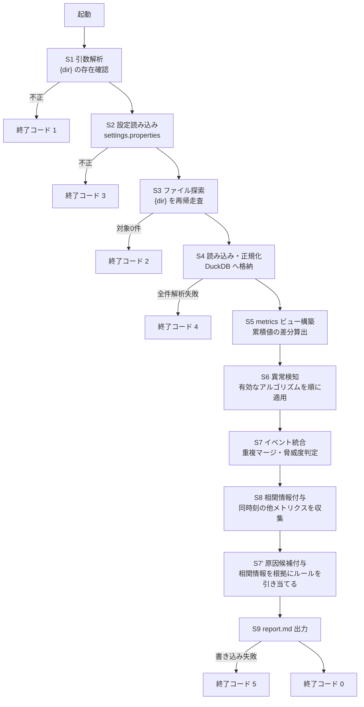

> **この文書は無効です。** CR-011 対応前の原本(2026-09-08時点)です。
> 現在有効なシステム要件定義は `docs/P001-requirement.md` です。

# P001 システム要件定義書 — アプリケーション環境分析アプリ (s_anomaly)

* 版: 初版
* 入力: `docs/P000-concept-analysis.md` (人間が記入した要求原文)
* 対象フェーズ: P001

> **本書の読み替えについて** ★ACCEPTED★
> `SKILL-P001-requirement.md` が定めるアウトプット項目は GUI アプリを前提とした語彙(画面一覧・画面遷移図・フロントエンド/バックエンド技術・バックエンドAPI一覧)で書かれている。本アプリは CLI アプリであるため、`TEMPLATE-P000-concept-analysis-cli.md` 冒頭の指示(「近い方をベースに章を読み替えて使う」)に従い、次のとおり読み替えて記載する。形態別に節構成を作り分ける案は採らなかった。章立ての大半(概要・技術・データ・非機能・テスト方針)は形態によらず共通であり、差分は「画面と遷移」か「コマンドと処理フロー」かに集約されるため。残る制約として、後続の P002(ユーザインタフェース設計)は画面設計書ではなく CLI インタフェース設計書として作成される。
>
> | SKILL の項目 | 本書での読み替え先 |
> | --- | --- |
> | 画面一覧 | 6. コマンド一覧 |
> | 画面遷移図 | 7. 処理フロー |
> | 各画面の入出力項目 | 8. コマンドの入出力項目 |
> | フロントエンドで使う技術 | 3.1 CLI 層の技術 |
> | バックエンドで使う技術 | 3.2 分析エンジン層の技術 |
> | バックエンドAPI一覧 | 9. 内部モジュールインタフェース一覧 |

---

## 1. アプリケーションの概要

膨大な量の運用ログ(DB コネクション数・JavaEE サーバの GC 統計・LSF 計算グリッドのキュー状態)を読み込み、統計的手法で異常箇所を自動的に抽出して、LLM に読ませる前提の Markdown レポート群(`report_{HOST}_{yyyymm}.md` と `report_summary_{yyyymm}.md`。※CR-001・CR-004により変更)を生成する CLI アプリケーションである。★FIXME★ (P000 第1章の「何をするアプリか」欄が未記入であったため、同章の「誰が使うか」「何を解決するか」および第4・5章の記述から Agent が要約した)

| 項目 | 内容 |
| --- | --- |
| 誰が使うか | アプリケーションの運用者 |
| 何を解決するか | 膨大な量のログから異常な箇所を見つける。人手で全ログを見る運用を、機械的な一次スクリーニングに置き換える |
| 何を解決しないか | 異常の原因を確定すること。本アプリは候補の提示までを行い、最終的な原因判断は後段の LLM と人間が行う |

### 1.1 位置づけ (処理の全体像)

本アプリは「一次スクリーニング」を担当し、レポートの文章化は後段の LLM が担当する。**本アプリ自身は LLM を呼び出さない**(実行環境がインターネット非接続であるため)。


### 1.2 要求 ID の体系

本書の各要求には `FR-`(機能要件) / `NFR-`(非機能要件) / `ALG-`(アルゴリズム要件) の ID を付す。P004 要求トレーサビリティマトリクスは、この ID を軸に P002・P003 の充足を検証する。

---

## 2. システムの前提

| 項目 | 内容 | 出典 |
| --- | --- | --- |
| 利用者数・同時実行 | 運用者が手動で単発実行する。同時実行は考慮しない ★FIXME★ (P000 第7章「同時実行」欄が未記入のため Agent が想定。複数の運用者が同一ディレクトリで同時に実行しレポート群が衝突する運用があるなら要見直し) | 想定 |
| デプロイ先 | Linux および Windows の両方。**インターネットに接続されていない閉域環境** | P000 2章 |
| 配布形態 | 「スクリプトそのまま」。配布資産一式をコピーすれば動作すること。ネットワーク経由の `pip install` は実行できない | P000 2章 |
| 認証 | 不要(ローカル実行の CLI であり、認証機構を持たない) ★FIXME★ (P000 に記載がないため Agent が想定) | 想定 |
| 連携する既存システム | なし | P000 3章 |
| データの永続化 | 行わない。1 回の分析で読み込んだデータは実行終了時に破棄してよい | P000 2章 |

### 2.1 前提から導かれる最重要の制約 — オフライン配布と DuckDB の両立

**FR-001**: 本アプリは、インターネット非接続の環境に配布資産一式をコピーするだけで動作しなければならない。

一方で P000 第2章はデータストアとして DuckDB を指定している。DuckDB は純 Python ではなく **C++ で書かれたネイティブ拡張**であり、「スクリプトそのまま」では動作しない。両立させるには、依存パッケージを配布資産に同梱する必要がある。

**FR-002**: 配布資産は次の構成とし、実行時にネットワークアクセスを行わない。

* `vendor/` ディレクトリに、DuckDB の Python パッケージを**実行環境に対応したプラットフォーム別に展開済みの状態で**同梱する。
* 起動時に `sys.path` の先頭へ `vendor/{platform}/` を追加してから `import duckdb` する。実行時に `pip install` を行わない。
* ★FIXME★ 次の点は人間の確認が必要である。Agent は下記を想定して設計を進める。
  * 同梱が必要なプラットフォームは **Linux(x86_64, manylinux) と Windows(AMD64) の 2 種類**と想定する。**対象の Python マイナーバージョンは配布先の環境に合わせて決める**(3.1 のとおりコード自体は 3.9 以上で動くが、DuckDB の wheel は Python マイナーバージョンごと・OS ごとに別物であるため、`vendor/` の中身は配布先の版と 1 対 1 で対応させる必要がある)。他のアーキテクチャ(aarch64 など)が混在する場合は同梱物を増やす。
  * 閉域環境へ持ち込む配布物のサイズ(DuckDB は展開後 50〜80MB 程度)が運用上許容されるか。
  * wheel の入手(インターネット接続のある別環境でのダウンロード)は人間の作業とする。取得・展開手順は P302 が文書化する。
* ★ACCEPTED★ 検討: 標準ライブラリの `sqlite3` に切り替える案(同梱物ゼロで「スクリプトそのまま」を完全に満たせる)。**不採用**。人間に判断を求めたところ「DuckDB を同梱する(P000 の指定どおり)」との回答を得たため(P001 完了時の確認、2026-09-02)。DuckDB が持つ分析向け窓関数・`quantile_cont`・列指向の集計性能を失うと、10章のアルゴリズムのうち分位数を用いるもの(ALG-A3)の実装が手書きになり、大規模データの集計性能も落ちるという判断による。残存リスク: 配布物が 50〜80MB 増え、実行環境の Python マイナーバージョンとアーキテクチャに配布物が縛られる(下記 FR-002 の ★FIXME★ が残る)。

**FR-003**: DuckDB 以外の外部パッケージ(numpy / pandas / scipy / scikit-learn / statsmodels など)には依存しない。10章のすべてのアルゴリズムは、**DuckDB の SQL 窓関数と Python 標準ライブラリのみ**で実装できる範囲から選定する。★ACCEPTED★ 検討: scikit-learn の Isolation Forest や statsmodels の STL 分解を使う案。不採用の理由: いずれもネイティブ拡張または大規模な依存ツリーを持ち、閉域環境への同梱コストが DuckDB 1 つの比ではなくなるため。残存リスク: 多変量の異常検知(複数メトリクスの相関崩れ)は本アプリの範囲外となる(17章「対象外」参照)。

---

## 3. 技術選定

### 3.1 CLI 層の技術 (SKILL でいう「フロントエンド」)

| 区分 | 選定 | 理由 |
| --- | --- | --- |
| 言語 | Python **3.9 以上** (CPython) | P000 第2章の指定「Python3」による。**コードは 3.9 で動く範囲の構文・標準ライブラリのみを使う**。実行時に評価される `X \| None` 形式の型注釈(`typing.Optional` を使う)、`match` 文、`tomllib` を使わない。下限を 3.9 に置く理由は P004 4章参照。ただし FR-002 の同梱 wheel は Python マイナーバージョンごとに別物であるため、**配布物は実行環境の版に合わせて用意する必要がある** ★FIXME★ (配布先の閉域環境の Python 版が未確認。vendor/ の中身は配布先の版に合わせて差し替える必要がある) |
| 検証環境 | Windows: Python 3.14.2 / Linux: Ubuntu(WSL2) Python 3.10.12。いずれも DuckDB 1.5.5 | NFR-006(Linux/Windows 両対応)を実機で確認するため。両環境の Python 版が異なることが、上記の下限を 3.9 に置く動機の 1 つである |
| 引数解析 | 標準ライブラリ `argparse` | 追加依存が不要で FR-003 を満たす |
| 進捗表示 | 標準ライブラリ `logging` | P000 第5章「長期に動くので、どこまで進んでいるか、今何をしているのか分かるようにしてください」に対応。標準出力・標準エラー出力の双方へ出す(8章参照) |
| 設定ファイル読み込み | 標準ライブラリ `configparser` | P000 第6章の `settings.properties` に対応。13章参照 |
| OS 差異の吸収 | 標準ライブラリ `pathlib` | Linux / Windows 両対応(NFR-006) |

### 3.2 分析エンジン層の技術 (SKILL でいう「バックエンド」)

| 区分 | 選定 | 理由 |
| --- | --- | --- |
| データストア | DuckDB (インメモリ) | P000 第2章の明示指定。列指向で集計が速く、窓関数(`avg` / `stddev_samp` / `median` / `quantile_cont` / `regr_slope`)が揃っており、10章のアルゴリズムの大半を SQL 1 本で表現できる |
| メモリ超過時 | DuckDB の一時ファイル退避 (`SET temp_directory`, `SET max_memory`) | P000 第2章「メモリからあふれたら temp ファイルを使う」に対応 |
| 統計計算 | DuckDB の SQL 窓関数を第一選択とし、SQL で表現しにくいもの(順位相関など)のみ Python 標準ライブラリ `statistics` / `math` | FR-003 を満たしつつ、大量データの走査を DuckDB 側へ寄せる |
| 帳票生成 | Python の文字列整形(テンプレートエンジンを使わない) | 出力は Markdown 1 ファイルのみであり、テンプレートエンジンを同梱する必要がない |

---

## 4. 入力データ仕様

**FR-010**: コマンド引数で指定されたディレクトリ `{dir}` を**再帰的に**たどり、ファイル名パターンに一致するログファイルをすべて読み込む。

| # | 種別 | ファイル名パターン | 形式 | 出典 |
| --- | --- | --- | --- | --- |
| ① | DB コネクションログ | `DBConnection_{yyyymmdd}.csv` | CSV、1行目が見出し | P000 3章 |
| ② | JavaEE サーバの GC 統計 | `{コンテナ名}_gc_{ホスト名}_{yyyymmdd}.txt` | 空白区切り、1行目が見出し | P000 3章 |
| ③ | LSF キュー状態 | `bqueues_{ホスト名}_{yyyymmdd}.txt` | CSV、1行目が見出し | P000 3章 |
| ④ | **OS 資源統計 (sar / sysstat)** ※CR-010により追加 | `sa-{ホスト名}-{yyyymmdd}.csv` | `;` 区切り、`#` で始まる見出し行が活動種別ごとに付く | 依頼者 (2026-09-05 / 2026-09-08) |

**FR-011**: いずれのパターンにも一致しないファイルは黙って読み飛ばす(エラーとしない)。読み飛ばした件数は進捗ログに出す。

### 4.1 ① DB コネクションログ

```
日付,ホスト名,ポート番号,データソース,activeConnectionsCurrentCount
2026/06/01 00:00:01,host01,7003,OraclePool_2,0
2026/06/01 00:00:01,host01,7003,OraclePool_1,4
```

* 日付書式: `yyyy/MM/dd HH:mm:ss`
* 系列を一意に識別するキー(以下「系列キー」): `(ホスト名, ポート番号, データソース)`
* 監視対象の数値: `activeConnectionsCurrentCount`

### 4.2 ② JavaEE サーバの GC 統計 (jstat)

**FR-012**: jstat の出力形式は 2 種類あり、見出し行から判別して両方を受け付ける。

P000 第3章に記載された見出し行と、その直下のデータ行は**列数が一致していない**。

* 見出し行: `time Timestamp SOC SIC SOU SIU EC EU OC OU MC MU CCSC YGC YGCT FGC FGCT GCT` (時刻を除いて 17 列。`jstat -gc` 系の列名)
* データ行: `2026/06/01 00:00:01 3019.0 63.30 74.99 100.00 53.52 96.26 86.35 753 414.206 25 581.636 995.842` (時刻を除いて 12 列。値が 100.00 を上限とする百分率であることから `jstat -gcutil` の出力)

★FIXME★ **この不一致は人間の確認が必要である。** Agent は「実際に採取されているのは `-gcutil` であり、見出し行には `-gc` のものが混在して記載された」と解釈し、**両形式を見出し行の列名で自動判別して受け付ける**設計とする(どちらか一方に決め打ちすると、実環境のファイルを読めなくなる危険があるため)。

| 形式 | 見出しに現れる列 | 値の意味 |
| --- | --- | --- |
| `-gcutil` | `S0 S1 E O M CCS YGC YGCT FGC FGCT GCT` | 各世代の**使用率(%)** |
| `-gc` | `S0C S1C S0U S1U EC EU OC OU MC MU CCSC CCSU YGC YGCT FGC FGCT GCT` | 各世代の**容量・使用量(KB)** |

P000 に記載された列名 `SOC SIC SOU SIU` は、英字の O・I ではなく数字の 0・1 を用いた `S0C S1C S0U S1U`(Survivor 0/1 の Capacity / Used)の誤記である。**人間に確認済み**(20章参照)。

* 時刻: 先頭の `time` 列(jstat 実行時刻。書式 `yyyy/MM/dd HH:mm:ss`)を用いる。`Timestamp` 列(JVM 起動からの経過秒)は時刻軸としては使わないが、**JVM の再起動を検出する**ために保持する(値が減少した点を再起動とみなし、系列を分割する。ALG-B3 で使う) ★FIXME★ (再起動検出に Timestamp の減少を用いるのは Agent の想定)
* コンテナ名・ホスト名: ファイル名 `{コンテナ名}_gc_{ホスト名}_{yyyymmdd}.txt` から取得する
* 系列キー: `(コンテナ名, ホスト名)`

### 4.3 ③ LSF キュー状態 (bqueues)

```
time,{QUEUE}_NJOBS,{QUEUE}_PEND,{QUEUE}_RUN,{QUEUE}_SUSP,...
2026-06-01 00:00:00:02,0,0,0,0,...
```

* **横持ち(wide)形式**である。QUEUE の数だけ 4 列 (`NJOBS` / `PEND` / `RUN` / `SUSP`) が繰り返される。見出し行を解析して QUEUE 名を動的に抽出し、縦持ち(long)に変換して格納する(5.3 参照)。
* ホスト名: ファイル名 `bqueues_{ホスト名}_{yyyymmdd}.txt` から取得する
* 系列キー: `(ホスト名, QUEUE)`
* 日付書式 `2026-06-01 00:00:00:02` の末尾 `02` は **1/100 秒**である(`yyyy-MM-dd HH:mm:ss:SS`)。**人間に確認済み**(20章参照)。実装は**末尾要素を無視して秒精度まで読む**(本アプリの分析はすべて秒精度以上の粒度で行うため、1/100 秒の情報を保持する必要がない)。
* P000 第3章の説明文にある `NJOBUS(Number of Jobs)` / `SUS(Number of Suspened Jobs)` は、同章の見出し行にある `NJOBS` / `SUSP` の誤記である。**人間に確認済み**(20章参照)。

### 4.3a ④ OS 資源統計 (sar / sysstat) ※CR-010により新設

```
# hostname;interval;timestamp;CPU;%user;%nice;%system;%iowait;%steal;%idle
host01;600;2026-06-01 00:10:00 UTC;-1;1.23;0.00;0.45;0.02;0.00;98.30
# hostname;interval;timestamp;DEV;tps;rd_sec/s;wr_sec/s;avgrq-sz;avgqu-sz;await;svctm;%util
host01;600;2026-06-01 00:10:00 UTC;sda;12.30;480.00;96.00;46.83;0.09;7.20;0.61;0.75
```

**FR-140**: **`sadf -d` が出力した CSV を読み込む。** バイナリの `saDD` は読まない。

* **前処理は人が採取ホスト上で行う。** 本アプリは外部プロセスを起動しない (NFR-008) ため `sar` / `sadf` を呼べない。また `sa` のバイナリ形式は sysstat の版に依存し、版が違うと本家の `sar` でさえ読めない。手順と変換スクリプトは `README.md` 付録A にある。
* 区切りは `;`。日付は `YYYY-MM-DD HH:MM:SS {TZ}` 固定である。

**FR-141**: **1 ファイルの中に、活動種別ごとのブロックが並ぶ。** 各ブロックの先頭に `#` で始まる見出し行があり、**列構成は活動種別ごとに異なる**。

* **列は位置ではなく見出し行の列名で対応付ける。** `sadf` の出力書式は sysstat の版によって差があり (`rd_sec/s` → `rkB/s`、`avgqu-sz` → `aqu-sz`、`svctm` の廃止など)、位置で読むと版が変わった瞬間に別のメトリクスを取り込む。
* **見出し行の第 1〜3 列は常に `hostname` / `interval` / `timestamp`** であり、第 4 列以降が活動種別ごとの内容である。
* **未知の活動種別・未知の列は読み飛ばす。** 実行を止めない (FR-011・FR-014 と同じ扱い)。読み飛ばした活動種別と列は、種別単位で件数を集計して進捗ログに出す。

**FR-142**: **取り込む活動種別は次の 8 種類とする。** これは `README.md` 付録A の変換スクリプトが出力する範囲と一致する。★依頼者の判断 (2026-09-08): 「まず 8 種類すべてを取り込み、量を見て設定で絞る」★

| 活動 | `sadf` の指定 | デバイス列 | 取り込むメトリクス |
| --- | --- | --- | --- |
| `cpu` | `-u` | `CPU` (全体は `-1`) | `pct_user` / `pct_system` / `pct_iowait` / `pct_idle` |
| `memory` | `-r` | なし | `pct_memused` / `pct_commit` / `kbmemfree` |
| `swap_space` | `-S` | なし | `pct_swpused` |
| `io` | `-b` | なし | `tps` / `bread_s` / `bwrtn_s` |
| `load` | `-q` | なし | `runq_sz` / `ldavg_1` / `ldavg_5` / `blocked` |
| `swapping` | `-W` | なし | `pswpin_s` / `pswpout_s` |
| `disk` | `-d -p` | `DEV` | `pct_util` / `await` / `tps` |
| `network` | `-n DEV` | `IFACE` | `pct_ifutil` / `rxkb_s` / `txkb_s` |

**FR-143**: **`%` `/` `-` を含む sar の列名は、次の規則で正規化してメトリクス名にする。** 系列キーやレポートに記号がそのまま出ると、設定ファイルのキーや Markdown の書式と衝突するためである。

| sar の列名 | メトリクス名 | 規則 |
| --- | --- | --- |
| `%user` | `pct_user` | 先頭の `%` を `pct_` に置き換える |
| `rd_sec/s` | `rd_sec_s` | `/` を `_` に置き換える |
| `ldavg-1` | `ldavg_1` | `-` を `_` に置き換える |
| `runq-sz` | `runq_sz` | 同上 |

**★重要★ 接頭の `pct_` と接尾の `_pct` は別物である。** 取り違えると検知が無言で消える。

| 記法 | 意味 | 検知対象か |
| --- | --- | --- |
| **`*_pct`(接尾)** | 本アプリが**導出した**使用率 (`ou_pct` など。ADR-005) | **対象外。** 脅威度判定と原因候補の材料としてのみ使う |
| **`pct_*`(接頭)** | **sar が直接出力する**比率 (`pct_memused` など) | **一次の検知対象である。** 他のメトリクスと同じく 11 アルゴリズムを適用する |

**FR-144**: 系列キーは **`sar/{ホスト名}/{活動}/{デバイス}`** とする。デバイス列を持たない活動は占位子 `-` を置く (例: `sar/host01/memory/-`)。**`cpu` のデバイス列は CPU 番号であり、`-1` が「全 CPU」を意味する**(`sadf` の出力そのまま)。したがって `sar/host01/cpu/-1` となり、占位子の `-` とは別物である。既存 3 書式と同じく、**ホスト名は第 1 区切りの直後**に来る (`lsf_queue/{host}/{queue}` と同じ形)。

**FR-145**: **ホスト名の正規化はアプリ側で行わない。** ★ACCEPTED★ (2026-09-06 依頼者の判断) 揃えるのは前処理の責任とする。**検討したこと**: `events.extract_host` に別名表を持たせて吸収する案。**採らなかった理由**: 変換スクリプトがホスト名を引数で受け取れるため、前処理で正しい名前を渡せる。アプリに運用知識を持ち込む必要がない。**残存リスク**: 変換時にホスト名を指定し忘れると、**エラーにならないまま同じサーバが別ホストとして扱われる**。レポートが割れ、「同時に発生したアノマリー」の同一ホスト優先も効かなくなる。運用手順書で担保する。

**FR-146**: ホスト名・日付は**ファイル名から取得する** (`sa-{ホスト名}-{yyyymmdd}.csv`)。データ行の第 1 列にもホスト名があるが、**ファイル名を正とする**。前処理でホスト名を指定した場合、ファイル名側が他のログに揃えた名前になっているためである。★FIXME★ (ファイル名を正とするのは Agent の判断。データ行と食い違う場合に警告を出すかは P003 で決める)

### 4.4 入力の共通仕様

**FR-013**: 同一系列に同一時刻のレコードが重複して存在する場合(ファイルの重複配置など)は、**先に読み込んだ 1 件を採用して残りを捨てる**。捨てた件数を進捗ログに出す。★FIXME★ (重複時の扱いは P000 に記載がないため Agent が想定。「最後の 1 件を採用」「平均をとる」も選択肢である)

**FR-014**: 解析できない行(列数不一致、数値に変換できない、日付書式が不正)は**その行だけを読み飛ばし**、ファイル単位・理由単位で件数を集計して進捗ログと各 `report_{HOST}_{yyyymm}.md` の末尾(12.3 参照)に出す。1 行の破損で実行全体を失敗させない。

**FR-015**: 数値列が `-`(jstat が未対応の列に出力することがある)や空文字の場合は NULL として格納し、アルゴリズムの計算対象から除外する。

**FR-147**: **※CR-010により新設。sar の時刻列に付くタイムゾーン表記を読み取り、`[timezone]` の設定と食い違う場合は警告を出す。**

`sadf -d` は時刻を `2026-06-01 00:10:00 UTC` のように**タイムゾーン表記付き**で出力する。★依頼者の判断 (2026-09-08): 「時刻列の TZ 表記を読んで検証する」★

* **設定値 (`[timezone] sar`) を正とする。** 表記を優先して自動変換はしない。CR-008 が定めた「設定が正」という設計を維持するためである (13.1)。
* **食い違った場合は警告を出して処理を続行する。** 停止しない。
* **表記が無い場合・解釈できない場合は、警告を出さずに設定値をそのまま使う。** sysstat の版によっては表記が付かないためである。
* この検証を行う理由は、**時刻がずれても一切エラーにならず、区間の重なり判定 (12.2 の「同時に発生したアノマリー」) が静かに全て外れる**ためである。

---

## 5. 内部データモデル (DuckDB)

**FR-020**: 読み込んだログは、種別ごとに次のテーブルへ正規化して格納する。P000 第5章「次の項目のテーブルに解釈しなおして格納する」に対応する。

### 5.1 `db_connection`

| 列 | 型 | 備考 |
| --- | --- | --- |
| `ts` | TIMESTAMP | 日付列 |
| `host` | VARCHAR | ホスト名 |
| `port` | INTEGER | ポート番号 |
| `datasource` | VARCHAR | データソース |
| `active_connections` | BIGINT | activeConnectionsCurrentCount |

### 5.2 `jvm_gc`

P000 第5章の指定「`time コンテナ名 ホスト名 SOC SIC SOU SIU EC EU OC OU MC MU CCSC YGC YGCT FGC FGCT GCT`」に対応する。`-gcutil` 形式にしか存在しない列と `-gc` 形式にしか存在しない列があるため、**すべての数値列を NULL 許容**とし、どちらの形式で採取されたかを `gc_format` 列に保持する。★FIXME★ (2 形式を 1 テーブルに統合するのは Agent の想定。形式ごとにテーブルを分ける設計もありうるが、10章のアルゴリズムを系列単位で一様に適用できる本設計を採る)

| 列 | 型 | 備考 |
| --- | --- | --- |
| `ts` | TIMESTAMP | time 列 |
| `container` | VARCHAR | ファイル名から取得 |
| `host` | VARCHAR | ファイル名から取得 |
| `jvm_uptime_sec` | DOUBLE | Timestamp 列。再起動検出に使う |
| `gc_format` | VARCHAR | `gc` または `gcutil` |
| `s0c`,`s1c`,`s0u`,`s1u`,`ec`,`eu`,`oc`,`ou`,`mc`,`mu`,`ccsc`,`ccsu` | DOUBLE | `-gc` 形式のとき容量・使用量(KB)。`-gcutil` 形式のときは使用率(%)を `s0u`,`s1u`,`eu`,`ou`,`mu`,`ccsu` に格納し、容量列は NULL |
| `ygc` | BIGINT | Young GC 回数(累積) |
| `ygct` | DOUBLE | Young GC 時間(累積秒) |
| `fgc` | BIGINT | Full GC 回数(累積) |
| `fgct` | DOUBLE | Full GC 時間(累積秒) |
| `gct` | DOUBLE | GC 総時間(累積秒) |

**FR-021**: `ygc` / `ygct` / `fgc` / `fgct` / `gct` は**累積値**であるため、そのまま外れ値検知にかけると常に単調増加する。分析時は**隣接レコードとの差分**(区間あたりの GC 回数・GC 時間)を導出列として算出し、それを検知対象とする。JVM 再起動により値が減少した点では差分を NULL とする。

### 5.3 `lsf_queue`

P000 第5章の指定「`time,ホスト名,QUEUE,NJOBS,PEND,RUN,SUSP`」に対応する(横持ちから縦持ちへの変換)。

| 列 | 型 | 備考 |
| --- | --- | --- |
| `ts` | TIMESTAMP | time 列 |
| `host` | VARCHAR | ファイル名から取得 |
| `queue` | VARCHAR | 見出し行の列名から抽出 |
| `njobs` | BIGINT | |
| `pend` | BIGINT | |
| `run` | BIGINT | |
| `susp` | BIGINT | |

### 5.3a `sar` ※CR-010により新設

**活動種別ごとに列構成が違うため、他の 3 テーブルと異なり縦持ち (long) で格納する。**

| 列 | 型 | 備考 |
| --- | --- | --- |
| `ts` | TIMESTAMP | `timestamp` 列。タイムゾーン表記は取り込み時に解釈して落とす (FR-147・ADR-019) |
| `host` | VARCHAR | ファイル名から取得 (FR-146) |
| `activity` | VARCHAR | `cpu` / `memory` / `swap_space` / `io` / `load` / `swapping` / `disk` / `network` |
| `device` | VARCHAR | `CPU` / `DEV` / `IFACE` 列の値。デバイスを持たない活動は `-` |
| `metric` | VARCHAR | 正規化した列名 (FR-143)。例 `pct_memused` |
| `value` | DOUBLE | |

★ACCEPTED★ **他の 3 テーブルのように活動ごとの横持ちテーブルを作らない。** **検討したこと**: 活動種別ごとに 8 テーブルを作る案 (`db_connection` などと同じ形)。**採らなかった理由**: (1) `sadf` の列は sysstat の版で増減するため、横持ちにすると版が変わるたびにテーブル定義の変更が要る。(2) 8 テーブル分の DDL とローダ分岐が増えるのに対し、`metrics` ビューへ載せる段階でどのみち縦持ちに畳む。**残存リスク**: 1 時刻・1 デバイスの値がテーブル上で複数行に分かれるため、活動種別をまたいだ横断的な SQL は書きにくい。本アプリの検知は系列単位であり、その必要が無い。

### 5.4 分析用の統一ビュー `metrics`

**FR-022**: 10章のアルゴリズムを 4 種別 (※CR-010により 3 → 4) に対して一様に適用できるよう、すべての監視対象を「系列 × 時刻 × 値」の縦持ちビューに統合する。アルゴリズムはこのビューのみを入力とし、ログ種別を意識しない。

| 列 | 型 | 備考 |
| --- | --- | --- |
| `series_id` | VARCHAR | 系列の一意キー。例: `db_connection/host01:7003/OraclePool_1` / `sar/host01/disk/sda` |
| `source` | VARCHAR | `db_connection` / `jvm_gc` / `lsf_queue` / `sar` ※CR-010により追加 |
| `metric` | VARCHAR | `active_connections` / `ou` / `fgc_delta` / `pend` / `pct_util` など |
| `ts` | TIMESTAMP | |
| `value` | DOUBLE | |

**FR-023**: 監視対象メトリクスは次のとおりとする。★FIXME★ (どのメトリクスを監視するかは P000 に明示がないため Agent が想定。「メモリリークなど」を例に挙げている P000 第5章の意図から、GC 系は使用量と Full GC 頻度を中心に選んだ)

| source | metric | 選定理由 |
| --- | --- | --- |
| `db_connection` | `active_connections` | P000 で唯一の数値列 |
| `jvm_gc` | `ou` (Old 使用量/使用率) | メモリリークの主指標 |
| `jvm_gc` | `eu` (Eden 使用量/使用率) | 短期的な負荷変動 |
| `jvm_gc` | `mu` (Metaspace 使用量/使用率) | クラスローダリーク |
| `jvm_gc` | `fgc_delta` (区間 Full GC 回数) | Full GC の頻発 |
| `jvm_gc` | `fgct_delta` (区間 Full GC 時間) | 停止時間の増大 |
| `jvm_gc` | `ygct_delta` (区間 Young GC 時間) | GC 負荷 |
| `lsf_queue` | `pend` | ジョブの滞留 |
| `lsf_queue` | `run` | 実行本数 |
| `lsf_queue` | `susp` | サスペンドの滞留 |
| `lsf_queue` | `njobs` | 総ジョブ数 |
| **`sar`** | `pct_user` / `pct_system` / `pct_iowait` / `pct_idle` | CPU の飽和・I/O 待ちの増加 ※CR-010 |
| **`sar`** | `pct_memused` / `pct_commit` / `kbmemfree` | メモリの枯渇 ※CR-010 |
| **`sar`** | `pct_swpused` / `pswpin_s` / `pswpout_s` | スワップの発生 (性能劣化の直接の原因になる) ※CR-010 |
| **`sar`** | `tps` / `bread_s` / `bwrtn_s` | I/O 量の変化 ※CR-010 |
| **`sar`** | `runq_sz` / `ldavg_1` / `ldavg_5` / `blocked` | 実行待ちの滞留 ※CR-010 |
| **`sar`** | `pct_util` / `await` / `tps` (デバイス単位) | ディスクの飽和・応答遅延 ※CR-010 |
| **`sar`** | `pct_ifutil` / `rxkb_s` / `txkb_s` (インタフェース単位) | ネットワークの飽和 ※CR-010 |

---

## 6. コマンド一覧 (SKILL でいう「画面一覧」)

**FR-030**: 本アプリが提供するコマンドは 1 つのみである。

| ID | コマンド | 用途 |
| --- | --- | --- |
| C01 | `s_anomaly.py {dir}` | `{dir}` 以下のログファイルから異常値を発見し、カレントディレクトリに `report_{HOST}_{yyyymm}.md` と `report_summary_{yyyymm}.md` を出力する ※CR-001・CR-004により変更 |

---

## 7. 処理フロー (SKILL でいう「画面遷移図」)



**FR-031**: 各ステップ S1〜S9 の開始・終了と、S4・S6 の内部進捗(処理済みファイル数 / 総ファイル数、処理済み系列数 / 総系列数、実行中のアルゴリズム名)を進捗ログに出す。P000 第5章「長期に動くので、どこまで進んでいるか、今何をしているのか分かるようにしてください」に対応する。

**FR-031a**: **原因候補の付与(S7')は、相関情報の収集(S8)の後に行う。** 12.1 の原因候補ルールは相関先メトリクスの増減を条件に含むため、相関情報が無い状態では判定できない。したがって実行順序は **S7(統合・脅威度)→ S8(相関)→ S7'(原因候補)** である。内部実装の詳細は `docs/P003-backend-spec.md` DS-10-02 に定める。

**FR-032**: S6 の異常検知は**系列 × メトリクス × アルゴリズム**の総当たりで実行する。1 つのアルゴリズムが例外で失敗しても、他のアルゴリズム・他の系列の処理は継続し、失敗を集計して 12.3 に出力する。

---

## 8. コマンドの入出力項目 (SKILL でいう「各画面の入出力項目」)

### 8.1 C01 `s_anomaly.py {dir}` の入力

| 項目 | 必須/任意 | 型・書式 | 既定値 | 説明 |
| --- | --- | --- | --- | --- |
| `{dir}` | 必須 | ディレクトリパス | なし | 探索対象のルートディレクトリ。再帰的に走査する |
| `settings.properties` | 任意 | ファイル | スクリプトと同じディレクトリの `settings.properties` | アルゴリズムの ON/OFF。存在しなければ全アルゴリズム有効(13章) |

★FIXME★ P000 第5章には「引数・オプション」の小節が存在せず、書式欄にも用途の文章のみが記入されていたため、引数は `{dir}` の 1 つのみと解釈した。次のオプションは**あると有用と考えられるが、P000 に記載がないため本書では追加しない**。必要であれば CR として起票いただきたい。

* レポートの出力先のパス指定(現状はカレントディレクトリ固定)※CR-001により表記を変更
* 分析対象期間の絞り込み(`--from` / `--to`)
* 設定ファイルのパス指定(`--config`)

### 8.2 C01 の出力

| 出力先 | 内容 | 出典 |
| --- | --- | --- |
| 標準出力 | 動作ログ(進捗)。INFO 以上 | P000 5章 |
| 標準エラー出力 | 動作ログ(進捗)。WARNING 以上 | P000 5章 |
| ファイル | カレントディレクトリの `report_{HOST}_{yyyymm}.md` と `report_summary_{yyyymm}.md` ※CR-001・CR-004により変更 | P000 5章 |

★FIXME★ P000 第5章は標準出力・標準エラー出力の**双方**に「動作ログを出力してください」と記載している。両者に同一内容を全量出すと、リダイレクト時に重複するため、Agent は上表のとおり**重大度で振り分ける**(標準出力=進捗、標準エラー出力=警告・エラー)ことを想定した。全量を両方へ出す意図であれば要修正。

**FR-033**: 進捗ログの各行には、時刻・重大度・ステップ ID・メッセージを含める。書式は `YYYY-MM-DD HH:MM:SS [LEVEL] [S6] メッセージ` とする。★FIXME★ (書式は Agent の想定)

---

## 9. 内部モジュールインタフェース一覧 (SKILL でいう「バックエンドAPI一覧」)

**FR-040**: 本アプリは HTTP API を持たない CLI であるため、SKILL のいう「API 一覧」を**内部モジュール間のインタフェース一覧**として読み替える。詳細な引数・戻り値は P003 が定義する。

| ID | モジュール | 責務 | 主な入力 → 出力 |
| --- | --- | --- | --- |
| M01 | `cli` | 引数解析・全体制御・終了コード決定 | argv → 終了コード |
| M02 | `config` | `settings.properties` の読み込みと検証 | ファイル → 設定オブジェクト |
| M03 | `discovery` | `{dir}` の再帰走査とファイル種別判定 | ディレクトリ → ファイル一覧(種別・メタ情報付き) |
| M04 | `loader.dbconn` | ① の解析と `db_connection` への格納 | ファイル → 格納件数・スキップ件数 |
| M05 | `loader.jstat` | ② の解析(形式自動判別)と `jvm_gc` への格納 | ファイル → 格納件数・スキップ件数 |
| M06 | `loader.bqueues` | ③ の解析(横持ち→縦持ち)と `lsf_queue` への格納 | ファイル → 格納件数・スキップ件数 |
| M07 | `metrics` | `metrics` ビューの構築、累積値の差分算出、JVM 再起動による系列分割 | 3 テーブル → `metrics` ビュー |
| M08 | `detector.*` | 10章の各アルゴリズム。1 アルゴリズム = 1 モジュール | `metrics` + パラメータ → 検知点の一覧 |
| M09 | `events` | 検知点のイベント化・重複マージ・脅威度判定 | 検知点 → イベント一覧 |
| M10 | `causes` | 原因候補の付与(ルールベース) | イベント → 原因候補付きイベント |
| M11 | `correlate` | 同時刻の他メトリクスの状況収集 | イベント + `metrics` → 相関情報 |
| M12 | `reporter` | レポート群の生成 ※CR-001・CR-004により変更 | イベント一覧 → ホスト別 Markdown ファイル + サマリ |
| M13 | `progress` | 進捗ログの出力 | — |
| M14 | `bootstrap` | `vendor/` の `sys.path` 追加と DuckDB の初期化 | — → DuckDB コネクション |

---

## 10. 異常検知アルゴリズム

**FR-050**: P000 第5章「異常値の観点は二つです。それぞれに観点を満たす、具体的な異常値の発見アルゴリズムは、代表的なものを実装してください」に対応し、観点ごとに代表的なアルゴリズムを複数実装する。

選定方針は次のとおり。

1. **観点を満たすこと**(観点1 = 瞬間的な外れ値、観点2 = 持続的な数値の増加)
2. **代表的であること**(運用監視・時系列異常検知で標準的に用いられる手法であること)
3. **FR-003 を満たすこと**(DuckDB の SQL 窓関数と Python 標準ライブラリのみで実装できること)
4. **前提が互いに異なること**(同じ弱点を持つ手法を並べても検知力が上がらないため、正規性を仮定するもの / しないもの、窓を持つもの / 持たないもの、を混ぜる)

### 10.1 観点1: 瞬間的な外れ値 (point anomaly)

| ID | 名称 | 原理 | 主な検知対象 | 弱点(この手法だけでは足りない理由) |
| --- | --- | --- | --- | --- |
| **ALG-A1** | 移動平均乖離率 (Moving Average ± kσ) | 直前 N 点の移動平均と標準偏差を求め、`|value − MA| > k × σ` を外れ値とする。k=2 と k=3 の 2 段階 | 全メトリクス | 外れ値自身が平均と標準偏差を押し上げるため、大きな外れ値ほど検知しにくくなる(マスキング) |
| **ALG-A2** | Hampel フィルタ (移動中央値 + MAD) | 移動中央値と MAD(中央絶対偏差)を用い、`|value − median| > k × 1.4826 × MAD` を外れ値とする | 全メトリクス | 窓内の半数以上が異常な場合は検知できない |
| **ALG-A3** | Tukey の外れ値境界 (IQR 法) | 系列全体の四分位数から `Q3 + 1.5×IQR`(WARN)、`Q3 + 3.0×IQR`(FATAL)を境界とする。窓を持たない | 全メトリクス | 系列全体の分布を使うため、時間帯による変動(夜間バッチなど)を異常と誤判定しやすい |
| **ALG-A4** | EWMA 管理図 | 指数加重移動平均 `z_t = λ·x_t + (1−λ)·z_{t−1}` と管理限界を用いる。λ=0.2 | 全メトリクス | 単発の大きな跳ねよりも、緩やかな水準変化に反応する(観点1と観点2の中間) |
| **ALG-A5** | 曜日・時刻別ベースライン | 「同じ曜日 × 同じ時刻帯」の分布を基準に Z スコアを求める。周期性を持つ運用ログ向け | 全メトリクス | 学習に十分な期間(最低数週間)がないと基準が作れない |

**ALG-A1** は P000 第5章が例示した「移動平均乖離率 (2σ、3σ)」そのものである。**ALG-A2 / A3** は A1 のマスキング弱点を補う頑健版として、**ALG-A4** は緩やかな変化への感度確保として、**ALG-A5** は日次・週次の周期を持つ運用ログの誤検知抑制として選定した。

★ACCEPTED★ 検討したが採らなかった手法: Isolation Forest、One-Class SVM、LOF、STL 分解。不採用の理由: いずれも scikit-learn / statsmodels に依存し、FR-003(外部パッケージ非依存)およびオフライン配布(FR-001)と両立しないため。残存リスク: 多変量の異常(複数メトリクスの相関崩れ)と、複雑な季節性を持つ系列の残差分析は検知できない。ALG-A5 は STL の簡易代替であり、複数周期の重畳には対応しない。

### 10.2 観点2: 持続的な数値の増加 (trend / leak)

| ID | 名称 | 原理 | 主な検知対象 | 弱点 |
| --- | --- | --- | --- | --- |
| **ALG-B1** | 短期/長期移動平均のクロス継続 | 短期移動平均が長期移動平均を上回る状態が M 点以上連続することを検知する | 全メトリクス | ノイズの多い系列では短時間のクロスが頻発する |
| **ALG-B2** | Mann-Kendall 傾向検定 (+ Theil-Sen 勾配) | 全ペアの増減の符号和 S から傾向の有無を非パラメトリックに検定し、Theil-Sen 中央値勾配で増加率を推定する | 全メトリクス | 計算量が O(n²) のため、長期系列では時間単位に集約してから適用する |
| **ALG-B3** | ローリング最小値(下限包絡線)の単調増加 | 窓内の最小値の系列が単調に増加しているかを見る。**メモリリーク検出の定番手法**(Full GC 直後の Old 使用量の下限が下がらなくなる現象を捉える) | `ou`, `mu`, `active_connections` | GC の実行タイミングに依存するため、窓幅が GC 間隔より短いと機能しない |
| **ALG-B4** | CUSUM (累積和管理図) | 基準値からの偏差を累積し、閾値超過で水準シフトを検知する | 全メトリクス | 変化の「開始点」の推定が窓幅に依存する |
| **ALG-B5** | 線形回帰の傾きと決定係数 | DuckDB の `regr_slope` / `regr_r2` を用い、傾きが正かつ R² が閾値以上のとき増加傾向とする | 全メトリクス | 直線的でない増加(指数的・階段状)を過小評価する |

**ALG-B1** は P000 第5章が例示した「長期の移動平均よりも短期の移動平均が常に上にある」そのものである。**ALG-B2** は統計的な裏付けを与える非パラメトリック検定として、**ALG-B3** は P000 が明示した「メモリリークなど」に直接対応する定番手法として、**ALG-B4** はリークではなく水準シフト(設定変更・負荷段階の変化)を切り分けるために、**ALG-B5** は増加率を人間が解釈しやすい形(1 日あたり何 MB 増か)で提示するために選定した。

### 10.2a 観点3: 上限への張り付き (saturation) ※CR-005により新設

**「変化」ではなく「変化しないまま高い値で止まっている」状態を捉える。**

| ID | 名称 | 原理 | 主な検知対象 | 弱点 |
| --- | --- | --- | --- | --- |
| **ALG-C1** | 上限への張り付き | 系列の**推定上限**に対する比率が閾値以上である状態が、一定時間継続していることを検知する | 上限の概念があるメトリクス | 推定上限が真の上限とは限らない(下記) |

**FR-055**: **※CR-005により新設。** 観点1(瞬間的な外れ値)・観点2(持続的な増加)の
いずれもが「**変化**」を捉えるものであるのに対し、本観点は「**状態**」を捉える。

**依頼者の要求**: 「DBConnection や Java のメモリが、**上限値に張りついている**ことを知りたい」。

**なぜ既存の 10 アルゴリズムでは足りないか**:

| 状況 | 観点1 | 観点2 | 観点3(本節) |
| --- | --- | --- | --- |
| 突発的に跳ねた | ○ | ✕ | ✕ |
| じわじわ増えている | ✕ | ○ | ✕ |
| **上限に達して頭打ち(平坦)** | **✕** | **✕**(変化していないため) | **○** |
| **期間の最初から張り付き** | **✕** | **✕** | **○** |

**FR-056**: **上限値は、入力に含まれていない場合、解析期間中の実測最大値から推定する。**

* `db_connection` の入力(`DBConnection_{yyyymmdd}.csv`)には**コネクションプールの上限値が無い**(4.1)。
* `jvm_gc` は `-gc` 形式なら容量列があるため**実際の容量を使う**。推定は容量が得られない場合の代替である。
* 推定した上限値は**レポートに明記する**。利用者が「その推定は妥当か」を判断できるようにするため。

★FIXME★ **推定上限は真の上限ではない。** 期間中に一度も上限へ達していない系列では、
推定値が実際より小さくなり、「張り付き」と判定されても実際には余裕がある可能性がある。
**入力に上限値の列を追加できるなら、そちらが本筋である。** 依頼者より
「運用管理側には設定値の変更が伝えられない場合が多い」との説明があり、推定方式を採った。

**FR-057**: **誤検知を抑えるため、次の条件をすべて満たす場合にのみ検知する。**

1. **上限に対する比率が閾値以上**(既定 `events.severe_pct` と同じ 90%)
2. **その状態が一定時間以上continueしている**(既定 6 時間)
3. **系列の変動幅が十分にある**(最大値が最小値の一定倍以上。既定 1.5 倍)

★FIXME★ 3 は、常時 0〜10 で推移する系列の最大が 10 のとき「9〜10 が続けば張り付き」と
誤判定されるのを防ぐためのものである。**閾値 1.5 倍は Agent の想定であり、実データでの確認が要る。**

**FR-058**: **上限の概念が無いメトリクスは対象外とする。**
`fgc_delta` / `fgct_delta` / `ygct_delta`(累積回数・時間)、`njobs` / `run`(上限が自明でない)。

**FR-148**: **※CR-010により新設。sar の比率メトリクス (`pct_*`) は、上限が 100 と自明であるため推定上限 (FR-056) を使わない。**

sar は `%memused` / `%util` / `%swpused` などを**比率として直接出力する**。実測最大値からの推定 (FR-056) を通す必要がなく、**推定が真の上限と違うという ★FIXME★ の弱点がそもそも生じない**。**sar は ALG-C1 にとって好条件である。**

| 分類 | メトリクス | ALG-C1 の扱い |
| --- | --- | --- |
| **比率で、大きいほど逼迫している** | `pct_user` / `pct_system` / `pct_iowait` / `pct_memused` / `pct_commit` / `pct_swpused` / `pct_util` / `pct_ifutil` | **上限 100 として判定する (推定しない)** |
| **比率だが、大きいことが正常である** | **`pct_idle`** | **対象外。** 100% に張り付いているのは**遊んでいるだけ**であり異常ではない。除外しないと、閑散なホストが全件「張り付き」になる |
| **上限の概念が無い** | `kbmemfree` / `tps` / `bread_s` / `bwrtn_s` / `pswpin_s` / `pswpout_s` / `runq_sz` / `ldavg_1` / `ldavg_5` / `blocked` / `await` / `rxkb_s` / `txkb_s` | **対象外** (FR-058 と同じ理由) |

**`kbmemfree` は「小さいほど逼迫している」メトリクスである。** 観点3 は「高い値で止まっている」ことを捉えるものであり、この向きは扱えない。**空きメモリの逼迫は `pct_memused` の側で捉える。** ★ACCEPTED★ **検討したこと**: 下向きの張り付き (低い値で止まっている) を観点3 に加える案。**採らなかった理由**: 同じ事象を `pct_memused` が上向きで捉えられるため、アルゴリズムを増やす利得が無い。**残存リスク**: `%memused` を出さない活動種別が将来加わった場合、その下向きの張り付きは検知できない。

---

### 10.3 アルゴリズム共通の要件

**FR-051**: 各アルゴリズムは、検知した箇所を次の情報を持つ「検知点」として返す。

| 項目 | 内容 |
| --- | --- |
| `series_id` / `metric` | 対象系列 |
| `algorithm` | アルゴリズム ID (ALG-A1 など) |
| `start_ts` / `end_ts` | 異常の開始・終了時刻。観点1は単点(start = end)、観点2は区間 |
| `values` | 該当区間の値の並び(report.md の「値」欄に使う) |
| `score` | 逸脱の大きさ(σ 倍率、検定統計量、勾配など。アルゴリズムごとに意味が異なるため、脅威度判定は 11 章の規則で正規化する) |
| `explanation` | なぜ異常と判断したかの機械生成テキスト |

**FR-052**: 各アルゴリズムのパラメータ(窓幅 N、係数 k、λ、連続点数 M、有意水準など)は 13 章の設定ファイルで上書きできる。既定値は 10.4 に定める。

**FR-053**: 系列の点数がアルゴリズムの必要最小点数に満たない場合、そのアルゴリズムはその系列をスキップし、スキップ件数を集計して 12.3 に出力する。エラーとしない。

**FR-054**: サンプリング間隔が一定でない系列(欠測・採取停止)に対しては、**時刻ベースの窓**(直近 T 分)を用いる。点数ベースの窓は、欠測時に実質的な窓幅が伸びてしまうため使わない。★FIXME★ (時刻ベースの窓を採るのは Agent の想定。採取間隔が常に一定であることが保証されるなら点数ベースの方が単純になる)

**FR-059**: **※CR-006により新設。同一系列のデータを検知器ごとに読み直さない。**
**SQL(窓関数)への移行は、系列単位では行わない。**

起票時の内容は「検知の計算を可能なかぎり DuckDB の SQL(窓関数)で行う」であった。
**実装と実測の結果、この方針は棄却した。** 経緯は `docs/P903-cr-records/CR-006.md` にある。

**実測で判明した事実**(30 日規模 / テーブル 950,400 行 / 156 系列)

| 判明した事実 | 数値 |
| --- | --- |
| **S6 の 52% は同一データの読み直しであった** | 11 検知器 × 156 系列 = 1,716 回の問い合わせのうち、1,560 回が同内容 |
| **系列ごとの SQL 窓関数は、純 Python より遅い** | 系列ごとに 156 回 = 7.59 秒 / 純 Python = 1.54 秒 |
| **全系列を 1 クエリで処理すれば SQL が速い** | 0.88 秒(純 Python の 1.75 倍速) |

**したがって本要件は次のとおりとする。**

* **系列ごとに取得した点列・segment 分割は、その系列を処理するあいだ保持し、
  検知器間で共有する。**(これが実際の支配要因であった)
* **系列単位の SQL 窓関数へは移さない。** 1 系列 8,640 点に対する問い合わせでは、
  DuckDB の 1 クエリあたりの固定費が窓計算そのものより大きい。
* **SQL が有利になるのは「全系列を 1 クエリで処理する」形だけである。**
  これは検知器の実行方式を「系列ごと」から「全系列一括の前処理 + 系列ごとの判定」へ
  変える設計変更であり、**本CRの範囲では行わない。** 別CRとして起票する
  (`docs/P302-deliver.md` 10章の申し送り)。
* **SQL 化しないアルゴリズムについては、その理由を設計書に記録する。**

**FR-060a**: **※CR-007により新設。S6(検知)は系列ごとに並列実行する。**

* **各スレッドは自分の DuckDB カーソル(`con.cursor()`)を持つ。**
  実測では、共有接続のままだと 8 スレッドでも **1.36 倍**にしかならないが、
  カーソルを配ると **5.68 倍**になる(SQL 主体の処理の場合)。
* **スレッド数には上限を設ける。** 既定は `min(8, 論理コア数)` とし、
  設定キー `common.detect_threads` で変更できる(0 は自動)。
* ★ACCEPTED★ **本アプリの実際の効果は 1.13 倍にとどまる。**
  検討したのは「純 Python の処理を SQL へ移して GIL を解放する」ことだが、
  FR-059 のとおり系列単位の SQL 化は逆に遅くなるため採らなかった。
  残存リスクは無い(遅くはならず、系列数が増え SQL 主体になれば効きが増す)。
  内訳の実測は次のとおり(30 日規模 / S6 の壁時計)。

  | 構成 | 1 スレッド | 8 スレッド | 速度比 |
  | --- | --- | --- | --- |
  | SQL 実装の検知器のみ(A3 / A5 / B5 / C1) | 10.5s | 5.9s (4 スレッド) | **1.78x** |
  | 全 11 検知器 | 26.3s | 23.2s | **1.13x** |
* **並列化しても検知結果は変わらない。** 実行順に依存しないこと(NFR-009)。
* **1 つの系列・アルゴリズムで例外が起きても、他は続行する**(FR-032 を維持)。

### 10.4 パラメータ既定値

★FIXME★ **本節の数値はすべて Agent の想定である。** P000 にはパラメータの指定がなく、実データも提供されていないため、運用監視で一般的に用いられる値を置いた。実データでの誤検知・見逃しの状況に応じて 13 章の設定ファイルで調整する前提とする。

| アルゴリズム | パラメータ | 既定値 |
| --- | --- | --- |
| ALG-A1 | 窓幅 / 係数 k | 直近 60 分 / k=2(WARN), k=3(FATAL) |
| ALG-A2 | 窓幅 / 係数 k | 直近 60 分 / k=3 |
| ALG-A3 | 境界 | Q3+1.5×IQR(WARN), Q3+3.0×IQR(FATAL) |
| ALG-A4 | λ / 管理限界 | 0.2 / 3σ |
| ALG-A5 | 集約単位 / 閾値 | 曜日 × 1 時間 / Z>3 |
| ALG-B1 | 短期 / 長期 / 連続点数 M | 1 時間 / 24 時間 / 連続 60 点 |
| ALG-B2 | 集約単位 / 有意水準 | 1 時間平均 / p<0.05(WARN), p<0.01(FATAL) |
| ALG-B3 | 窓幅 / 連続増加回数 | 6 時間 / 連続 10 窓 |
| ALG-B4 | 参照幅 / 閾値 h | 24 時間 / 5σ |
| ALG-B5 | 対象期間 / 閾値 | 全期間 / slope>0 かつ R²>0.7 |
| **ALG-C1** | 上限比 / 継続時間 / 変動幅の下限 | **上限の 90% / 360 分 / 最大値が下位 5% 水準の 1.5 倍以上**(※CR-005) |
| 共通 | 必要最小点数 | 30 点 |
| 共通 | **S6 のスレッド数** | **0 = 自動(`min(8, 論理コア数)`)**(※CR-007) |

---

## 11. 脅威度の判定

**FR-060**: P000 第5章が指定する 4 段階 `INFO` / `WARN` / `FATAL` / `SEVERE` を、次の規則で決定する。★FIXME★ **本章の判定規則はすべて Agent の想定である。** P000 は 4 段階の値を示すのみで、どの状況がどの段階に当たるかを定義していない。運用上の重み付け(どのメトリクスをどれだけ重く見るか)は人間の判断が必要である。

| 脅威度 | 判定条件 | 意味 |
| --- | --- | --- |
| `SEVERE` | 観点2 の検知であり、かつ対象が上限に接近している(使用率メトリクスが 90% 超、または `pend` が単調増加で最大値を更新中) | 放置すると停止に至る可能性が高い |
| `FATAL` | 観点1 で 3σ 相当を超える、または観点2 で強い傾向(ALG-B2 が p<0.01) | 明確な異常。調査が必要 |
| `WARN` | 観点1 で 2σ〜3σ 相当、または観点2 で弱い傾向(ALG-B2 が p<0.05) | 逸脱はあるが単独では判断できない |
| `INFO` | 上記に該当しないが複数アルゴリズムが同一箇所を検知した、または単発の軽微な逸脱 | 参考情報 |

**FR-061**: 同一の系列・メトリクス・時間帯を**複数のアルゴリズムが検知した場合は 1 つのイベントに統合**し、`イベント種別` 欄にすべてのアルゴリズム ID を併記する。統合されたイベントの脅威度は、構成する検知点の最大値を採る。★FIXME★ (統合の時間的な近接判定を「区間が重なるか、間隔が窓幅以内」とするのは Agent の想定)

**FR-062**: 統合により検知アルゴリズム数が増えるほど確度が高いとみなし、**3 つ以上のアルゴリズムが一致した場合は脅威度を 1 段階引き上げる**(上限 `SEVERE`)。★FIXME★ (Agent の想定)

---

## 12. 出力仕様 (`report_{HOST}_{yyyymm}.md` / `report_summary_{yyyymm}.md`) ※CR-001・CR-004により章タイトルを変更

**FR-070**: レポートはカレントディレクトリに出力する。既存ファイルがある場合は上書きする。★FIXME★ (上書きするか、退避してから作るかは P000 に記載がないため Agent が想定)

**※CR-001・CR-004により変更。** 出力は**単一の `report.md` ではなく、次の 2 種類のファイル群**とする。

| ファイル名 | 内容 | 単位 |
| --- | --- | --- |
| `report_{HOST}_{yyyymm}.md` | そのホスト・その年月のイベント本文 | ホスト × 年月ごとに 1 ファイル |
| `report_summary_{yyyymm}.md` | 全ホスト横断の集計サマリ | 年月ごとに 1 ファイル |

* イベントは、その**ホスト**と、**開始日が属する年月**で振り分ける。解析期間が複数の月にまたがる場合、同一ホストでも月ごとに別ファイルになる。
* 検知イベントが 1 件も無いホスト × 年月の組に対しては、ファイルを作らない。
* **分割の前後で、出力されるイベントの集合は変わらない。** どのファイルにも現れないイベントが生じてはならない。
* ホスト名にファイル名として使えない文字が含まれる場合でも、実行は失敗しない。
* 書き込みは一時ファイル経由で行う(FR-092)。これは分割後の各ファイルにも適用する。

**変更の理由**: 単一ファイルでは 30 日分で 14,393,965 バイト(約 1,150 万トークン)になり、**コンテキスト長 4K トークンのローカル LLM で扱えない**(CR-001)。

**FR-071**: レポートは後段の LLM に読ませることを前提とするため、機械的に一定の構造を保つ。P000 第5章が指定した書式に従い、各異常値について次を出力する。

```
# イベントID( EVT-YYYYMMDD-999 )

* イベント種別 : {どのアルゴリズムに基づく異常値か}
* 脅威度 : {INFO,WARN,FATAL,SEVERE}
* データ : {どのデータか}
* 値     : {どのような値か 例: 3→5→2→20→21 }
* 開始   : {異常の開始時刻}
* 終了   : {異常の終了時刻}
* 現象   : {状況説明 例:最低値が14日上昇し、回復しない、負荷増はない}
* 説明   : {なぜ異常と判断したか}
* 原因候補 : {原因として考えられることを確率付きで述べる}
* 同時に発生したアノマリー : {同じ時間帯に検知された他のアノマリーを述べる}
```

**※CR-002により変更。** 最終行は従来 `* 同時刻のその他のデータ :`(他系列の**平常時の統計値**を並べるもの)であったが、**`* 同時に発生したアノマリー :`(同じ時間帯に検知された他の**アノマリー**を並べるもの)に置き換える。** 生成方法は 12.2 に定める。

**変更の理由**: 従来の欄はレポート全体の **63.4%** を占めながら、その大半が「平常時と有意差なし」という**異常でないもの**の列挙であった。運用者が知りたいのは「DB コネクションの高止まりと利用メモリの高止まりが**同時に起きている**」というアノマリー同士の同時発生である(CR-002)。

P000 の記載では 1 行目が `( イベント種別 : ...` と丸括弧で始まっていたが、他の項目に合わせた `* イベント種別 : ...` が正である。**人間に確認済み**(20章参照)。

P000 の「原因として考えられることを**確立**付きで述べる」は「**確率**付き」が正である。**人間に確認済み**(20章参照)。表現方法は 12.1 に定める。

**FR-072**: イベント ID は `EVT-{異常の開始日:YYYYMMDD}-{ホスト名}-{連番:3桁}` とする(例: `EVT-20260601-host01-001`)。**※CR-003により変更**(従来は `EVT-{YYYYMMDD}-{その日の連番:3桁}`)。

* **連番は「日 × ホスト」ごとに 1 から振る。** 日単位の全ホスト通し番号ではない。
* ホスト名が特定できない系列がある場合でも、実行は失敗しない。
* 同一の入力に対して常に同一の ID を振る(NFR-009)。

**変更の理由**: FR-070 でレポートをホスト単位に分割したため、**ID からホストが分からないと、どのファイルを開けばよいか判別できない**。とくに 12.2 の「同時に発生したアノマリー」欄は他ホストのイベントを参照するため、参照先を辿れなくなる(CR-003)。

★FIXME★ ホスト名を含めると ID が長くなる(例: `EVT-20260601-host01-001` は 29 文字)。ホスト名の長さに上限を設けるかは人間の確認が必要である。

**FR-073**: イベントは**脅威度の降順、次いで開始時刻の昇順**で並べる。★FIXME★ (並び順は P000 に記載がないため Agent が想定)

### 12.1 「原因候補」の生成方法

**FR-074**: 本アプリは LLM を呼び出せない(2章)ため、原因候補は**ルールベースの知識表**から生成する。「メトリクス × アルゴリズム × 同時に発生したアノマリー」の組み合わせに対して、あらかじめ定義した候補と確度を引き当てる。

**※CR-002により変更。** 従来は「メトリクス × アルゴリズム × **相関状況**」であった。相関(他系列の平常時の統計値)を廃止したため、引き当ての第 3 要素を「同時に発生したアノマリー」に改める。**下表の各行が、この新しい入力で引き当て可能かは P003 の詳細設計で確認すること**(例: 「かつ同時刻に `active_connections` も増加」は、従来は相関の統計値で判定していたが、今後は同時刻に `active_connections` のアノマリーが検知されているかで判定することになる)。★FIXME★ この読み替えにより、引き当たる条件が変わる。実データでの妥当性は要確認である。

| 状況の例 | 原因候補 | 確度 |
| --- | --- | --- |
| `ou` が ALG-B3 で単調増加、かつ `fgc_delta` も増加、かつ `eu` に変化なし | メモリリーク | 高 |
| `ou` が増加、かつ同時刻に `active_connections` も増加 | 負荷増に伴う正常な増加 | 中 |
| `active_connections` が ALG-B3 で単調増加し回復しない | コネクションリーク(クローズ漏れ) | 高 |
| `pend` が単調増加、かつ `run` が横ばい | 計算資源の枯渇、またはジョブのスタック | 高 |
| `mu` が単調増加 | クラスローダリーク(動的クラス生成) | 中 |
| `fgct_delta` が急増、かつ `ou` が高止まり | ヒープ不足による Full GC 頻発 | 高 |
| 単発の ALG-A1 検知のみで他に相関なし | 一時的な負荷スパイク、または採取タイミングの揺れ | 低 |

★FIXME★ **本表は Agent が一般的な運用知識から作成したものであり、対象システム固有の事情を反映していない。** 実運用で頻出する原因(特定バッチの実行、定例メンテナンスなど)を人間から追加いただきたい。確度は `高` / `中` / `低` の 3 段階とし、数値の百分率は用いない(統計的な裏付けのない数値を出すとかえって誤読を招くため)。P000 が求める「確率付き」の解釈としてこの 3 段階を採る。


★ACCEPTED★ **※CR-010 では、原因候補ルールに sar の指標を根拠として加えない。** **検討したこと**: 「CPU が飽和している」「スワップが発生している」「ディスクが飽和している」を根拠に持つルールを新設する案。**採らなかった理由**: 既存 9 ルールはいずれもアプリ層の指標だけで完結しており、OS 層の指標を根拠に加えると**ルールの前提が 2 層にまたがる**。CR-010 の要求は「分析対象に加える」ことであり、ルールの新設は含まれていない。**残存リスク**: sar の異常は「同時に発生したアノマリー」(12.2)と重ね合わせチャートには現れるが、**原因候補の文面には現れない**。人間または後段の LLM が突き合わせる必要がある。**次の CR の候補である。**

### 12.2 「同時に発生したアノマリー」の生成方法 ※CR-002により全面改訂

**FR-075**: **すべてのイベントを確定させたあとで**、イベント同士を突き合わせ、**発生時間の区間に重なりがあるもの**を「同時に発生したアノマリー」とする。

* 「同時」の判定は `[start_ts, end_ts]` の**区間の重なり**による。前後の窓幅を足さない。
* **`metrics` テーブルを参照しない。** 検知済みのイベント同士の突き合わせだけで求める。
* **本処理は、個々のイベントの検知時ではなく、全イベントの確定後に一括で行う。**

**FR-076**: 対象は**観点1(瞬間的な外れ値)のイベントのみ**とする。

* **観点1 のアルゴリズム(ALG-A1〜A5)だけで構成されたイベント**のみが、主体としても相手としても対象になる。
* **観点2(ALG-B1〜B5)を含むイベントは、観点2 のみ・観点1 と観点2 の混在のいずれも対象外**とする。これらのイベントには「同時に発生したアノマリー」欄自体を出力しない。
* **「持続的な数値の増加の期間中に瞬間的な外れ値が起きた」ことは報告しない。**
* 1 イベントあたり**最大 10 件**を列挙する。
* 並び順は **「同一ホストを優先 → 脅威度の高い順 → 重なっている時間の長い順」** とする。
* 各行は、相手の**イベント ID・ホスト・メトリクス・脅威度**が分かる情報を含む。
* 重なる相手が 1 件も無い場合は、その旨が分かるようにする。

**この定義を採る理由**(いずれも 30 日分の実データによる実測にもとづく):

| 検討した案 | 1 イベントあたりの相手 | 総行数 | 判断 |
| --- | --- | --- | --- |
| 全イベントを対象 / 上限なし | 中央値 22・**最大 7,228** | 218,128 | **不採用**。解析期間の全体(30 日)を覆うイベントが存在し、他の全件と「同時」になってしまう |
| 観点1 を含む(混在も)/ 上限なし | 中央値 16・最大 6,275 | 326,542 | **不採用**。混在イベントが最大 719.9 時間の区間を持ち込み、**相手ゼロのイベントが 0 件**になって弁別力を失う |
| **観点1 のみ / 上限 10** | 中央値 3・最大 165 | **22,336** | **採用**。最大区間が 16.0 時間に収まり、10.4% が「単独発生」として区別できる |

★FIXME★ 上限 10 件・上記の並び順は、実測にもとづく Agent の提案を人間が承認したものである。実運用での妥当性は要確認である。

### 12.3 レポート全体の構成

**FR-077**: `report_{HOST}_{yyyymm}.md` は次の構成とする。★FIXME★ (P000 はイベント部分の書式のみを指定しているため、それ以外は Agent が想定)。**※CR-001・CR-004により変更**(従来は単一の `report.md` の構成であった)。

1. **そのホスト・その年月の集計表**(**※CR-004により追加**)
   * イベント総数と脅威度別の内訳
   * メトリクス別の集計(メトリクス / SEVERE / FATAL / WARN / 計 / 検知手法)
   * **この章だけで 4K トークンのコンテキストに収まること。**
2. 実行サマリ(実行日時、対象ディレクトリ、読み込んだファイル数、対象期間、系列数、検知イベント数の脅威度別内訳)
3. 有効だったアルゴリズムの一覧とパラメータ(再現性のため)
4. 検知イベント(FR-071 の書式で列挙)
5. 実行時の注意事項(読み飛ばした行の件数と理由、点数不足でスキップした系列数、失敗したアルゴリズム)

**FR-078**: **※CR-004により追加。** `report_summary_{yyyymm}.md` は次の構成とする。

1. 対象期間・ホスト数・系列数・レコード数・イベント総数と脅威度別の内訳
2. **ホスト別の集計表**(ホスト / SEVERE / FATAL / WARN / 計 / 主なメトリクス / **対応するファイル名**)
3. **日別のイベント数**(日 / SEVERE / FATAL / WARN / 計)。異常が集中した日が分かること
4. **複数ホストにまたがって同時に発生した観点1 のアノマリーの集計**(12.2 の判定結果を入力とする)

* **サマリ全体で 4K トークンのコンテキストに収まること。**
* 集計は**アプリが行う**。LLM に数えさせない。
* イベントが 1 件も無い場合でもサマリは生成し、0 件であることが分かるようにする。
* **サマリの数値と、本文に出力されたイベントの実数が一致すること**(数え漏れ・二重計上がない)。

**この構成を採る理由**: **1 イベントあたり約 728 バイト ≒ 582 トークン**あり、4K のうち入力に使える 3,000 トークンに収まるのは**約 5 件**にすぎない。**イベントを 1 件ずつ並べる形式である限り、分割の粒度をどれだけ細かくしても 4K には入らない**(全 7,229 件を載せるには約 1,400 ファイルが必要になる)。したがって、列挙とは別に**集計した形式**の出力が要る(CR-004)。

想定する使い方は次のとおりである。

1. LLM はまず `report_summary_{yyyymm}.md` を読み、全体像と注目すべきホストを掴む
2. 次に `report_{HOST}_{yyyymm}.md` の**先頭の集計表**を読む
3. 個々のイベントの詳細が要るときだけ、人間または大きなコンテキストのモデルが本文を読む

★FIXME★ 90 日規模では日別表が 90 行になり約 4,000 トークンに達する見込みである。**日別表を週別に切り替えるか、上位 N 日に絞るかの判断が必要**である。

---

## 13. 設定ファイル仕様 (`settings.properties`)

**FR-080**: P000 第6章の指定に従い、`settings.properties` で**異常検知に使うアルゴリズムの ON/OFF を切り替える**。既定はすべて `true` とする。

**FR-081**: 設定ファイルが存在しない場合は、全アルゴリズム有効の既定値で動作する(エラーとしない)。

**FR-082**: 書式は `configparser` が読める INI 形式とする。★FIXME★ (拡張子は `.properties` だが Java の properties 形式ではなく INI 形式とするのは Agent の想定。セクションなしの `key=value` 形式が意図であれば要修正)

```ini
[algorithms]
ALG-A1 = true
ALG-A2 = true
ALG-A3 = true
ALG-A4 = true
ALG-A5 = true
ALG-B1 = true
ALG-B2 = true
ALG-B3 = true
ALG-B4 = true
ALG-B5 = true

[parameters]
# 10.4 の既定値を上書きする場合のみ記載する
ALG-A1.window_minutes = 60
ALG-A1.k_warn = 2.0
ALG-A1.k_fatal = 3.0

[duckdb]
max_memory = 4GB
temp_directory = ./tmp
```

**FR-083**: 未知のキーが書かれていた場合は警告を出して無視する。値が型変換できない場合は終了コード 3 で異常終了する(設定の誤りに気づかないまま誤った分析結果を出すことを防ぐため)。★FIXME★ (Agent の想定)

**FR-084**: すべてのアルゴリズムが `false` の場合は、警告を出したうえで検知 0 件のレポートを出力し、終了コード 0 とする。★FIXME★ (Agent の想定)

### 13.2 チャート ※CR-009により新設

**FR-130**: **アノマリーの状況を SVG の折れ線チャートとして出力する。**
`charts/` 配下へ 1 イベント 1 ファイルで置き、**ホスト別レポートから
相対パスの画像リンクで参照する**。

```markdown

```

**FR-131**: **同時期に発生した他のアノマリーを重ね合わせる。**
重ねる相手は「同時に発生したアノマリー」(FR-074 / CR-002)とする。
**単位が異なるため、各系列を自身の最小〜最大で正規化する。**
正規化により縦軸は無次元になるので、**凡例に実際の最小値・最大値を併記する**。

**FR-132**: **外部ライブラリを追加しない**(FR-003 を維持)。SVG は自前で生成する。

**FR-133**: **チャートを付けるイベントを設定で絞れる**(`[chart]`)。
**全イベントには付けない。** 30 日規模でイベントは約 7,200 件あり、
全件に付けると出力が倍増する。

**枠を 2 つに分ける。**

| 枠 | 選び方 | 目的 |
| --- | --- | --- |
| 1 | 脅威度の高い順(`max_per_host`) | 「どういう形で異常だったのか」を見る |
| 2 | **同時アノマリーを持つイベント**から脅威度の高い順(`max_overlay_per_host`) | 「同時に何が起きていたか」を見る |

**枠 2 が必要な理由**: `SEVERE` は定義上「観点2 の検知」であり(FR-060)、
**観点2 のイベントには同時アノマリーが付かない**(FR-074)。
脅威度順だけで選ぶと**重ね合わせが構造的に一度も描かれない。**

**FR-133a**: **チャートが無いイベントにも `[NO CHART]` の画像を出す**
(2026-09-06 の依頼者の指示)。**図が無いと「ツールの不備」と誤解されるためである。**

* **画像は 1 つだけ作り、全イベントが同じものを参照する。**
* **理由は書かない。** 脅威度・件数の上限・点数不足と複数あり 1 行で正確に言えず、
  レポートの分量にも効く(4K トークンの目標に抵触しうる)。
* **チャート機能が無効のときは画像を一切出さない**(誰も図を期待しないため)。

**FR-133b**: **点数が `MIN_POINTS` に満たないために図にできない場合は、
生の点列を Markdown の表で出す**(2026-09-06 の依頼者の指示)。
図の代わりに元の値をそのまま見せる。件数は定義上 `MIN_POINTS` 未満であり、
レポートの分量にはほとんど効かない。

**FR-134**: **サマリ(`report_summary_*.md`)は変えない。**
4K トークンの目標(FR-076)を守るため、チャートはホスト別レポートにのみ出す。

**FR-135**: **同一入力・同一設定なら SVG もバイト単位で一致する**(NFR-009)。
そのため座標は固定の桁数で丸め、日付・乱数を埋めず、系列の並び順を固定する。

**FR-136**: **チャートを作れなくても実行を止めない。** 1 件の失敗を記録して続行する
(FR-032 と同じ考え。チャートは補助的な情報であり、描けないことを理由に
レポートを失うほうが損失が大きい)。

★ACCEPTED★ **チャートは人間向けであり、後段の LLM 向けではない。**
**検討したのは** ASCII のチャートをレポート本文に埋める案。
**採らなかった理由**: (a) 試作した結果、**3 系列の重ね合わせは記号が散らばって
線を追えず実用にならない**、(b) トークンを消費するのに LLM の判断には寄与しない、
(c) レポート本体が肥大する。
**残存リスク**: LLM だけで完結する運用では、チャートの情報は使われない。
**サマリを変えないため、その運用は現在どおり成立する。**

### 13.1 タイムゾーン ※CR-008により新設

**FR-120**: **入力ファイルの種別ごとに、読み込むデータのタイムゾーンを設定できる。**
設定キーは `[timezone]` セクションに置き、キー名は格納先テーブル名
(`db_connection` / `jvm_gc` / `lsf_queue` / `sar` ※CR-010により追加)と一致させる。

**FR-121**: **DuckDB へ投入するときのタイムゾーン(`[timezone] storage`)を設定できる。**

**FR-122**: **S4(取り込み)で、読み込み元のタイムゾーンから `storage` へ変換して格納する。**

* **読み込み元と `storage` が同じ場合は変換を行わない**(2026-09-06 の依頼者の指示)。
  既定はすべて `UTC` であるため、**通常の構成では変換が一度も発生しない。**
* `ts` の型は `TIMESTAMP` のまま変えない。格納後は「`storage` における素朴な時刻」という意味になる。

**FR-123**: **レポートは、格納された時刻をそのまま出力する。再変換しない。**
時刻には**タイムゾーンを併記する**。

```
| 対象期間 | 2026-06-01 00:00:00 (UTC) 〜 2026-06-30 23:55:00 (UTC) |
* 開始   : 2026-06-05 03:20:00 (UTC)
```

**FR-124**: **設定できるのは IANA の名前付きタイムゾーンのみ**とする
(例 `UTC` / `Asia/Tokyo`)。

* **固定オフセット(`+09:00`)は受け付けない。** DuckDB が解釈できないためである
  (実測: `Unknown TimeZone '+09:00'`)。
* **大文字小文字を区別する**(`utc` は不可)。
* 名前が実在するかは**接続を開いたあとに `pg_timezone_names()` で検証**し、
  不正なら**終了コード 3** で停止する。誤りはまとめて全件報告する(FR-083 と同じ扱い)。

**FR-125**: **既定値はすべて `UTC` とする。**
**本アプリが使われることが想定されているシステムはすべて UTC である**
(2026-09-06 に依頼者が明示)。配布する `settings.properties` も全て `UTC` とする。

★ACCEPTED★ **夏時間(DST)の妥当性は検証しない。** 名前付きタイムゾーンを使うため
DuckDB 側が DST を解釈するが、本アプリはその結果を検証しない。
**検討したのは** DST 切り替え時刻の重複・欠落を検出して警告する案。
**採らなかった理由**: 想定システムはすべて UTC であり DST が存在しない。
**残存リスク**: DST のある地域を設定した場合、切り替え時刻付近の 1 時間で
時刻の重複または欠落が起きうる。その区間の検知結果は信用できない。

### 13.3 sar ※CR-010により新設

**FR-149**: **取り込む sar の活動種別を設定で絞れる。** `[sar]` セクションの `activities` キーに、活動名をカンマ区切りで列挙する。

```ini
[sar]
# 取り込む活動種別。既定は 8 種類すべて。
activities = cpu,memory,swap_space,io,load,swapping,disk,network
```

* **既定は 8 種類すべてとする**(FR-142)。★依頼者の判断 (2026-09-08): 「まず 8 種類、量を見て絞る」★
* **絞れるようにする理由は系列数である。** sar はデバイス・インタフェース単位で系列が増え、S6(検知)の所要時間は系列数にほぼ比例する(ADR-018)。NFR-002(大規模ケースで 600 秒)に収まらない場合、**運用側が設定だけで狭められる**必要がある。
* 未知の活動名が書かれていた場合は、FR-083 と同じく**警告を出して無視する**。
* 空リストを指定した場合は sar を 1 件も取り込まない(`sa-*.csv` が無い場合と同じ動作になる)。

★実測を要する★ 8 種類すべてを取り込んだときの系列数と S6 の所要時間は、A006(性能テスト)で実測して記録する。**NFR-002 を超える場合は、既定値を狭めるか `docs/CR.md`「次のCRの候補」#1(全系列を 1 クエリで処理する方式)を起票するかの判断が要る。** ★FIXME★ (どちらを採るかは実測後に人間が判断する)

---

## 14. 終了コードと異常系

**FR-090**: 終了コードは次のとおりとする。

★FIXME★ **本章は全面的に Agent の想定である。** P000 第5章「終了コードと異常系」の表はテンプレートの例示のまま未記入であった。`SKILL-P001-requirement.md` の規定により、空欄を「異常系は不要」と読み替えず、想定で補ったうえで本印を付す。**この表はテンプレートが「中心である」と位置づけている箇所であり、人間の確認を最も要する。**

| コード | 状況 | 振る舞い |
| --- | --- | --- |
| 0 | 正常終了(検知 0 件を含む) | レポート群を出力する ※CR-001・CR-004により変更。検知 0 件の場合も `report_summary_{yyyymm}.md` を出力し「異常は検出されませんでした」と記載したレポートを出す |
| 1 | 引数不正(`{dir}` 未指定、存在しない、ディレクトリでない、読み取り権限がない) | 使用方法を標準エラーへ出して終了。レポートは出力しない |
| 2 | 対象ログファイルが 0 件 | 「対象ファイルが見つかりません」と探索したパスを標準エラーへ出して終了。レポートは出力しない ★FIXME★ (テンプレートの例では「0件は正常終了(0)」となっているが、本アプリではディレクトリ指定の誤りである可能性が高いため異常終了とした。0 件でも正常終了させたい場合は要修正) |
| 3 | 設定ファイルの内容が不正 | 該当キーと理由を標準エラーへ出して終了 |
| 4 | 全ファイルの解析に失敗した(有効なレコードが 1 件も得られなかった) | ファイルごとの失敗理由を標準エラーへ出して終了 |
| 5 | レポートの書き込みに失敗した(権限、ディスク不足)※CR-001により表記を変更 | 理由を標準エラーへ出して終了。検知結果は標準出力へフォールバック出力する |
| 6 | メモリ不足・DuckDB の実行時エラー | 理由と、`settings.properties` の `max_memory` / `temp_directory` の見直しを促すメッセージを標準エラーへ出して終了 |
| 7 | DuckDB の読み込みに失敗した(`vendor/` の同梱物が実行環境と不一致) | 期待するプラットフォーム・Python 版と、実際の値を標準エラーへ出して終了(FR-002 の失敗を切り分けられるようにする) |

**FR-091**: 一部のファイルの解析に失敗しても、有効なレコードが 1 件でも得られた場合は処理を継続し、終了コード 0 とする。失敗の内訳は 12.3 の「実行時の注意事項」に記載する。

**FR-092**: 想定外の例外で異常終了する場合は、スタックトレースを標準エラーへ出したうえで終了コード 6 以外の値(`99`)を返す。★FIXME★ (Agent の想定)

---

## 15. 非機能要件

★FIXME★ **本章は全面的に Agent の想定である。** P000 第7章「非機能要件」は全項目が未記入であった。

| ID | 項目 | 要件 |
| --- | --- | --- |
| **NFR-001** | 処理対象の規模 | 1 回あたり最大 10,000 ファイル、合計 1 億レコードを処理できること ★FIXME★ (「膨大な量のログ」という記述以外に規模の指定がないため想定。1 日 1 ファイル × 3 種別 × 数百ホスト × 1 年分を見積もった) |
| **NFR-002** | 実行時間の目標 | 1,000 万レコードで 10 分以内 ★FIXME★ (想定) ※CR-010: **sar の追加で系列数が大きく増える**(デバイス・インタフェース単位)。S6 の所要時間は系列数にほぼ比例するため、**A006 で実測して本要件に収まることを確認する**(13.3) |
| **NFR-003** | メモリ | 既定で最大 4GB。超過分は `temp_directory` へ退避して処理を継続する(P000 2章の指定に対応) |
| **NFR-004** | 実行権限 | 一般ユーザーで実行可能であること。管理者権限を要求しない |
| **NFR-005** | ログの出力先と監視 | 標準出力・標準エラー出力のみ。ログファイルは作らず、監視も行わない ★FIXME★ (想定) |
| **NFR-006** | 移植性 | Linux および Windows で同一の結果を返すこと。パス区切り・改行コード(CRLF/LF)・文字コードの差異を吸収する |
| **NFR-007** | 文字コード | 入力ファイルは UTF-8 を既定とし、BOM 付き UTF-8 も受け付ける。レポート群は BOM なし UTF-8、改行 LF で出力する ★FIXME★ (入力が Shift_JIS の可能性がある。日本語のホスト名・データソース名が含まれるなら要確認) |
| **NFR-008** | セキュリティ | ネットワーク通信を一切行わない。外部プロセスを起動しない。読み込むのは `{dir}` 配下と `settings.properties` のみ |
| **NFR-009** | 再現性 | 同一の入力・同一の設定に対して、常に同一のレポート群(実行日時欄を除く。ファイル名・ファイル数・各ファイルの内容のすべてを含む ※CR-001により明確化)を出力すること。乱数を用いるアルゴリズムを採用しない |
| **NFR-010** | 同時実行 | 考慮しない(2章)。同一ディレクトリで同時実行した場合のレポート群の競合は防止しない ★FIXME★ (想定) |
| **NFR-011** | 可搬性(配布) | 配布資産をコピーするだけで動作すること。インストーラを要求しない(FR-001/FR-002) |

---

## 16. テスト方針

方針レベルのみを記す。詳細な計画は P006、個別のテスト定義は P008・P009 が作成する。

| 区分 | 方針 |
| --- | --- |
| 単体テスト | 標準ライブラリの `unittest` を用いる(FR-003 により pytest を使わない)。特に **10章の各アルゴリズムは、既知の答えを持つ人工データ**(既知の位置に外れ値を埋め込んだ系列、既知の傾きで増加する系列)で検証する |
| 解析処理のテスト | 4章の 3 形式それぞれについて、正常系・列数不一致・日付書式不正・数値変換不能・空ファイル・見出しのみのファイル・BOM 付き・CRLF の各ケースを用意する。jstat は `-gc` / `-gcutil` の両形式を用意する(FR-012) |
| 結合テスト | 小規模なログ一式を含むテストデータディレクトリを用意し、レポート群の内容を期待値と突き合わせる ※CR-001により表記を変更 |
| 受け入れテスト | 14章の終了コード表の全行を、実際にその状況を作って検証する |
| 再実行可能性 | テストスイートを 2 回連続で実行して同じ結果になることを確認する(`SKILL.md` 共通指示)。本アプリはデータを永続化しないため、カレントディレクトリのレポート群の残存のみが再実行に影響しうる ※CR-001により表記を変更。**分割によりファイル数が増えるため、前回実行時の残存ファイルの扱いに注意が要る**(例: 前回はイベントがあったホストが今回は 0 件の場合、前回のファイルが残る) |
| 性能テスト | NFR-001/NFR-002 に対して、生成した大規模データで計測する ★FIXME★ (規模の指定が想定であるため、目標値の妥当性も併せて確認が必要) |
| テストデータ | 実データは提供されていないため、4章の記述にもとづく人工データを **FR-110 のテストデータ生成ツールで作成**する。**実データでの検証は人間が行う必要がある** ★FIXME★ |

---

## 17. やらないこと・対象外

★FIXME★ P000 第8章は未記入であった。次は Agent が「本アプリの範囲外」と判断した事項である。**気を利かせて作らないための一覧**であり、必要なものがあれば指摘いただきたい。

* 異常の**原因を確定すること**。本アプリは候補の提示までを行う(1章)
* **LLM の呼び出し**。レポートを LLM に読ませるのは人間の作業である(1.1)
* **多変量の異常検知**(複数メトリクス間の相関崩れの検知)。FR-003 の制約による(10.1 の ★ACCEPTED★)
* **将来予測**(いつ枯渇するかの予測)
* **リアルタイム監視・常駐**。単発のバッチ実行のみ
* **通知**(メール・Slack など)。NFR-008 によりネットワーク通信を行わない
* ~~**グラフ・図の生成**。レポートはテキストのみ~~ → **※CR-009 により対象になった(P012 #5 により是正。2026-09-08)。** SVG の折れ線チャートを `charts/` へ出力する(13.2 / FR-130〜136)。**本行が更新されないまま残っていたため、「チャートは対象外」と誤読される状態にあった**
* **ログの収集**。ログは既に採取されている前提であり、本アプリは読むだけである
* **分析結果の永続化・履歴管理**。P000 2章「一回の分析で読み込んだデータは捨ててよい」による
* **`sar` のバイナリ形式 (`saDD`) を直接読むこと** ※CR-010。版依存であり、外部プロセスも起動しない (NFR-008)。CSV への変換は人が採取ホスト上で行う (4.3a)
* **`sar` のホスト名を他のログの名前へ読み替えること** ※CR-010。揃えるのは前処理の責任とする (FR-145)
* **認証・認可**(2章)

---

## 18. 成果物に関する要求

**FR-100**: **`README.md` に、10章のすべての異常検知アルゴリズムを取りまとめて記載する。** 人間からの明示の要求による。記載する内容は次のとおりとする。

* アルゴリズムの一覧(観点1 / 観点2 の区分、ID、名称)
* 各アルゴリズムの原理(数式を含む)と、それが何を捉えるための手法か
* 各アルゴリズムの弱点と、他のどのアルゴリズムがそれを補うか
* パラメータの一覧と既定値(10.4)、および `settings.properties` のキーとの対応(13章)
* 脅威度の判定規則(11章)

★ACCEPTED★ `README.md` の作成フェーズは P302(納品物作成)とする。検討: P102(実装)で作る案もあったが、`SKILL-P302-deliver.md` が `README.md` を配布資産の確認・整備対象として明示しており、起動手順と同一ファイルに集約されるほうが利用者にとって自然であるため。残存リスク: P302 到達までアルゴリズムの説明が README として存在しない期間が生じる(その間は本書 10 章が唯一の記述となる)。

**FR-101**: `README.md` には、FR-002 の `vendor/` の準備手順(インターネット接続環境で何をダウンロードし、どこへ展開するか)を記載する。

### 18.1 テストデータ生成ツール

**FR-110**: 実データが提供されていないため、**4章の入力仕様に準拠したテストデータを生成するツールを配布資産に含める**。人間からの明示の要求(「適当なテストデータを作って、テストしてください」)による。

| 項目 | 内容 |
| --- | --- |
| コマンド | `tools/gen_testdata.py {出力先dir}` |
| 生成するもの | ① `DBConnection_{yyyymmdd}.csv` ② `{コンテナ名}_gc_{ホスト名}_{yyyymmdd}.txt`(`-gcutil` と `-gc` の両形式) ③ `bqueues_{ホスト名}_{yyyymmdd}.txt` **④ `sa-{ホスト名}-{yyyymmdd}.csv`(※CR-010により追加。8 種類の活動ブロックを含む)** を、複数ホスト × 複数日分 |
| 埋め込む異常 | **10章の各アルゴリズムが検知すべき異常を、既知の位置・既知の大きさで意図的に埋め込む**。正常系のノイズには日次の周期性を持たせる |
| 再現性 | 乱数シードを固定し、同じ引数で常に同一のファイル群を生成する(NFR-009 と同じ理由) |

**FR-111**: 生成するテストデータには、少なくとも次の異常を含める。**どの時刻にどの異常を埋め込んだかを記した正解ファイル(`expected.json`)を同時に出力し、テストの期待値として用いる**。

| 埋め込む異常 | 検知を期待するアルゴリズム |
| --- | --- |
| 単発の大きなスパイク(平常の 10 倍) | ALG-A1, ALG-A2, ALG-A3 |
| 連続する複数点の中程度の逸脱 | ALG-A2, ALG-A4 |
| 特定の曜日・時刻帯だけの逸脱 | ALG-A5 |
| `ou` が下限を切り上げながら単調増加(メモリリーク相当) | ALG-B1, ALG-B2, ALG-B3, ALG-B5 |
| ある時刻を境に水準が階段状に上がる | ALG-B4 |
| `pend` が単調増加し `run` が横ばい(ジョブ滞留相当) | ALG-B1, ALG-B2, ALG-B5 と、12.1 の原因候補「計算資源の枯渇」 |
| **`pct_memused` が 90% を超えたまま数時間続く(メモリ逼迫相当)** | **ALG-C1** と、12.1 の原因候補 ※CR-010 |
| **`pct_util` が特定のデバイスだけ跳ねる(ディスク飽和相当)** | **ALG-A1, ALG-A2** ※CR-010。デバイス単位で系列が分かれることの確認を兼ねる |
| **`pct_idle` が常時 99% 台で平坦(閑散なホスト)** | **(ALG-C1 が検知しないこと = FR-148 の除外が効いていることの確認)** ※CR-010 |
| 異常を含まない平常な系列 | (いずれも検知しないこと = 誤検知しないことの確認) |

**FR-150**: **※CR-010により新設。sar のテストデータは、既存 3 種別と同じ時刻軸・同じホスト名で生成する。** 揃えないと「同時に発生したアノマリー」(12.2)が成立せず、**sar 対応の主目的である「アプリ層の異常と OS 資源の異常を突き合わせる」ことをテストで確認できない**。

* 少なくとも 1 件は、**既存のアプリ層の異常(`ou` の増加など)と同一ホスト・同一時刻帯に OS 資源の異常を埋め込む**。
* 時刻列には**タイムゾーン表記を付けて出力する**(FR-147 の検証経路を通すため)。
* **sysstat の版差を模したケースを含める**: 列名が新旧で異なるもの(`rd_sec/s` と `rkB/s`)、未知の活動種別ブロック、未知の列。いずれも**実行を止めずに読み飛ばす**ことを確認する(FR-141)。

**FR-112**: 破損データのテストのため、列数不一致・日付書式不正・数値変換不能・空ファイル・見出しのみ・BOM 付き・CRLF 改行の各ケースを含むディレクトリも生成できること(FR-014 の確認に用いる)。

**FR-113**: 生成したテストデータに対して `s_anomaly.py` を実際に実行し、`expected.json` と突き合わせて **検知漏れ(false negative)と誤検知(false positive)を判定する**結合テストを用意する。P103・P201 はこのテストを実行する。

---

## 19. 参考・補足

★FIXME★ P000 第9章は未記入であった。本書の作成にあたり Agent が前提とした事柄を記す。

* 用語「系列」: 同一の監視対象を時系列に並べたもの。系列キーは 4 章に定義した
* 用語「観点1 / 観点2」: P000 第5章の記述に対応する。本書では観点1 = 点異常、観点2 = 傾向異常として扱う
* `jstat -gcutil` の各列の意味: S0/S1 = Survivor 領域の使用率、E = Eden、O = Old、M = Metaspace、CCS = 圧縮クラス空間、YGC/FGC = GC 回数、YGCT/FGCT/GCT = GC 累積時間(秒)
* LSF の `bqueues` の各列の意味: NJOBS = 総ジョブ数、PEND = 待機中、RUN = 実行中、SUSP = サスペンド中
* `sar` の各列の意味 ※CR-010: `%user` / `%system` = ユーザ / システムの CPU 時間の割合、`%iowait` = I/O 完了待ちで CPU が遊んだ割合、`%idle` = 遊休、`%memused` = メモリ使用率、`%commit` = コミット済みメモリの割合、`kbmemfree` = 空きメモリ(KB)、`%swpused` = スワップ領域の使用率、`pswpin/s` / `pswpout/s` = 毎秒のスワップイン / アウトのページ数、`tps` = 毎秒の転送回数、`bread/s` / `bwrtn/s` = 毎秒の読み書きブロック数、`runq-sz` = 実行待ちのプロセス数、`ldavg-1` / `ldavg-5` = 1 分 / 5 分のロードアベレージ、`blocked` = I/O 待ちでブロックされたプロセス数、`await` = I/O 要求の平均応答時間(ms)、`%util` = デバイスが要求を処理していた時間の割合、`rxkB/s` / `txkB/s` = 毎秒の受信 / 送信 KB、`%ifutil` = インタフェース帯域の使用率
* **`%iowait` は「CPU が遊んでいた時間のうち I/O 待ちの分」であり、I/O の負荷そのものではない。** CPU が忙しいと I/O が遅くても `%iowait` は下がる。I/O の逼迫は `disk` の `%util` / `await` で見る ※CR-010

---

## 20. 誤字の解釈 (人間に確認済み)

`SKILL-P001-requirement.md` の規定「誤字と思われる箇所は、勝手に直さず人間に確認する(誤字だと思ったものが固有名詞であることがある)」に従い、下表の 7 件について人間に確認を求めた。**2026-09-02、P001 完了時の確認において「すべてその解釈でよい」との回答を得たため、本表の解釈を確定とする。** P000 の原文(`docs/P000-concept-analysis.md`)は人間が書いた原本であるため書き換えていない。後続フェーズは本表の右列を正として実装・テストを行うこと。

| # | P000 の記載 | 確定した解釈 | 反映箇所 |
| --- | --- | --- | --- |
| 1 | 4章 `repot.md` | `report.md` | 12章 |
| 2 | 3章 `SOC SIC SOU SIU` | `S0C S1C S0U S1U`(数字の 0・1) | 4.2 |
| 3 | 3章 `NJOBUS(Number of Jobs)` | `NJOBS` | 4.3 |
| 4 | 3章 `SUS(Number of Suspened Jobs)` | `SUSP`(および `Suspended`) | 4.3 |
| 5 | 5章 `( イベント種別 : ...` | `* イベント種別 : ...` | 12章 |
| 6 | 5章 「確立付きで述べる」 | 「確率付きで述べる」(表現は 12.1 のとおり高/中/低の 3 段階) | 12.1 |
| 7 | 3章 `2026-06-01 00:00:00:02` | `HH:mm:ss:SS`(1/100 秒) | 4.3 |

---

## P012 による修正履歴

`docs/P010-design-review.md`(1 回目)が検出した矛盾点にもとづき、本書を次のとおり修正した。

| 矛盾点 | 修正内容 | 根拠 |
| --- | --- | --- |
| #4 | 7章の処理フロー図に S7'(原因候補付与)のノードを追加し、FR-031a を新設して実行順序 S7 → S8 → S7' を明記した | `docs/P011-impact-analysis.md` 2.4 |
| #10 | FR-002 の ★FIXME★ にあった「対象 Python は CPython 3.11 の 1 系列」を、3.1 で確定した「3.9 以上」と整合するよう「配布先の環境に合わせて決める」に改めた(P010 1 回目で見落とし、P012 の作業中に検出) | P010 2 回目で追認 |
