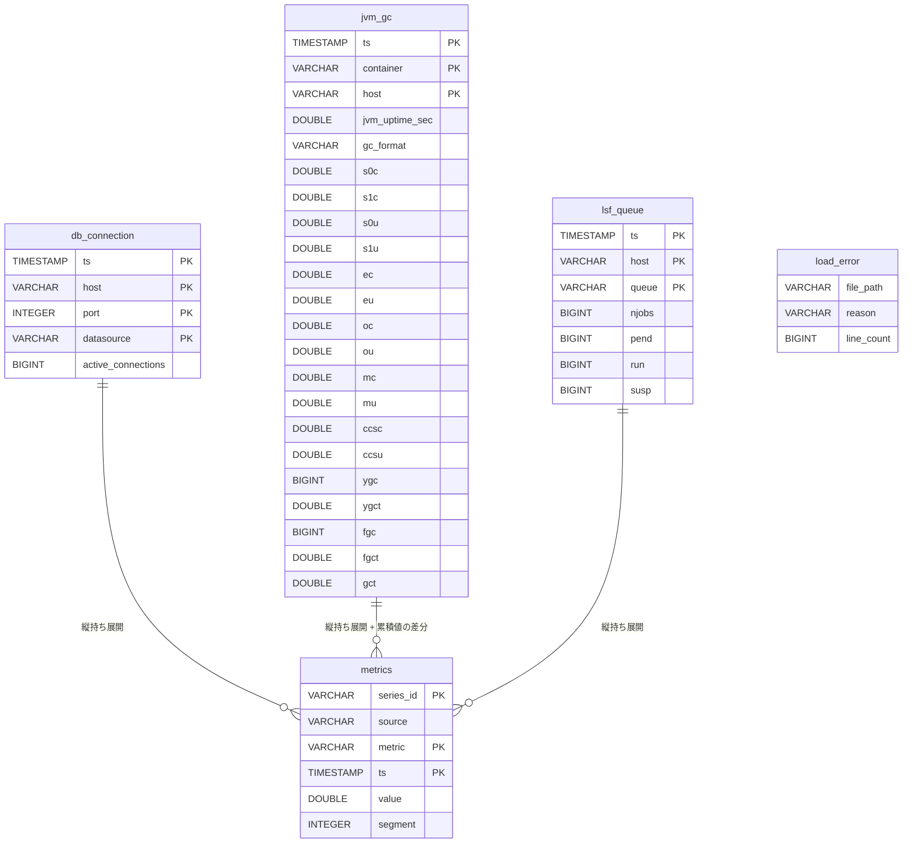
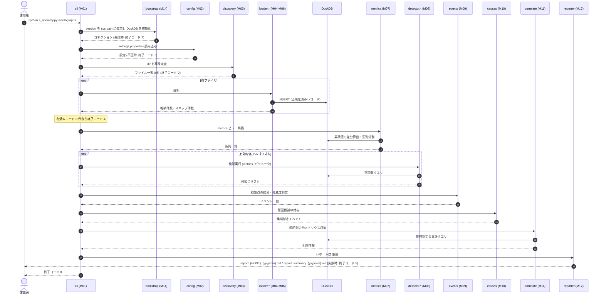
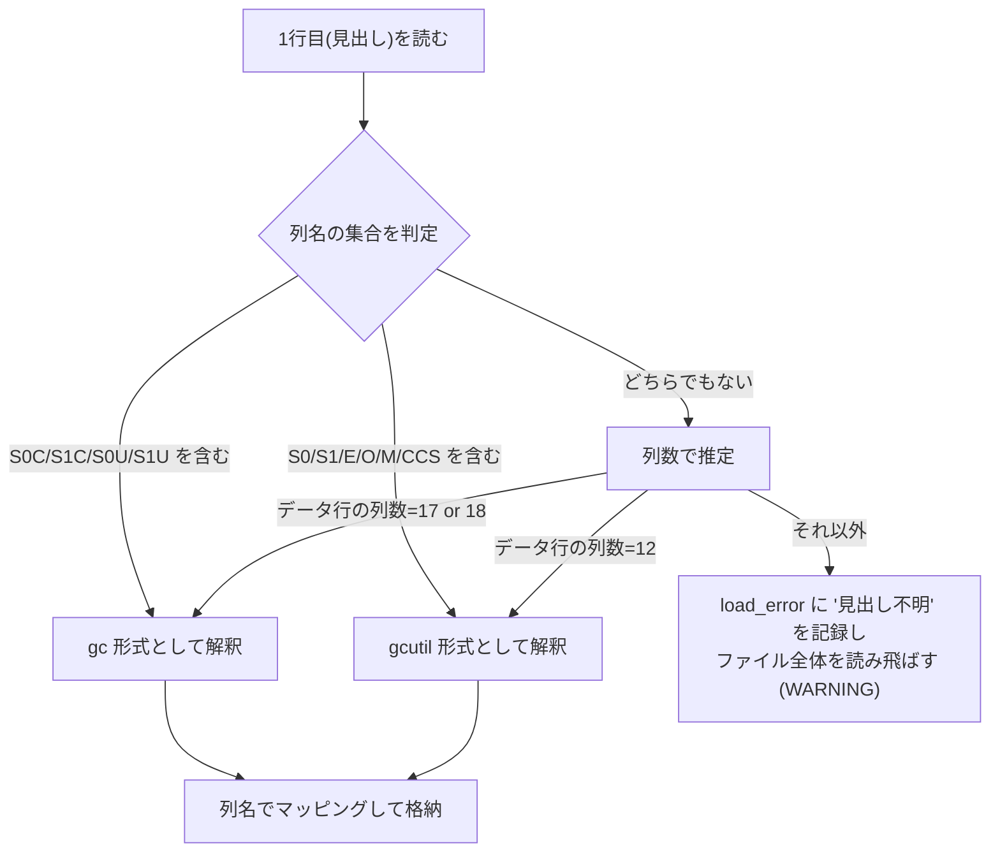

# P002 ユーザインタフェース設計書 — s_anomaly

* 版: 初版
* 入力: `docs/P001-requirement.md`
* 対象フェーズ: P002

> **本書の位置づけ** ★ACCEPTED★
> 本アプリは CLI アプリであり、画面を持たない。`SKILL-P002-frontend-spec.md` がいう「ユーザインタフェース」を、**利用者および後段の LLM から見える外部契約**(コマンドライン引数・設定ファイル・進捗ログ・`report.md`・終了コード)と読み替えて確定する。検討: 画面設計書の節構成をそのまま流用する案は採らなかった。画面・遷移・バリデーションという語彙が対応物を持たず、空章が並ぶだけになるため。残存リスク: 「画面一覧」に対応する章が本書に無いため、P004 のトレーサビリティは P001 6章(コマンド一覧)を起点に取る必要がある。
>
> **P003 との役割分担**: 本書は**外部から観測できる契約**のみを確定する。内部実現方法(アルゴリズムの計算手順、DuckDB の SQL、モジュール分割、メモリ管理)は `docs/P003-backend-spec.md` で確定する。判断に迷う項目には、どちらで決めるかを本文に明記した。

---

## 1. コマンドラインインタフェース (UI-01)

### 1.1 書式

```
python s_anomaly.py <dir>
```

### 1.2 引数・オプションのバリデーションルール

| # | 項目 | 必須/任意 | 型・書式 | 既定値 | バリデーションルール | 違反時の終了コード |
| --- | --- | --- | --- | --- | --- | --- |
| 1 | `<dir>` | 必須 | ディレクトリパス(相対/絶対) | なし | (a) 引数が 1 個であること (b) パスが存在すること (c) ディレクトリであること (d) 読み取り権限があること | 1 |

**UI-01-V01**: 引数が 0 個の場合、使用方法(usage)を標準エラーへ出力して終了コード 1 で終了する。

**UI-01-V02**: 引数が 2 個以上の場合、「引数は 1 個です」と受け取った引数を列挙して終了コード 1 で終了する。★FIXME★ (P001 8.1 のとおり `--from` / `--to` / `--config` / 出力先指定は要求に無いため実装しない。将来追加する場合、余分な引数をエラーにする本規則が変更対象になる)

**UI-01-V03**: パスが存在しない・ディレクトリでない・読めない場合、次の書式で理由を標準エラーへ出力して終了コード 1 で終了する。

```
error: 指定されたパスを読み取れません: {受け取ったパス}
  理由: {存在しません|ディレクトリではありません|読み取り権限がありません}
```

**UI-01-V04**: パスは `pathlib.Path` で解決し、シンボリックリンクをたどる。走査中の循環参照(自分自身を指すリンク)は訪問済みの実パス集合で検出して読み飛ばす。★FIXME★ (循環参照の扱いは P001 に記載がないため Agent が想定)

### 1.3 usage の文言

```
usage: s_anomaly.py <dir>

  <dir>  解析対象のログが格納されたディレクトリ。再帰的に探索します。

対象となるファイル名:
  DBConnection_{yyyymmdd}.csv                    DBコネクションログ
  {コンテナ名}_gc_{ホスト名}_{yyyymmdd}.txt        JavaEE の jstat 出力
  bqueues_{ホスト名}_{yyyymmdd}.txt               LSF のキュー状態

結果はカレントディレクトリの report_{ホスト名}_{年月}.md と report_summary_{年月}.md に出力します。
アルゴリズムの ON/OFF は settings.properties で切り替えます。
```

---

## 2. 設定ファイルの外部仕様 (UI-02)

### 2.1 探索場所

**UI-02-L01**: `s_anomaly.py` と同じディレクトリの `settings.properties` を読む。存在しない場合は全項目を既定値として動作し、その旨を進捗ログの INFO に出す(P001 FR-081)。

### 2.2 キー一覧とバリデーションルール

| セクション | キー | 型 | 既定値 | 許容範囲 | 違反時 |
| --- | --- | --- | --- | --- | --- |
| `[algorithms]` | `ALG-A1` 〜 `ALG-A5`, `ALG-B1` 〜 `ALG-B5`, **`ALG-C1`**(※CR-005) | 真偽値 | `true` | `true` / `false`(大文字小文字を区別しない。`1`/`0`, `yes`/`no` も受理) | 終了コード 3 |
| `[parameters]` | `ALG-A1.window_minutes` | 整数 | 60 | 1 以上 100000 以下 | 終了コード 3 |
| `[parameters]` | `ALG-A1.k_warn` | 実数 | 2.0 | 0 より大きい | 終了コード 3 |
| `[parameters]` | `ALG-A1.k_fatal` | 実数 | 3.0 | `k_warn` より大きい | 終了コード 3 |
| `[parameters]` | `ALG-A2.window_minutes` | 整数 | 60 | 1 以上 100000 以下 | 終了コード 3 |
| `[parameters]` | `ALG-A2.k` | 実数 | 3.0 | 0 より大きい | 終了コード 3 |
| `[parameters]` | `ALG-A3.iqr_warn` | 実数 | 1.5 | 0 より大きい | 終了コード 3 |
| `[parameters]` | `ALG-A3.iqr_fatal` | 実数 | 3.0 | `iqr_warn` より大きい | 終了コード 3 |
| `[parameters]` | `ALG-A4.lambda` | 実数 | 0.2 | 0 より大きく 1 以下 | 終了コード 3 |
| `[parameters]` | `ALG-A4.k` | 実数 | 3.0 | 0 より大きい | 終了コード 3 |
| `[parameters]` | `ALG-A5.z` | 実数 | 3.0 | 0 より大きい | 終了コード 3 |
| `[parameters]` | `ALG-A5.min_weeks` | 整数 | 2 | 1 以上 | 終了コード 3 |
| `[parameters]` | `ALG-B1.short_minutes` | 整数 | 60 | 1 以上 | 終了コード 3 |
| `[parameters]` | `ALG-B1.long_minutes` | 整数 | 1440 | `short_minutes` より大きい | 終了コード 3 |
| `[parameters]` | `ALG-B1.min_run` | 整数 | 60 | 1 以上 | 終了コード 3 |
| `[parameters]` | `ALG-B2.bucket_minutes` | 整数 | 60 | 1 以上 | 終了コード 3 |
| `[parameters]` | `ALG-B2.p_warn` | 実数 | 0.05 | 0 より大きく 1 未満 | 終了コード 3 |
| `[parameters]` | `ALG-B2.p_fatal` | 実数 | 0.01 | 0 より大きく `p_warn` 未満 | 終了コード 3 |
| `[parameters]` | `ALG-B3.window_minutes` | 整数 | 360 | 1 以上 | 終了コード 3 |
| `[parameters]` | `ALG-B3.min_increases` | 整数 | 10 | 2 以上 | 終了コード 3 |
| `[parameters]` | `ALG-B4.baseline_minutes` | 整数 | 1440 | 1 以上 | 終了コード 3 |
| `[parameters]` | `ALG-B4.h` | 実数 | 5.0 | 0 より大きい | 終了コード 3 |
| `[parameters]` | `ALG-B5.min_r2` | 実数 | 0.7 | 0 以上 1 以下 | 終了コード 3 |
| `[parameters]` | `ALG-C1.ratio_pct` | 実数 | 90.0 | 0 より大きく 100 以下 | 終了コード 3 |   ※CR-005
| `[parameters]` | `ALG-C1.min_minutes` | 実数 | 360.0 | 0 より大きい | 終了コード 3 |   ※CR-005
| `[parameters]` | `ALG-C1.min_spread` | 実数 | 1.5 | 1.0 以上 | 終了コード 3 |   ※CR-005
| `[parameters]` | `common.detect_threads` | 整数 | 0 | 0 以上 64 以下。**0 は自動**(`min(8, 論理コア数)`) | 終了コード 3 |   ※CR-007
| `[parameters]` | `common.min_points` | 整数 | 30 | 2 以上 | 終了コード 3 |
| `[parameters]` | `common.sigma_floor_ratio` | 実数 | 0.02 | 0 以上 1 以下 | 終了コード 3 |
| `[parameters]` | `common.sigma_floor_abs` | 実数 | 0.5 | 0 以上 | 終了コード 3 |
| `[parameters]` | `ALG-B2.max_buckets` | 整数 | 2000 | 100 以上 | 終了コード 3 |
| `[parameters]` | `events.severe_pct` | 実数 | 90.0 | 0 より大きく 100 以下 | 終了コード 3 |
| `[parameters]` | `events.merge_gap_minutes` | 整数 | 60 | 0 以上 | 終了コード 3 |
| `[duckdb]` | `max_memory` | 文字列 | `4GB` | DuckDB が受理する容量表記(`^\d+(\.\d+)?(KB|MB|GB|TB)$`) | 終了コード 3 |
| `[duckdb]` | `temp_directory` | 文字列 | `./tmp` | 書き込み可能なパスとして解決できること(存在しなければ作成する) | 終了コード 3 |
| `[chart]` | `enabled` | 真偽値 | `true` | `true` / `false` | 終了コード 3 |   ※CR-009
| `[chart]` | `min_severity` | 文字列 | `FATAL` | `SEVERE` / `FATAL` / `WARN` / `INFO` のいずれか。**大文字小文字を区別** | 終了コード 3 |   ※CR-009
| `[chart]` | `max_per_host` | 整数 | 10 | 0 以上 10000 以下 | 終了コード 3 |   ※CR-009
| `[chart]` | `max_overlay_per_host` | 整数 | 10 | 0 以上 10000 以下 | 終了コード 3 |   ※CR-009
| `[chart]` | `pad_ratio` | 実数 | 0.25 | 0 以上 10 以下 | 終了コード 3 |   ※CR-009
| `[timezone]` | `storage` | 文字列 | `UTC` | **IANA の名前付きタイムゾーン**。固定オフセット不可。大文字小文字を区別 | 終了コード 3 |   ※CR-008
| `[timezone]` | `db_connection` | 文字列 | `UTC` | 同上 | 終了コード 3 |   ※CR-008
| `[timezone]` | `jvm_gc` | 文字列 | `UTC` | 同上 | 終了コード 3 |   ※CR-008
| `[timezone]` | `lsf_queue` | 文字列 | `UTC` | 同上 | 終了コード 3 |   ※CR-008

> **追記(P003 による)**: 上表の末尾 5 キー(`common.sigma_floor_ratio`, `common.sigma_floor_abs`, `ALG-B2.max_buckets`, `events.severe_pct`, `events.merge_gap_minutes`)は、`docs/P003-backend-spec.md` 15章の要請により追加した。それぞれ、ゼロ分散系列での誤検知抑制(DS-08-03)、Mann-Kendall の計算量抑制(DS-08-B2-02)、SEVERE 判定の閾値(DS-09-05)、イベント統合の近接判定(DS-09-01)に必要である。データモデル(6章)への変更はない。

**UI-02-V01**: 未知のセクション・未知のキーは WARNING を出して無視する(P001 FR-083)。

**UI-02-V02**: 値が型変換できない、または許容範囲外の場合、次の書式で標準エラーへ出力して終了コード 3 で終了する。

```
error: settings.properties の設定値が不正です
  [{セクション}] {キー} = {与えられた値}
  理由: {期待する型・範囲}
```

**UI-02-V03**: `[algorithms]` の全キーが `false` の場合、WARNING を出したうえで検知 0 件のレポートを出力し、終了コード 0 で終了する(P001 FR-084)。

> **P003 へ委譲**: 設定値をどのデータ構造で保持するか、各アルゴリズムへどう引き渡すかは `docs/P003-backend-spec.md` で確定する。本書は「どのキーがどの範囲を受理し、外れたときに何が起きるか」という外部契約のみを定める。

---

## 3. 進捗ログの外部仕様 (UI-03)

### 3.1 出力先の振り分け

**UI-03-01**: P001 FR-033 に従い、重大度で出力先を振り分ける。

| 出力先 | 出力する重大度 |
| --- | --- |
| 標準出力 | `INFO` |
| 標準エラー出力 | `WARNING`, `ERROR` |

★FIXME★ P000 第5章は標準出力・標準エラー出力の双方に「動作ログを出力してください」と記載しており、本振り分けは Agent の想定である(P001 8.2 の ★FIXME★ と同一の論点)。

### 3.2 行の書式

```
YYYY-MM-DD HH:MM:SS [LEVEL] [ステップID] メッセージ
```

* `LEVEL`: `INFO` / `WARNING` / `ERROR` の 3 種
* `ステップID`: `S1`〜`S9`(P001 7章の処理フロー)。ステップに属さないもの(起動時・終了時)は `--`

### 3.3 出力する内容

| ステップ | 出力するもの | 重大度 |
| --- | --- | --- |
| `--` | 起動メッセージ(バージョン、Python 版、DuckDB 版、対象ディレクトリ) | INFO |
| S1 | 引数の解決結果(絶対パス) | INFO |
| S2 | 設定ファイルの読み込み元、既定値からの変更点、無効なアルゴリズム名 | INFO |
| S2 | 未知のキーを無視したこと | WARNING |
| S3 | 探索したファイル総数、種別ごとの該当件数、対象外として読み飛ばした件数 | INFO |
| S4 | **1 ファイル読むごとに** `[{処理済}/{総数}] {ファイル名} ({行数}行, スキップ{件})` | INFO |
| S4 | 解析できない行があったファイルと、その理由・件数 | WARNING |
| S5 | 系列数、メトリクス数、対象期間(最小時刻〜最大時刻)、総レコード数 | INFO |
| S6 | **検知の開始時に 1 行** `{個数} アルゴリズムを {系列数} 系列に適用します (並列度 {N})` | INFO |   ※CR-007 で変更
| S6 | **系列 20 件ごとに** `{処理済}/{総数} 系列` | INFO |   ※CR-007 で変更
| S6 | 全系列の完了後に、アルゴリズムごとに `{ALG-ID} 完了: 検知 {件数} 点, スキップ {件数} 系列, 所要 {秒}s(全スレッド合計)` | INFO |
| S6 | 最後に `検知の総所要 {秒}s`(**壁時計**) | INFO |   ※CR-007 で追加
| S6 | アルゴリズムが例外で失敗したこと(系列と理由) | WARNING |
| S7 | 検知点の総数、統合後のイベント数、脅威度別の内訳 | INFO |
| S8 | 相関情報の収集完了 | INFO |
| S9 | 出力した各レポートのパス(絶対パス)とサイズ、および出力ファイル数 ※CR-001により変更 | INFO |
| `--` | 総所要時間と終了コード | INFO |

**UI-03-02**: S4・S6 の進捗行は、**長時間動作中に何も出力されない時間が生じないこと**を目的とする(P001 FR-031)。

★訂正 2026-09-05 / CR-007★ **S6 のループの向きが「検知器ごと」から「系列ごと」へ変わった**ため、
進捗も「アルゴリズム単位の開始 → 系列」から「**系列の消化件数**」に変わった。
アルゴリズムごとの完了行は全系列の処理後にまとめて出る。
**その「所要」は全スレッドの合計であり、壁時計ではない**(スレッドが GIL を待つ時間を含むため、
合計は壁時計より大きくなる)。壁時計は最後の `検知の総所要` 行に出る。

**UI-03-03**: 標準出力・標準エラー出力はいずれも行単位でフラッシュする(リダイレクト時にバッファリングで進捗が見えなくなることを防ぐ)。

---

## 4. レポートの外部仕様 (UI-04) ※CR-001・CR-004により章タイトルを変更

**UI-04-00**: レポートは後段の LLM が読む入力である。したがって**構造の安定性を最優先**とし、検知件数が 0 件でも節構成を省略しない。

**※CR-004により追加。** さらに、**コンテキスト長 4K トークンのローカル LLM で扱えること**を要件とする(FR-077 / FR-078)。イベントを 1 件ずつ並べた本文は原理的に 4K に入らない(1 イベント約 728 バイト ≒ 582 トークン)ため、**列挙(本文)と集計(サマリ)の 2 層構造**を採る。LLM はまずサマリを読み、必要に応じてホスト別ファイルの集計章を読む。

### 4.1 全体構成 ※CR-001・CR-002・CR-003・CR-004により全面改訂

**UI-04-F01**: 出力は**単一の `report.md` ではなく、次の 2 種類のファイル群**である(FR-070)。

| ファイル名 | 内容 | 単位 |
| --- | --- | --- |
| `report_{HOST}_{yyyymm}.md` | そのホスト・その年月のイベント本文 | ホスト × 年月ごとに 1 ファイル |
| `report_summary_{yyyymm}.md` | 全ホスト横断の集計サマリ | 年月ごとに 1 ファイル |

**UI-04-F02**: イベントは、その**ホスト**と、**開始日が属する年月**で振り分ける。
検知イベントが 1 件も無いホスト × 年月の組に対しては、ファイルを作らない。
**分割の前後で、出力されるイベントの集合は変わらない。**

**UI-04-F03**: `{HOST}` はファイル名に使えない文字を `_` に置き換えた形とする。
置き換えの結果として別ホストのファイル名と衝突する場合は、末尾に連番を付して区別する。
**ホスト名にどのような文字が含まれても実行は失敗しない。**

**UI-04-F04**: 検知イベントが 1 件も無い場合でも、**`report_summary_{yyyymm}.md` は必ず生成する**
(FR-078)。この場合、解析した期間が特定できないときは実行日の年月を用いる。

#### 4.1.1 `report_summary_{yyyymm}.md` の構成(FR-078。※CR-004により新設)

````markdown
# 異常検知サマリ 2026-06

## 1. 実行サマリ

| 項目 | 値 |
| --- | --- |
| 実行日時 | 2026-06-15 10:23:45 |
| 対象ディレクトリ | /var/log/apps |
| 対象期間 | 2026-06-01 00:00:00 〜 2026-06-30 23:55:00 |
| 読み込んだファイル数 | 120 |
| 総レコード数 | 950,400 |
| ホスト数 | 17 |
| 系列数 | 110 |
| 検知イベント数 | 7,229 (SEVERE: 416, FATAL: 2,898, WARN: 3,915, INFO: 0) |

## 2. ホスト別の集計

| ホスト | SEVERE | FATAL | WARN | 計 | 主なメトリクス | レポート |
| --- | --- | --- | --- | --- | --- | --- |
| host02 | 17 | 17 | 24 | 58 | active_connections, ou, eu | report_host02_202606.md |
| lsfhost01 | 10 | 23 | 38 | 2,183 | pend, run, njobs | report_lsfhost01_202606.md |

## 3. 日別のイベント数

| 日 | SEVERE | FATAL | WARN | 計 |
| --- | --- | --- | --- | --- |
| 06-01 | 12 | 84 | 131 | 227 |
| 06-02 | 9 | 91 | 118 | 218 |

## 4. 複数ホストで同時に発生したアノマリー

| 時間帯 | ホスト数 | イベント数 | 関与したホスト | 主なメトリクス |
| --- | --- | --- | --- | --- |
| 06-05 14:00〜14:30 | 4 | 11 | host01, host02, host09, lsfhost01 | active_connections, ou, pend |
````

**UI-04-F05**: 「4. 複数ホストで同時に発生したアノマリー」は、4.5 で定める「同時に発生したアノマリー」の
判定結果のうち、**2 つ以上の異なるホストにまたがるもの**を時間帯ごとにまとめたものである。

**UI-04-F06**: **`report_summary_{yyyymm}.md` は 4K トークンのコンテキストに収まること**(FR-078)。
そのために次の制約を置く。

* 「2. ホスト別の集計」は**全ホストを列挙する**(ホスト数はレコード数に比例しないため、規模が伸びても増えない)。
* 「3. 日別のイベント数」は、**対象期間が 31 日を超える場合は週単位に切り替える**。★FIXME★ 90 日規模では日別 90 行で約 4,000 トークンに達する見込みであり、週単位なら 13 行に収まる。切り替えの閾値を 31 日とするのは Agent の想定である。
* 「4. 複数ホストで同時に発生したアノマリー」は**上位 20 行まで**とし、超える場合は件数の多い順に絞る。

#### 4.1.2 `report_{HOST}_{yyyymm}.md` の構成(FR-077)

````markdown
# host01 2026-06 の異常検知レポート

## 1. このホストの集計

| 項目 | 値 |
| --- | --- |
| 対象期間 | 2026-06-01 00:00:00 〜 2026-06-30 23:55:00 |
| 検知イベント数 | 348 (SEVERE: 10, FATAL: 21, WARN: 317, INFO: 0) |

| メトリクス | SEVERE | FATAL | WARN | 計 | 検知手法 |
| --- | --- | --- | --- | --- | --- |
| active_connections | 10 | 21 | 21 | 52 | ALG-A1, ALG-A2, ALG-A4, ALG-B4 |
| ou | 0 | 0 | 25 | 25 | ALG-A1, ALG-B3 |

## 2. 実行サマリ

| 項目 | 値 |
| --- | --- |
| 実行日時 | 2026-06-15 10:23:45 |
| 対象ディレクトリ | /var/log/apps |
| 読み込んだファイル数 | 120 |
| 総レコード数 | 950,400 |
| 系列数(全体) | 110 |
| サマリ | report_summary_202606.md |

## 3. 適用したアルゴリズム

| ID | 名称 | 観点 | 状態 | 主なパラメータ |
| --- | --- | --- | --- | --- |
| ALG-A1 | 移動平均乖離率 | 瞬間的な外れ値 | 有効 | window=60min, k_warn=2.0, k_fatal=3.0 |
| ... | | | | |

## 4. 検知イベント

# イベントID( EVT-20260601-host01-001 )

* イベント種別 : ALG-B3 ローリング最小値の単調増加, ALG-B2 Mann-Kendall 傾向検定
* 脅威度 : SEVERE
* データ : jvm_gc / ou (Old 使用率) / container=app01, host=host01
* 値     : 41.2→45.8→52.3→58.9→64.1→71.5→78.2→85.0→91.3
* 開始   : 2026-06-01 03:00:00
* 終了   : 2026-06-14 23:00:00
* 現象   : 最低値が14日上昇し、回復しない、負荷増はない
* 説明   : 6時間窓のローリング最小値が連続34窓にわたり単調増加した(ALG-B3)。
           Mann-Kendall検定でも有意な増加傾向を検出した(S=+1842, p<0.001, Sen勾配=+3.6%/日)。
           Full GC は期間中に25回発生しているが、GC後もOld使用率の下限が下がっていない。
* 原因候補 : メモリリーク (確度: 高) — ou が単調増加し、fgc_delta も増加、eu に変化がないため
             ヒープサイズ不足 (確度: 低) — 負荷指標(active_connections)に増加が見られないため確度は低い

# イベントID( EVT-20260605-host01-014 )

* イベント種別 : ALG-A1 移動平均乖離率, ALG-A4 EWMA 管理図
* 脅威度 : FATAL
* データ : db_connection / active_connections / host=host01, port=7003, datasource=OraclePool_1
* 値     : 12→14→13→98→95
* 開始   : 2026-06-05 14:00:00
* 終了   : 2026-06-05 14:05:00
* 現象   : 平常値の約 8 倍のスパイクが 2 点連続した
* 説明   : 直近60分の移動平均 13.4、標準偏差 1.2 に対し 98 は 70.5σ に相当する(ALG-A1)。
* 原因候補 : 一時的な負荷スパイク (確度: 中) — 同時刻に他ホストでも同種の外れ値が検知されているため
* 同時に発生したアノマリー :
  - EVT-20260605-host01-015 (同一ホスト) jvm_gc / ou : FATAL / 重なり 5 分
  - EVT-20260605-host09-008 (他ホスト) db_connection / active_connections : FATAL / 重なり 5 分
  - EVT-20260605-lsfhost01-031 (他ホスト) lsf_queue / pend : WARN / 重なり 5 分
````

**UI-04-F07**: **「1. このホストの集計」は 4K トークンのコンテキストに収まること**(FR-077)。
本章はメトリクスの種類数(最大 11)で決まり、**イベント数に比例しない**ため、規模が伸びても増えない。

**UI-04-F08**: 「2. 実行サマリ」には、対応する `report_summary_{yyyymm}.md` のファイル名を載せる。
**どのファイルを見れば全体像が分かるかを、各ファイル単体から辿れるようにするため**である。

**UI-04-F09**: **1 つ目のイベントの直前に置く見出しは `## 4. 検知イベント` である。**
イベント本文の見出し(`# イベントID( ... )`)は `#` 1 個であり Markdown の階層としては逆転するが、
**P000 が指定した書式をそのまま守る**ことを優先する(従来と同じ扱い)。

**UI-04-F10**: 「4. 実行時の注意事項」は**各ホストのファイルに置く**。読み飛ばした行・
点数不足でスキップした系列・失敗したアルゴリズムのうち、**そのホストに関係するものだけ**を載せる。
ホストに紐づけられないもの(ファイル全体の読み込み失敗など)は、**サマリ側**に載せる。

### 4.2 イベント本文の項目仕様

**UI-04-01**: 各項目の生成規則は次のとおり。P001 12章の書式(人間に確認済み)に厳密に従う。

| 項目 | 生成規則 | 空になりうるか |
| --- | --- | --- |
| イベントID | `EVT-{開始日 YYYYMMDD}-{ホスト名}-{連番 3桁ゼロ埋め}` **※CR-003により変更**。連番は**「日 × ホスト」ごと**に 1 から振る。ホスト名が特定できない系列では `unknown` を用いる | 否 |
| イベント種別 | 統合された全アルゴリズムの `{ID} {名称}` をカンマ区切り。P001 FR-061 | 否 |
| 脅威度 | `INFO` / `WARN` / `FATAL` / `SEVERE` のいずれか 1 語。P001 11章 | 否 |
| データ | `{source} / {metric} ({メトリクスの和名}) / {系列キーの各要素}` | 否 |
| 値 | 該当区間の値を `→` で連結。**9 点を超える場合は先頭 4 点 + `…` + 末尾 4 点** に省略する。小数は有効数字 4 桁 | 否 |
| 開始 / 終了 | `YYYY-MM-DD HH:MM:SS`。観点1 の単点検知では開始 = 終了 | 否 |
| 現象 | 検知の型ごとの定型文 + 実測値(4.3 参照) | 否 |
| 説明 | アルゴリズムごとの判定根拠(統計量と閾値)を、統合された数だけ並べる | 否 |
| 原因候補 | P001 12.1 の知識表から引き当てた候補を `{候補} (確度: 高/中/低) — {根拠}` の形で 1 行 1 件。**該当なしの場合は「該当する候補なし (確度: —)」と書く** | 否 |
| 同時に発生したアノマリー | **※CR-002により全面変更**(従来は「同時刻のその他のデータ」)。4.5 の規則で求めた最大 10 件を `- ` の箇条書きにする。**観点2(ALG-B*)を含むイベントでは、この項目行ごと出力しない。** 観点1 のみのイベントで重なる相手が無い場合は `- (同じ時間帯に検知された他のアノマリーはありません)` と書く | 否(ただし観点2 を含むイベントでは項目ごと省略する) |

**UI-04-02**: **すべての項目は必ず出力する。** 値が得られない場合も項目行を省略せず、上表の定型文を書く。**※CR-002による唯一の例外**: 「同時に発生したアノマリー」は、観点2(ALG-B1〜B5)を含むイベントでは項目行ごと出力しない。後段の LLM が項目の欠落を「異常がない」と誤読することを防ぐ。

### 4.3 「現象」欄の定型文

★FIXME★ 定型文の文言は Agent の想定である(P000 は例を 1 つ示すのみ)。

| 検知の型 | 定型文 |
| --- | --- |
| 単点の上振れ | `平常時({平均値})に対し {倍率}倍({値})に跳ね上がった。前後の点は平常範囲` |
| 単点の下振れ | `平常時({平均値})に対し {比率}({値})に落ち込んだ` |
| 連続する逸脱 | `{継続時間}にわたり平常範囲を上回った状態が継続した` |
| 下限の切り上がり | `最低値が{期間}上昇し、回復しない、{負荷指標の状況}` |
| 傾向の増加 | `{期間}で {開始値}から{終了値}へ増加した(平均 {勾配}/日)` |
| 水準シフト | `{時刻}を境に水準が {前水準}から{後水準}へ移行し、元に戻らない` |
| 周期からの逸脱 | `{曜日}{時刻帯}の平常値({平常値})に対し {値}であった` |

### 4.4 出力ファイルの物理仕様 ※CR-001・CR-004により改訂

| 項目 | 仕様 |
| --- | --- |
| パス | カレントディレクトリの `report_{HOST}_{yyyymm}.md` および `report_summary_{yyyymm}.md` |
| 既存ファイル | 上書きする(P001 FR-070) |
| 文字コード | BOM なし UTF-8(P001 NFR-007) |
| 改行 | LF(Windows でも LF。`newline='
'` を明示して開く) |
| 書き込み方式 | **ファイルごとに**一時ファイルへ書き出してから `os.replace` で置換する。途中で失敗したときに壊れたファイルを残さないため |

**UI-04-03**: 検知 0 件の場合、`report_summary_{yyyymm}.md` のみを出力し、
「2. ホスト別の集計」「3. 日別のイベント数」「4. 複数ホストで同時に発生したアノマリー」の各章に
`検知された異常はありません。` の 1 行を置く。**ホスト別のファイルは 1 つも作らない。**

**UI-04-04**: **※CR-001により追加。** 複数のファイルに書き出す途中で失敗した場合、
**既に書き終えたファイルは残す**。全ファイルの書き込みが原子的に成功または失敗することは保証しない。

★ACCEPTED★ 検討: 全ファイルを一時ディレクトリに書いてから一括で差し替える案。
**不採用**: 実装が複雑になるうえ、本アプリは 1 回の解析ごとに全ファイルを作り直すため、
失敗した場合は再実行すればよい。残存リスク: 書き込み途中で失敗すると、
**前回実行時のファイルと今回のファイルが混在した状態になる**。この場合の判別手段は、
各ファイルの「実行日時」欄である。

**UI-04-05**: **※CR-001により追加。前回実行時のファイルは削除しない。**
前回はイベントがあったホストが今回は 0 件だった場合、そのホストの前回のファイルが残る。

★FIXME★ 実行前にカレントディレクトリの `report_*.md` を消すべきかは、
**人間の確認が必要**である。消す方式は、無関係な同名ファイルを巻き添えにする恐れがある。
現状は「消さない」を採り、混在の判別は「実行日時」欄に委ねる。

---

### 4.5 「同時に発生したアノマリー」の生成規則 ※CR-002により新設

**UI-04-C01**: 本欄は、**すべてのイベントが確定したあとで**、イベント同士を突き合わせて求める(FR-075)。
**`metrics` テーブルを参照しない。** 検知済みのイベント同士だけを見る。

**UI-04-C02**: **判定は発生時間の区間の重なりによる。** イベント A(`[a_start, a_end]`)と
イベント B(`[b_start, b_end]`)が「同時」であるとは、`a_start <= b_end` かつ `b_start <= a_end` を満たすことをいう。
**前後に窓幅を足さない**(`events.merge_gap_minutes` は本判定に使わない)。

**UI-04-C03**: **対象は観点1 のイベントのみ**(FR-076)。

* **対象**: 統合された検知アルゴリズムが `ALG-A1`〜`ALG-A5` **のみ**で構成されるイベント。
* **対象外**: `ALG-B1`〜`ALG-B5` を 1 つでも含むイベント。**観点2 のみ・観点1 と観点2 の混在の両方**を含む。
* 対象外のイベントは、**主体としても相手としても本欄に現れない**。それらのイベントには**本欄自体を出力しない**(UI-04-02 の例外)。

**この定義を採る理由**: 観点2 のイベントは区間が長く(実測で最大 30 日)、
**それを含めると解析期間の全体を覆うイベントが他の全件と「同時」になる**。
実測では、混在を含めると「相手が 1 件も無いイベント」が 0 件になり弁別力を失った。
観点1 のみに限ると区間の最大は 16.0 時間に収まり、10.4% が「単独発生」として区別できる。

**UI-04-C04**: 1 イベントあたり**最大 10 件**を出力する。並び順は次の優先順位による。

1. **同一ホストのイベントを優先する**(自ホスト内の同時発生のほうが因果として近いため)
2. **脅威度の高い順**(`SEVERE` > `FATAL` > `WARN` > `INFO`)
3. **重なっている時間の長い順**
4. 上記がすべて同じ場合は**イベント ID の昇順**(再現性のため。NFR-009)

**UI-04-C05**: 各行の書式は次のとおり。

```
  - {相手のイベントID} ({同一ホスト|他ホスト}) {source} / {metric} : {脅威度} / 重なり {時間}
```

例:

```
  - EVT-20260605-host01-015 (同一ホスト) jvm_gc / ou : FATAL / 重なり 5 分
  - EVT-20260605-host09-008 (他ホスト) db_connection / active_connections : FATAL / 重なり 5 分
```

* **相手のイベント ID にホスト名が含まれる**(UI-04-01。CR-003)ため、**どのファイルを開けばよいかが行から分かる。**
* 「重なり」は重複区間の長さを、`分` / `時間` / `日` のうち適切な単位で表す。単点どうしが同一時刻で重なる場合は `0 分` とする。

**UI-04-C06**: 重なる相手が 1 件も無い観点1 のイベントでは、次の 1 行を書く。

```
  - (同じ時間帯に検知された他のアノマリーはありません)
```

**UI-04-C07**: 本欄は **P001 12.1 の原因候補ルールの入力**でもある(FR-074)。
従来は他系列の**平常時との比較**を入力にしていたが、今後は**同時刻に他のアノマリーが検知されているか**を入力とする。
★FIXME★ この読み替えにより、原因候補の引き当たる条件が変わる。実データでの妥当性は要確認である。

---

## 5. 終了コードの外部仕様 (UI-05)

P001 14章の表を外部契約として確定する。**利用者はこの値でスクリプトの成否を判定する。**

| コード | 意味 | レポートを出すか | 標準エラーへの出力 |
| --- | --- | --- | --- |
| 0 | 正常終了(検知 0 件を含む) | 出す | (WARNING があれば出す) |
| 1 | 引数不正 | 出さない | usage + 理由 |
| 2 | 対象ログファイルが 0 件 | 出さない | 探索したパスと対象パターン |
| 3 | 設定ファイル不正 | 出さない | 該当キーと理由(UI-02-V02) |
| 4 | 全ファイルの解析に失敗 | 出さない | ファイルごとの失敗理由 |
| 5 | レポートの書き込み失敗 | 出せない(既に書き終えたファイルは残る。UI-04-04) | 理由 + 検知結果を標準出力へフォールバック |
| 6 | メモリ不足・DuckDB 実行時エラー | 出さない | 理由 + `max_memory` / `temp_directory` の見直し案内 |
| 7 | DuckDB の読み込み失敗(`vendor/` 不一致) | 出さない | 期待する OS・Python 版と実際の値 |
| 99 | 想定外の例外 | 出さない | スタックトレース |

**UI-05-01**: 終了コード 5 のとき、レポートに書けなかった内容の**全文を標準出力へ出す**。長時間の解析結果を書き込み失敗だけで失うことを防ぐ。

---

## 6. データモデル

P001 5章のテーブル定義を、制約とリレーションを含めて確定する。

### 6.1 ER 図



**注**: 3 つの実テーブルと `metrics` の関係は外部キー制約ではなく、**S5 で `metrics` を構築する際のデータフロー**である。DuckDB はインメモリで 1 回の実行のみに使い、参照整合性制約は張らない(P001 の「1 回の分析で読み込んだデータは捨ててよい」による)。

### 6.2 テーブル定義書

#### 6.2.1 `db_connection`

| カラム | 型 | NULL | 制約 | 説明 |
| --- | --- | --- | --- | --- |
| `ts` | TIMESTAMP | NOT NULL | 論理 PK(1/4) | ログの日付列。`yyyy/MM/dd HH:mm:ss` を解釈した値 |
| `host` | VARCHAR | NOT NULL | 論理 PK(2/4) | ホスト名 |
| `port` | INTEGER | NOT NULL | 論理 PK(3/4) | ポート番号 |
| `datasource` | VARCHAR | NOT NULL | 論理 PK(4/4) | データソース名 |
| `active_connections` | BIGINT | NULL 可 | 0 以上 | 値が `-`/空のとき NULL(P001 FR-015) |

#### 6.2.2 `jvm_gc`

| カラム | 型 | NULL | 制約 | 説明 |
| --- | --- | --- | --- | --- |
| `ts` | TIMESTAMP | NOT NULL | 論理 PK(1/3) | jstat 実行時刻(`time` 列) |
| `container` | VARCHAR | NOT NULL | 論理 PK(2/3) | ファイル名から抽出 |
| `host` | VARCHAR | NOT NULL | 論理 PK(3/3) | ファイル名から抽出 |
| `jvm_uptime_sec` | DOUBLE | NULL 可 | 0 以上 | `Timestamp` 列。JVM 再起動検出に使う |
| `gc_format` | VARCHAR | NOT NULL | `gc` / `gcutil` | 見出し行から判別した形式 |
| `s0u`,`s1u`,`eu`,`ou`,`mu`,`ccsu` | DOUBLE | NULL 可 | `gcutil` のとき 0〜100 | 使用量(KB) または 使用率(%) |
| `s0c`,`s1c`,`ec`,`oc`,`mc`,`ccsc` | DOUBLE | NULL 可 | 0 以上 | 容量(KB)。`gcutil` のとき常に NULL |
| `ygc`,`fgc` | BIGINT | NULL 可 | 0 以上・単調非減少 | GC 回数(累積) |
| `ygct`,`fgct`,`gct` | DOUBLE | NULL 可 | 0 以上・単調非減少 | GC 時間(累積秒) |

**注**: `gc_format` が `gcutil` のとき、`-gcutil` の `S0`/`S1`/`E`/`O`/`M`/`CCS` 列(使用率)は `s0u`/`s1u`/`eu`/`ou`/`mu`/`ccsu` に格納する(P001 5.2)。容量列は取得できないため NULL とする。

#### 6.2.3 `lsf_queue`

| カラム | 型 | NULL | 制約 | 説明 |
| --- | --- | --- | --- | --- |
| `ts` | TIMESTAMP | NOT NULL | 論理 PK(1/3) | `time` 列。末尾の 1/100 秒は切り捨てる |
| `host` | VARCHAR | NOT NULL | 論理 PK(2/3) | ファイル名から抽出 |
| `queue` | VARCHAR | NOT NULL | 論理 PK(3/3) | 見出し行の列名から抽出 |
| `njobs`,`pend`,`run`,`susp` | BIGINT | NULL 可 | 0 以上 | 値が `-`/空のとき NULL |

#### 6.2.4 `metrics` (ビュー)

| カラム | 型 | NULL | 説明 |
| --- | --- | --- | --- |
| `series_id` | VARCHAR | NOT NULL | 系列キー。書式は 6.3 |
| `source` | VARCHAR | NOT NULL | `db_connection` / `jvm_gc` / `lsf_queue` |
| `metric` | VARCHAR | NOT NULL | P001 FR-023 の 11 種 |
| `ts` | TIMESTAMP | NOT NULL | |
| `value` | DOUBLE | NULL 可 | NULL の点はアルゴリズムの対象から除外する |
| `segment` | INTEGER | NOT NULL | JVM 再起動などで系列を分割した際の通番。既定 0 |

#### 6.2.5 `load_error`

| カラム | 型 | NULL | 説明 |
| --- | --- | --- | --- |
| `file_path` | VARCHAR | NOT NULL | 相対パス |
| `reason` | VARCHAR | NOT NULL | `列数不一致` / `日付書式不正` / `数値変換不能` / `見出し不明` |
| `line_count` | BIGINT | NOT NULL | 該当した行数 |

各 `report_{HOST}_{yyyymm}.md` の「実行時の注意事項」(読み飛ばした行)の出力元となる。※CR-001により変更

### 6.3 `series_id` の書式

| source | 書式 | 例 |
| --- | --- | --- |
| `db_connection` | `db_connection/{host}:{port}/{datasource}` | `db_connection/host01:7003/OraclePool_1` |
| `jvm_gc` | `jvm_gc/{container}@{host}` | `jvm_gc/app01@host01` |
| `lsf_queue` | `lsf_queue/{host}/{queue}` | `lsf_queue/lsfhost01/normal` |

**UI-06-01**: `series_id` はレポートの「データ」欄と、4.5 の「同時に発生したアノマリー」の並び順(同一ホストの判定)、および**レポートの分割先ホストの決定**(UI-04-F02)に使う。※CR-001・CR-002により変更ホスト名の抽出が必要なため、上表の書式を固定とする。

### 6.4 スキーマの適用方式 (マイグレーション)

`SKILL-P003-backend-spec.md` が要求するマイグレーション方式の明記について、本アプリの事情を先に記す(詳細な手順は P003 が確定する)。

* **適用のタイミングと方式**: プロセス起動のたびに、インメモリの DuckDB に対して `CREATE TABLE` を実行する。永続化されたデータベースファイルを持たない(P001 の「1 回の分析で読み込んだデータは捨ててよい」)。
* **冪等かどうか**: **冪等である。** プロセスごとに新しいインメモリ DB が作られるため、前回実行の状態が残らない。
* **将来 CR でカラムを追加した場合**: 既存の永続データが存在しないため、`ALTER TABLE` による差分適用を必要としない。スキーマ定義を書き換えるだけでよい。
* ★ACCEPTED★ 検討: バージョン管理テーブルを設ける案。**不採用**。永続化しない設計では適用済みバージョンを記録する先が無く、常に初回実行と等価であるため。残存リスク: 将来 CR で「分析結果を永続化して前回と比較する」といった要求が出た場合、本節の前提が崩れる。その時点でマイグレーション方式を設計し直す必要がある。
* **再起動耐性の確認**: 上記のとおりスキーマ適用は自明に冪等だが、**アプリを 2 回連続で実行しても同じ結果になること**は別途確認が必要である(カレントディレクトリの `report.md` の残存、`temp_directory` の残骸が 2 回目に影響しうるため)。この観点は `docs/P006-test-plan.md` に含め、**受け入れ結合テスト(P009)が担当する**。

---

## 7. 処理シーケンス

複数のモジュールをまたぐ流れを明確化する。

### 7.1 正常系の全体シーケンス



### 7.2 jstat 形式の自動判別シーケンス

P001 FR-012 の外部から観測できる振る舞いを示す。



**UI-07-01**: P000 に示された「見出しは `-gc` 系だがデータは `-gcutil`」というファイルは、**見出しの列数(17)とデータの列数(12)が一致しない**。この場合、上図の判定では見出しから `gc` と判定されるが、実データの列数が合わないため、**データ行の列数を優先して `gcutil` として解釈する**。この優先順位を明示する。★FIXME★ (この優先順位は Agent の想定。実ファイルが本当に「見出しだけ `-gc`」なのか、それとも P000 への転記時の混在なのかによって正しい扱いが変わる。P001 20章の確認では列名の綴りのみが確定しており、この混在自体の原因は未確認)

---

## 8. テストデータ生成ツールの外部仕様 (UI-08)

P001 FR-110〜FR-113 に対応する。

### 8.1 書式

```
python tools/gen_testdata.py <出力先dir> [--broken]
```

| # | 項目 | 必須/任意 | バリデーション | 違反時 |
| --- | --- | --- | --- | --- |
| 1 | `<出力先dir>` | 必須 | 書き込み可能なパスとして解決できること(存在しなければ作成する) | 終了コード 1 |
| 2 | `--broken` | 任意 | フラグ。指定時は FR-112 の破損データのみを生成する | — |

### 8.2 生成物

| ファイル | 内容 |
| --- | --- |
| `{出力先}/logs/DBConnection_{yyyymmdd}.csv` | ①。14 日分 × ホスト 2 台 × ポート 1 × データソース 3 |
| `{出力先}/logs/{container}_gc_{host}_{yyyymmdd}.txt` | ②。14 日分 × **2 組**(`app01@host01` と `app02@host02`。全組み合わせではなく、この 2 組のみ) = 28 ファイル。**`app01` は `-gcutil` 形式、`app02` は `-gc` 形式**で出力し、FR-012 の両形式を確実に踏む |
| `{出力先}/logs/bqueues_{host}_{yyyymmdd}.txt` | ③。14 日分 × ホスト 1 × QUEUE 3 |
| `{出力先}/expected.json` | 正解ファイル(8.3) |

**UI-08-01**: サンプリング間隔は 5 分固定とする(14 日 × 288 点/日 = 4,032 点/系列)。ALG-A5 が要求する最小 2 週間(UI-02 の `ALG-A5.min_weeks`=2)をちょうど満たす。★FIXME★ (間隔と期間は Agent の想定。実環境の採取間隔が異なる場合、10.4 のパラメータ既定値も見直しが必要)

**UI-08-02**: 乱数シードを `20260601` に固定し、同じ引数で常に同一のファイル群を生成する(P001 FR-110)。

### 8.3 `expected.json` の書式

```json
{
  "generated_at": "2026-06-01T00:00:00",
  "seed": 20260601,
  "period": {"from": "2026-06-01T00:00:00", "to": "2026-06-14T23:55:00"},
  "injected": [
    {
      "id": "INJ-001",
      "kind": "spike",
      "series_id": "db_connection/host01:7003/OraclePool_1",
      "metric": "active_connections",
      "from": "2026-06-05T14:00:00",
      "to": "2026-06-05T14:00:00",
      "expect_algorithms": ["ALG-A1", "ALG-A2", "ALG-A3"],
      "expect_min_severity": "WARN",
      "description": "平常値の10倍のスパイクを1点だけ埋め込む"
    }
  ],
  "clean_series": [
    "lsf_queue/lsfhost01/short"
  ]
}
```

| 項目 | 意味 |
| --- | --- |
| `injected[].expect_algorithms` | **少なくともこの中の 1 つ**が検知すべきアルゴリズム。全アルゴリズムの一致は求めない(手法ごとに感度が異なるため) |
| `injected[].expect_min_severity` | 検知されたイベントの脅威度がこれ以上であること |
| `clean_series` | **いかなるアルゴリズムも検知してはならない**系列(誤検知の確認用) |

**UI-08-03**: 結合テスト(P001 FR-113)は `expected.json` を読み、**レポート群を解析して**次を判定する。※CR-001により変更。判定は全ファイルを合わせた集合に対して行う。

| 判定 | 合格条件 |
| --- | --- |
| 検知漏れ(false negative) | `injected` の全件について、`expect_algorithms` のいずれかを含むイベントが、期間が重なる形で存在すること |
| 誤検知(false positive) | `clean_series` に属する検知点が、その系列の総点数の **1% 未満**であり、かつ **SEVERE のイベントが 0 件**であること。★FIXME★ **当初は「1 件も存在しないこと」としていたが、P102 の実装で達成不能であることが判明したため改めた**(`docs/ADR.md` ADR-012)。4,000 点の系列に 2σ の判定を当てると正規分布のノイズだけで約 180 点が閾値を超えるため、統計的手法である以上「0 件」は期待できない。この基準の妥当性は実データでの確認が必要である |
| 脅威度 | 各 `injected` に対応するイベントの脅威度が `expect_min_severity` 以上であること |

★FIXME★ 「期間が重なる」の許容幅を、埋め込み区間の前後 1 窓幅(既定 60 分)までとするのは Agent の想定である。傾向系(ALG-B*)は検知の開始時刻が本質的に遅れるため、この許容がないと判定が厳しすぎる。

---

## 9. P001 のスコープとの対応

`SKILL-P002-frontend-spec.md` の規定「`docs/P001-requirement.md` になかった画面や API をここで新たに追加しない」に従い、本書が確定したものはすべて P001 に対応物を持つ。

| 本書 | 対応する P001 の要求 |
| --- | --- |
| 1章 コマンドラインインタフェース | FR-030, 6章, 8.1 |
| 2章 設定ファイル | FR-080〜FR-084, 13章 |
| 3章 進捗ログ | FR-031, FR-033, 8.2 |
| 4章 レポート | FR-070〜FR-078, 12章 ※CR-004により FR-078 を追加 |
| 5章 終了コード | FR-090〜FR-092, 14章 |
| 6章 データモデル | FR-020〜FR-023, 5章 |
| 7章 処理シーケンス | 7章, FR-012 |
| 8章 テストデータ生成ツール | FR-110〜FR-113, 18.1 |

### 9.1 詳細化の過程で気づいたスコープの抜け漏れ (拡張はしない)

`SKILL-P002-frontend-spec.md` の規定に従い、**勝手に拡張せず指摘のみを行う**。

| # | 気づいた点 | なぜ問題になりうるか | 本書での扱い |
| --- | --- | --- | --- |
| 1 | レポートの出力先がカレントディレクトリ固定である | 同一ディレクトリで複数回・複数対象を分析すると、前回の結果が上書きされる。P001 NFR-010 で同時実行を考慮しないと決めているため矛盾はしないが、運用上は不便になりうる | 拡張しない。`--output` は追加しない |
| 2 | 分析対象期間を絞る手段がない | 「膨大な量のログ」を毎回全件読むことになり、NFR-002 の実行時間目標に影響しうる | 拡張しない。`--from`/`--to` は追加しない |
| 3 | `-gc` 形式では使用量(KB)、`-gcutil` 形式では使用率(%)と、**同じ `ou` メトリクスでも単位が異なる** | 両形式が混在する環境では、`ou` の閾値(P001 11章の「使用率 90% 超で SEVERE」)が `-gc` 形式のホストに適用できない | 本書 6.2.2 で単位の差を明記した。**判定規則の切り分けは P003 で確定する**(内部実装の問題であるため) |
| 4 | 系列ごとの「正常な上限値」(ヒープ最大量、コネクションプール上限)を知る手段がない | P001 11章の SEVERE 判定は使用率に依存するが、`-gc` 形式では容量列(`oc`)から計算できる一方、`db_connection` には上限の情報が無い | 拡張しない。`db_connection` の SEVERE 判定は使用率を用いない規則とする旨を **P003 で確定する** |

---

## P012 による修正履歴

`docs/P010-design-review.md`(1 回目)が検出した矛盾点にもとづき、本書を次のとおり修正した。

| 矛盾点 | 修正内容 | 根拠 |
| --- | --- | --- |
| #3 | 8.2 の ② の生成規模を「コンテナ 2 × ホスト 2」から「2 組(`app01@host01` と `app02@host02`)= 28 ファイル」に明確化した | `docs/P011-impact-analysis.md` 2.3 |
| #9 | 6.1 の ER 図の `metrics` エンティティに `segment` 列を追加した(6.2.4 のテーブル定義と一致させた) | `docs/P011-impact-analysis.md` 2.9 |
