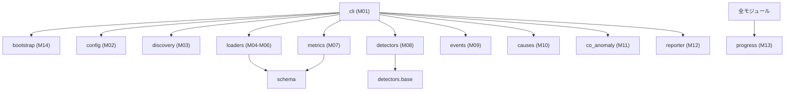

# P003 システム詳細設計書 — s_anomaly

* 版: 初版
* 入力: `docs/P001-requirement.md`, `docs/P002-frontend-spec.md`
* 対象フェーズ: P003

> **本書の位置づけ**
> `docs/P002-frontend-spec.md` が確定した外部契約(引数・設定・ログ・`report.md`・終了コード・データモデル)を、**どう成り立たせるか**を確定する。本書は P007(プログラム実装定義)が実装指示を書けるだけの粒度を持つ。
>
> 本アプリは HTTP API を持たないため、`SKILL-P003-backend-spec.md` のいう「全エンドポイントの内部仕様」を **P001 9章の内部モジュール M01〜M14 の内部仕様**と読み替える。

---

## 1. 全体構成

### 1.0 言語バージョンの制約

**DS-00-01**: コードは **Python 3.9 で動作する範囲**の構文・標準ライブラリのみを使う(P001 3.1、根拠は P004 4章)。具体的に禁止するもの:

| 使わないもの | 代わりに使うもの | 理由 |
| --- | --- | --- |
| `X \| None` 形式の型注釈(実行時評価されるもの) | `typing.Optional[X]` / `typing.Union` | 3.10 以降でしか実行時に評価できない |
| `match` 文 | `if` / `elif` | 3.10 以降 |
| `tomllib` | `configparser`(既に採用済み) | 3.11 以降 |
| `itertools.pairwise` | `zip(seq, seq[1:])` | 3.10 以降 |
| `dataclasses` の `slots=True` | 指定しない | 3.10 以降 |
| `str.removeprefix` / `removesuffix` | スライス | 3.9 で使用可能だが、より古い版への保険として避ける ★FIXME★ (3.9 で使えるため必須の制約ではない。下限をさらに下げる可能性に備えた予防的な制約であり、不要と判断すれば外してよい) |

**DS-00-02**: 本書のコード例に現れる `Path | None` 等の記法は説明のためのものであり、**実装では `Optional[Path]` に読み替える**。

**DS-00-03**: 検証は Windows(Python 3.14.2)と Linux(WSL2 Ubuntu, Python 3.10.12)の両方で行う。3.9 そのものの実行環境は無いため、3.9 互換性は**構文レベルの制約遵守**によって担保する。★FIXME★ (3.9 実機での検証は行えない。`python_requires` の宣言と、上表の制約遵守をレビューで確認する)

### 1.1 ディレクトリ構成

**DS-01-00**: コードの格納先は、プロジェクトルート直下の **`app/`** とする(`SKILL-P007-impl-direction.md` の規定「単一アプリの場合は `app/` とする」に従う)。以下のツリーはすべて `app/` を起点とする。配布時は `app/` の中身一式をコピーする。

```
AnomalyDetect/
└── app/                       ← ソースツリー(配布単位)
    ├── s_anomaly.py               エントリポイント(薄い起動スクリプト)
    ├── settings.properties        既定の設定ファイル
    ├── README.md                  P302 が作成(FR-100/FR-101)
    ├── VERSION                    バージョン文字列
    ├── INDEX.md                   P020/P104 が作成・更新
    └── src/
        └── s_anomaly/
            ├── __init__.py
            ├── bootstrap.py       M14 vendor/ の解決と DuckDB 初期化
            ├── cli.py             M01 引数解析・全体制御・終了コード決定
            ├── config.py          M02 settings.properties の読み込みと検証
            ├── discovery.py       M03 ファイル探索と種別判定
            ├── errors.py          AppError とその派生(終了コードの定義。DS-01-01)
            ├── schema.py          DuckDB のスキーマ定義(DDL)
            ├── loaders/
            │   ├── __init__.py    共通の解析ユーティリティ
            │   ├── dbconn.py      M04
            │   ├── jstat.py       M05
            │   └── bqueues.py     M06
            ├── metrics.py         M07 metrics テーブル構築
            ├── detectors/
            │   ├── __init__.py    レジストリ(ID → 実装の対応)
            │   ├── base.py        検知点(Detection)の定義と共通ヘルパ
            │   ├── a1_ma_sigma.py     ALG-A1
            │   ├── a2_hampel.py       ALG-A2
            │   ├── a3_tukey.py        ALG-A3
            │   ├── a4_ewma.py         ALG-A4
            │   ├── a5_seasonal.py     ALG-A5
            │   ├── b1_ma_cross.py     ALG-B1
            │   ├── b2_mann_kendall.py ALG-B2
            │   ├── b3_rolling_min.py  ALG-B3
            │   ├── b4_cusum.py        ALG-B4
            │   └── b5_regression.py   ALG-B5
            ├── events.py          M09 統合・脅威度判定
            ├── causes.py          M10 原因候補(ルール表)
            ├── co_anomaly.py      M11 同時に発生したアノマリー ※CR-002により correlate.py から改称
            ├── reporter.py        M12 report.md 生成
            └── progress.py        M13 進捗ログ

app/ の続き:
    ├── vendor/
    │   ├── README.md              入手手順(P302 が整備)
    │   ├── linux-x86_64-cp310/    DuckDB を展開したもの
    │   └── win-amd64-cp314/
    ├── tools/
    │   └── gen_testdata.py        テストデータ生成(FR-110)
    └── tests/
        ├── unit/                  単体テスト(unittest)
        ├── integration/           結合テスト
        ├── acceptance/            受け入れ・システムテスト(P009)
        ├── fixtures/              小規模な固定テストデータ(Git 管理)
        └── _work/                 生成テストデータ(Git 管理しない)
```

**DS-01-01**: `vendor/` のサブディレクトリ名は `{os}-{arch}-cp{major}{minor}` である(DS-14-01)。上のツリーに示した `linux-x86_64-cp310` / `win-amd64-cp314` は**検証環境に対応するもの**であり、配布先の Python 版に合わせて用意し直す必要がある(P001 3.1 の ★FIXME★)。

**DS-01**: `s_anomaly.py` は `src/` を `sys.path` に追加して `s_anomaly.cli:main()` を呼ぶだけの薄いスクリプトとする。P001 の「スクリプトそのまま」を満たしつつ、内部をパッケージとして分割する。

★ACCEPTED★ 検討: 全体を 1 ファイルの巨大スクリプトにする案(「スクリプトそのまま」の最も素朴な解釈)。**不採用**。11 個のアルゴリズムと 3 種のローダを含むため数千行になり、単体テストの対象を切り出せなくなるため。残存リスク: 配布時にディレクトリ構造を保ってコピーする必要がある(単一ファイルのコピーでは済まない)。この点は README(P302)に明記する。

### 1.2 依存関係の方向



**DS-02**: 依存は一方向とし、循環を作らない。`detectors` は DuckDB コネクションと設定のみを受け取り、`events` 以降を知らない。

---

## 2. M14 `bootstrap` — vendor 解決と DuckDB 初期化

**DS-14-01**: 起動直後、`import duckdb` より前に次を実行する。

```python
def resolve_vendor_dir(app_root: Path) -> Path | None:
    """実行環境に対応する vendor/ サブディレクトリを返す。無ければ None。"""
    # 例: linux-x86_64-cp311, win-amd64-cp313
    tag = f"{_os_tag()}-{_arch_tag()}-cp{sys.version_info.major}{sys.version_info.minor}"
```

| 判定 | 値 |
| --- | --- |
| `_os_tag()` | `sys.platform` が `win32` なら `win`、`linux` なら `linux`、それ以外はその値 |
| `_arch_tag()` | `platform.machine()` を小文字化。`amd64`/`x86_64` はそのまま使う |

**DS-14-02**: 解決手順は次の順で試し、最初に成功したものを採る。

1. `vendor/{tag}/` が存在すれば `sys.path` の**先頭**に挿入する
2. `vendor/{tag}/` が無く、かつ既に環境へ DuckDB が導入されている場合(`import duckdb` が成功する)はそれを使い、INFO ログに「vendor を使わず環境の DuckDB を使用」と記録する
3. いずれも失敗した場合、**終了コード 7** で終了する(P002 UI-05)

★ACCEPTED★ 検討: 2 の「環境の DuckDB へのフォールバック」を設けない案。**不採用**。開発環境・CI では `pip install duckdb` 済みの環境で動かすほうが自然であり、この経路が無いと開発中も常に `vendor/` を用意する必要が生じるため。残存リスク: 配布先で `vendor/` の用意を忘れても、たまたま環境に DuckDB があれば動いてしまい、同梱漏れに気づけない。これを防ぐため、**フォールバック経路を通ったことを INFO ログと `report.md` の 1 章に必ず記録する**。

**DS-14-03**: 終了コード 7 のメッセージは、切り分けができるよう次を含める。

```
error: DuckDB を読み込めませんでした
  期待した vendor ディレクトリ: {app_root}/vendor/{tag}
  実行中の環境: OS={sys.platform}, アーキテクチャ={platform.machine()}, Python={x.y.z}
  用意されている vendor: {vendor/ 配下のディレクトリ名の一覧}
  対処: README.md の「vendor の準備」を参照してください
```

**DS-14-04**: DuckDB コネクションの初期化。

```sql
-- 設定値 (P002 UI-02) を反映する
SET memory_limit = '{max_memory}';
SET temp_directory = '{temp_directory}';
SET preserve_insertion_order = false;   -- 大量 INSERT のメモリ削減
```

`temp_directory` は存在しなければ作成する。作成に失敗した場合は終了コード 3(設定不正)とする。

★FIXME★ DuckDB のバージョンによって `SET memory_limit` と `SET max_memory` の別名が異なる。実装時に **`SET memory_limit` を第一候補とし、失敗したら `SET max_memory` を試す**フォールバックを入れる(検証環境は DuckDB 1.5.5)。

---

## 3. M02 `config` — 設定の読み込みと検証

**DS-02-01**: `configparser.ConfigParser` を用い、P002 2.2 の表を **1 つの宣言的なスキーマ定義**として持つ。

```python
@dataclass(frozen=True)
class Param:
    section: str
    key: str
    kind: type          # bool / int / float / str
    default: object
    validate: Callable[[object, "Config"], str | None]  # エラー理由 or None
```

**DS-02-02**: 検証は 2 段階で行う。

1. **単項検証**: 型変換と範囲(例: `ALG-A4.lambda` は 0 < x <= 1)
2. **相関検証**: 他のキーとの関係(例: `k_fatal > k_warn`, `long_minutes > short_minutes`, `p_fatal < p_warn`)

相関検証は全キーの単項検証が終わったあとに実行する。**最初の 1 件で止めず、全違反を集めて一括で出力する**(利用者が 1 回の実行で全問題を直せるようにするため)。

**DS-02-03**: 真偽値の受理は `configparser` の `getboolean` に従う(`true/false`, `yes/no`, `on/off`, `1/0`。大文字小文字を区別しない)。P002 UI-02 の記載と一致する。

**DS-02-04**: 未知のキーは WARNING を出して無視する。ただし**既知のアルゴリズム ID に似た綴り**(例: `ALG-A6`, `alg-a1`)については、`[algorithms]` セクション内の未知キーであることを理由に、より強い WARNING 文言(「アルゴリズム ID として解釈されませんでした。有効な ID は …」)を出す。設定したつもりで効いていない事故を防ぐ。

---

## 4. M03 `discovery` — ファイル探索と種別判定

**DS-03-01**: `os.walk` で再帰走査する。各ファイル名を次の正規表現に順に照合し、最初に一致した種別とする。

| 種別 | 正規表現 | 抽出する値 |
| --- | --- | --- |
| ① `db_connection` | `^DBConnection_(\d{8})\.csv$` | 日付 |
| ② `jvm_gc` | `^(.+)_gc_(.+)_(\d{8})\.txt$` | コンテナ名, ホスト名, 日付 |
| ③ `lsf_queue` | `^bqueues_(.+)_(\d{8})\.txt$` | ホスト名, 日付 |

**DS-03-02**: ② の正規表現は貪欲一致だと `{コンテナ名}` が `a_gc_b` のような名前を飲み込む。**`_gc_` を区切りとして最後の 2 つの `_` 区切り要素を後ろから取る**方式で解決する。

```python
# 例: "app01_gc_host01_20260601.txt"
stem = name[:-4]                    # 拡張子を除く
parts = stem.rsplit("_", 1)         # [..., "20260601"]
date = parts[1]
rest = parts[0].rsplit("_gc_", 1)   # ["app01", "host01"]
container, host = rest[0], rest[1]
```

`_gc_` を含まない、または日付部が 8 桁数字でない場合は種別なしとして読み飛ばす。

★FIXME★ ホスト名自体に `_gc_` が含まれる可能性は考慮していない(Agent の想定)。`rsplit("_gc_", 1)` は**最後の** `_gc_` で分割するため、コンテナ名側に `_gc_` があっても正しく動くが、ホスト名側にあると誤る。

**DS-03-03**: シンボリックリンクの循環を防ぐため、訪問済みディレクトリの実パス(`Path.resolve()`)を集合で保持し、既訪問なら降りない(P002 UI-01-V04)。

**DS-03-04**: 探索結果は `list[LogFile]` として返す。`LogFile` は `path`, `kind`, `container`, `host`, `date` を持つ。**日付順・パス順に安定ソート**してから返す(P001 NFR-009 の再現性のため。同一時刻の重複レコードで「先に読み込んだ 1 件を採用」(FR-013)する規則が、走査順に依存しないようにする)。

---

## 5. M04〜M06 `loaders` — 解析と格納

### 5.1 共通方針

**DS-LD-01**: どのローダも次のシグネチャに従う。

```python
def load(con, logfile: LogFile, progress) -> LoadResult:
    """LoadResult: ok_rows, skipped_rows, errors: list[(reason, count)]"""
```

**DS-LD-02**: 文字コードは `utf-8-sig` で開く(BOM 付き UTF-8 を透過的に扱える。BOM なしでもそのまま読める。P001 NFR-007)。デコードに失敗した場合は `cp932` で再試行し、それも失敗したらファイル全体を `load_error` に **`見出し不明`** として記録して読み飛ばす。理由コードは DS-LD-05 の 4 種に限定されており(`docs/P002-frontend-spec.md` 6.2.5 が定める外部契約)、`文字コード不明` という 5 種目を作らない。文字コードが判別できないファイルは**内容から列構成を判別できない**状態であり、意味的に `見出し不明`(「1 行目から列構成を判別できない」)に含まれる。**失われる情報は WARNING ログに具体的な理由(「UTF-8 でも CP932 でもデコードできません」)を出すことで補う。** ★FIXME★ (cp932 へのフォールバックは Agent の想定。P001 NFR-007 の「入力が Shift_JIS の可能性」への保険)

**DS-LD-03**: 改行は Python のユニバーサル改行(`newline=None`)に任せ、CRLF/LF を透過的に扱う。

**DS-LD-04**: 挿入は 1 行ずつではなく **10,000 行ごとのバッチ**で行う(NFR-002 の性能目標のため)。バッチ境界でのみ進捗を更新する。

> **P102 による方式変更(ADR-011)**: 当初は `executemany` を指定していたが、実測で 500〜600 行/秒しか出ず NFR-002 を満たせないことが判明した。**一時 CSV へ書き出して `read_csv` で一括投入する方式**に変更した(約 143,000 行/秒)。詳細と計測値は `docs/ADR.md` ADR-011 を参照。

**DS-LD-05**: 行の解析失敗は例外を投げず、理由コードを返して集計する(P001 FR-014)。理由コードは P002 6.2.5 の 4 種に限定する。

| 理由コード | 条件 |
| --- | --- |
| `列数不一致` | 期待する列数と異なる |
| `日付書式不正` | 時刻列を `datetime` に変換できない |
| `数値変換不能` | 数値列が `-`/空 以外で変換できない(`-`/空 は NULL 扱いで正常。FR-015) |
| `見出し不明` | 1 行目から列構成を判別できない(ファイル全体を読み飛ばす) |

### 5.2 M04 `loaders.dbconn`

* 区切り: `,`(`csv.reader`)
* 期待する列数: 5
* 見出し行: 1 行目を読み飛ばす。列名の検証は行わない(P000 の見出しが日本語であり、環境差の可能性があるため)★FIXME★ (列名を検証しないのは Agent の想定。列順が固定である前提を置いている)
* 日付: `%Y/%m/%d %H:%M:%S`
* `port` は整数へ変換。失敗時は `数値変換不能`

### 5.3 M05 `loaders.jstat`

**DS-05-01**: 形式判別は P002 7.2 の流れに従う。実装は次の順で判定する。

```python
COLS_GCUTIL = ["S0","S1","E","O","M","CCS","YGC","YGCT","FGC","FGCT","GCT"]
COLS_GC     = ["S0C","S1C","S0U","S1U","EC","EU","OC","OU","MC","MU",
               "CCSC","CCSU","YGC","YGCT","FGC","FGCT","GCT"]
```

1. 見出し行を空白で分割し、先頭の `time` と `Timestamp` を除いた残りを取得する
2. **最初のデータ行の列数**を数える(時刻の 2 トークン `yyyy/MM/dd` と `HH:mm:ss` を 1 つの時刻として結合したあとの値の個数)
3. 値の個数が 12 なら `gcutil`(Timestamp + 11 列)、17 または 18 なら `gc` と判定する
4. 3 で決まらない場合のみ、見出しの列名集合で判定する
5. どちらでも決まらなければ `見出し不明` として、ファイル全体を読み飛ばす

**DS-05-02**: 上記のとおり**データ行の列数を見出しより優先する**(P002 UI-07-01)。P000 に示されたサンプルは見出しが `-gc` 系・データが `-gcutil` であり、見出しを信じると全行が `列数不一致` になってファイルが丸ごと失われるため。

**DS-05-03**: 列のマッピング。

| 形式 | 読み取り位置 | 格納先 |
| --- | --- | --- |
| `gcutil` | S0, S1, E, O, M, CCS | `s0u`, `s1u`, `eu`, `ou`, `mu`, `ccsu`(いずれも %) |
| `gcutil` | (容量列は存在しない) | `s0c`,`s1c`,`ec`,`oc`,`mc`,`ccsc` は NULL |
| `gc` | S0C,S1C,S0U,S1U,EC,EU,OC,OU,MC,MU,CCSC,CCSU | 同名の列(いずれも KB) |
| 共通 | YGC, YGCT, FGC, FGCT, GCT | 同名の列 |

**DS-05-04**: `-gc` 形式で `CCSU` 列が無い(17 列)場合は `ccsu` を NULL とする。Java 8 の `-gc` は 17 列(CCSU を含まない構成)と 18 列の両方が存在するため。★FIXME★ (Java 8 の jstat の列構成にはビルドによる差があり、Agent は 17/18 の両方を受理する設計とした)

**DS-05-05**: 時刻は 2 トークン(`2026/06/01` と `00:00:01`)を結合して `%Y/%m/%d %H:%M:%S` で解釈する。

### 5.4 M06 `loaders.bqueues`

**DS-06-01**: 見出し行を `,` で分割し、`time` 以外の各列名を `^(?P<queue>.+)_(?P<field>NJOBS|PEND|RUN|SUSP)$` で解析して QUEUE 名とフィールドの対応表を作る。

**DS-06-02**: 1 データ行から、QUEUE ごとに 1 レコードを生成する(横持ち → 縦持ち)。ある QUEUE について 4 フィールドすべてが揃っていない場合は、欠けたフィールドを NULL として格納する。

**DS-06-03**: 時刻は `%Y-%m-%d %H:%M:%S` で解釈する。**末尾に `:SS`(1/100 秒)が付いている場合は切り落とす**(P001 4.3、人間に確認済み)。

```python
# "2026-06-01 00:00:00:02" -> "2026-06-01 00:00:00"
m = re.match(r"^(\d{4}-\d{2}-\d{2} \d{2}:\d{2}:\d{2})(?::\d+)?$", token)
```

`-` 区切りだけでなく `/` 区切りも受理する(環境差への保険)。★FIXME★ (`/` 区切りの受理は Agent の想定)

### 5.5 重複レコードの排除 (FR-013)

**DS-LD-06**: 各テーブルの論理 PK(P002 6.2)で重複を排除する。実装は**格納後に一括で行う**(1 行ごとの存在確認は遅いため)。

```sql
-- 例: db_connection
CREATE OR REPLACE TABLE db_connection AS
SELECT * FROM (
  SELECT *, row_number() OVER (
      PARTITION BY ts, host, port, datasource ORDER BY _load_seq
  ) AS _rn
  FROM db_connection
) WHERE _rn = 1;
```

`_load_seq` は挿入順の通番。DS-03-04 の安定ソートと合わせて、「先に読み込んだ 1 件を採用」(FR-013)が決定的になる。

---

## 6. M07 `metrics` — 統一ビューの構築

### 6.1 系列の分割 (segment)

**DS-07-01**: `jvm_gc` は JVM 再起動をまたぐと累積値がリセットされる。`jvm_uptime_sec` が直前レコードより**小さくなった点**を再起動とみなし、そこで `segment` を +1 する。

```sql
SELECT *, sum(CASE WHEN jvm_uptime_sec < prev_uptime THEN 1 ELSE 0 END)
             OVER (PARTITION BY container, host ORDER BY ts) AS segment
FROM (SELECT *, lag(jvm_uptime_sec) OVER (PARTITION BY container, host ORDER BY ts) AS prev_uptime
      FROM jvm_gc)
```

`jvm_uptime_sec` が NULL の場合は、**累積値 `gct` の減少**を代替の判定に使う。★FIXME★ (代替判定は Agent の想定)

**DS-07-02**: `db_connection` と `lsf_queue` は `segment` を常に 0 とする(リセットの概念がないため)。

### 6.2 累積値の差分 (FR-021)

**DS-07-03**: `ygc`/`ygct`/`fgc`/`fgct`/`gct` から、区間あたりの値を導出する。

```sql
CASE WHEN segment = prev_segment AND fgc >= prev_fgc
     THEN fgc - prev_fgc
     ELSE NULL END AS fgc_delta
```

`segment` が変わった点(再起動直後)と、値が減少した点は NULL とする。

**DS-07-04**: 導出するメトリクス名は `ygct_delta`, `fgc_delta`, `fgct_delta` とする(P001 FR-023)。`ygc_delta`, `gct_delta` は監視対象に含めない(`ygct_delta` と `fgct_delta` で足りるため)。

### 6.3 単位差の解決 — `-gc` と `-gcutil` の統一 (P002 9.1 #3 への回答)

**DS-07-05**: P002 9.1 で指摘した「同じ `ou` でも `-gc` は KB、`-gcutil` は %」という問題を、**使用率メトリクスを導出することで解決する**。

| 元 | 導出するメトリクス | 計算 |
| --- | --- | --- |
| `gcutil` 形式 | `ou_pct` | `ou` をそのまま(既に %) |
| `gc` 形式 | `ou_pct` | `ou / oc * 100`(`oc` が NULL または 0 なら NULL) |
| 同様に | `eu_pct`, `mu_pct` | `eu/ec*100`, `mu/mc*100` |

**DS-07-06**: `metrics` ビューに載せるメトリクスを次のとおり確定する(P001 FR-023 を単位の観点で整理したもの)。

| source | metric | 単位 | 用途 |
| --- | --- | --- | --- |
| `db_connection` | `active_connections` | 件 | 全アルゴリズム |
| `jvm_gc` | `ou`, `eu`, `mu` | KB または %(形式依存) | 観点1・観点2 の**形状**の検知(単位に依存しない) |
| `jvm_gc` | `ou_pct`, `eu_pct`, `mu_pct` | % (0〜100) | 上に加えて**脅威度 SEVERE の判定**に使う(8章) |
| `jvm_gc` | `fgc_delta`, `fgct_delta`, `ygct_delta` | 回 / 秒 | 全アルゴリズム |
| `lsf_queue` | `njobs`, `pend`, `run`, `susp` | 件 | 全アルゴリズム |

**DS-07-07**: `ou` と `ou_pct` は `gcutil` 形式では同一の値になる。**同一系列で両方を検知すると同じ異常が 2 件出る**ため、`ou_pct` は**脅威度判定と原因候補の材料としてのみ**用い、検知アルゴリズム(10章)の入力からは除外する。`gc` 形式でも同様に `ou` のみを検知対象とする。

★ACCEPTED★ 検討: `-gc` 形式では `ou_pct` を検知対象にし、`-gcutil` では `ou` を使う、という形式別の切り替え案。**不採用**。同じメトリクス名の系列が環境によって別物になり、`expected.json`(P002 8.3)による結合テストの期待値が形式ごとに分岐して複雑になるため。残存リスク: `-gc` 形式のホストでは、ヒープ最大量が変更された前後をまたぐ期間で `ou`(KB)の傾向が実態とずれる(容量が増えれば使用量も自然に増える)。この場合 `ou_pct` のほうが正しいが、検知は `ou` で行われる。

### 6.4 サンプリング間隔の推定

**DS-07-08**: 10章のアルゴリズムは時刻ベースの窓(P001 FR-054)を使うため、窓内の点数が可変になる。各系列の**サンプリング間隔の中央値**を求めておき、`common.min_points`(既定 30)との比較や、点数不足の判定に用いる。

```sql
SELECT series_id, median(diff_sec) AS interval_sec
FROM (SELECT series_id,
             epoch(ts) - epoch(lag(ts) OVER (PARTITION BY series_id, segment ORDER BY ts)) AS diff_sec
      FROM metrics)
WHERE diff_sec IS NOT NULL AND diff_sec > 0
GROUP BY series_id
```

### 6.5 物理化

**DS-07-09**: `metrics` は VIEW ではなく **TABLE として物理化**する(`CREATE TABLE metrics AS SELECT ...`)。11 個のアルゴリズムが同じビューを繰り返し走査するため、都度再計算すると NFR-002 を満たせないため。物理化後に `ts` でソートしておく。

---

## 7. M08 `detectors` — アルゴリズムの内部仕様

### 7.1 共通のインタフェース

```python
@dataclass
class Detection:
    series_id: str
    source: str
    metric: str
    algorithm: str          # "ALG-A1"
    start_ts: datetime
    end_ts: datetime
    values: list[float]     # 該当区間の値
    score: float            # 正規化済みスコア(7.3)
    severity_hint: str      # "WARN" / "FATAL" 等。events が最終決定する
    detail: dict            # 統計量(平均・σ・p値・勾配など)。「説明」欄に使う
    shape: str              # "spike_up"/"spike_down"/"sustained"/"floor_rise"/
                            # "trend_up"/"level_shift"/"seasonal_dev"
```

```python
@dataclass
class SkipInfo:
    series_id: str
    metric: str
    algorithm: str
    reason: str      # "点数不足" / "分布が広く適用不可" / "基準期間の不足" など

class Detector(abc.ABC):
    id: str          # "ALG-A1"
    name: str        # "移動平均乖離率"
    aspect: str      # "観点1" / "観点2" / "観点3" (※CR-005)
    def min_points(self, cfg) -> int: ...
    def run(self, con, cfg, series, progress) -> Tuple[List[Detection], List[SkipInfo]]: ...
```

**DS-08-00**: `run` が `SkipInfo` のリストも返すのは、**検知できなかった理由を `report.md` の 4.2 節(点数不足でスキップした系列)と 4.3 節(失敗したアルゴリズム)へ運ぶ経路が必要**であるため(`docs/P002-frontend-spec.md` 4.1)。`List[Detection]` だけでは、ALG-A3 の「分布が広いため適用できませんでした」(DS-08-A3-03)や、ALG-A5 の有効バケット不足(DS-08-A5-02)を利用者へ伝えられない。

**DS-08-00a**: `Detector` は `typing.Protocol` ではなく `abc.ABC` として定義する。Python 3.9 での実行時のサブクラス判定が素直であるため(DS-00-01)。

**DS-08-01**: レジストリ `detectors/__init__.py` が `{"ALG-A1": A1MovingAverage(), ...}` を持つ。`config` の `[algorithms]` で `true` のものだけを実行する。

**DS-08-02**: 1 つの Detector の実行が例外を送出した場合、`cli` が捕捉して WARNING を出し、**その系列だけをスキップして次へ進む**(P001 FR-032)。失敗は `report.md` の 4.3 に集計する。

#### 7.1a 系列単位のキャッシュ (※CR-006)

**DS-08-01a**: `detectors/base.py` は、**1 系列を処理するあいだだけ有効なスレッドローカルの
キャッシュ**を持つ。`begin_series(series)` で開始し、`end_series()` で解放する。

| 関数 | キャッシュする内容 |
| --- | --- |
| `fetch_series(con, series)` | `(ts, value, segment)` の点列 |
| `fetch_segments(con, series)` | 上記を segment ごとに分けたリスト |

**なぜ必要か(実測)**: 従来は検知器ごとに同じ系列を読み直しており、
**S6 の 52% が `fetch_series` であった**(11 検知器 × 156 系列 = 1,716 回の
問い合わせのうち 1,560 回が同内容)。`group_by_segment` も同様に 1,092 回
呼ばれ約 1.7 秒を費やしていた。

**DS-08-01b**: **キャッシュはスレッドローカルである。** CR-007 により系列ごとに
スレッドが割り当てられるため、グローバルに持つと別の系列の点列を返しうる。

**DS-08-01c**: **`begin_series` を呼ばなければ従来どおり毎回問い合わせる。**
単体テストは検知器を直接呼ぶため、この経路を保つ。

#### 7.1b SQL(窓関数)へ移さない判断 (※CR-006)

**DS-08-01d**: **検知の計算を系列単位の SQL 窓関数へは移さない。** ALG-A1 で実装し、
**出力が完全一致することを確認したうえで差し戻した**(実測 4.6 秒 → 8.9 秒)。

| 方式 | 156 系列 × 8,640 点の所要 |
| --- | --- |
| 系列ごとに SQL 窓関数(156 クエリ) | 7.59s |
| 純 Python の逐次走査 | **1.54s** |
| 全系列を 1 クエリ(`PARTITION BY series_id, metric, segment`) | **0.88s** |

**1 系列あたりの問い合わせでは、DuckDB の 1 クエリあたりの固定費が窓計算そのものより
大きい。** SQL が有利になるのは全系列を 1 クエリで処理する形だけであり、
それは検知器の実行方式を変える設計変更になるため本CRでは行わない
(`docs/P302-deliver.md` 10章の申し送り)。

**DS-08-01e**: SQL 化しない個別の理由。

| アルゴリズム | 理由 |
| --- | --- |
| ALG-A1 / B1 | 時刻範囲の窓。SQL でも書けるが上記のとおり遅くなる |
| ALG-A2 | 移動中央値 + MAD。**MAD は 2 段階の中央値**であり、窓関数 1 回では書けない |
| ALG-A4 | EWMA は**前の値に依存する再帰**であり、窓関数で表現できない |
| ALG-B2 | Mann-Kendall の全ペア符号和は **O(n²)**。SQL 化するとかえって重い |
| ALG-B4 | CUSUM の累積和は**再帰**。ADR-013 の二分探索がすでに効いている |
| ALG-B3 | バケット最小値。SQL の `GROUP BY` で書けるが所要 0.4 秒で移す利得が無い |

### 7.2 ゼロ分散・微小分散への対処 (全アルゴリズム共通)

**DS-08-03**: 本アプリのデータには `active_connections`, `pend`, `susp` のように**小さな整数で、ほとんど一定**の系列が多い。標準偏差が 0 または極小のとき `|x−μ|/σ` は発散し、`0 → 1` のような些細な変化が FATAL として大量に検出される。これを防ぐため、**実効的なばらつき**を次で定義し、σ・MAD・IQR を用いる全アルゴリズムで共通に使う。

```
effective_sigma = max(σ, floor_ratio × |μ|, floor_abs)
```

| パラメータ | 既定値 | 意味 |
| --- | --- | --- |
| `common.sigma_floor_ratio` | 0.02 | 平均の 2% を下限とする |
| `common.sigma_floor_abs` | 0.5 | 絶対値の下限 |

★FIXME★ **この 2 つの既定値は Agent の想定である。** 実データでの誤検知の量に直結するため、最初の実運用で調整が必要になる可能性が高い。P002 2.2 の設定表にはこの 2 キーが含まれていないため、**`[parameters]` に `common.sigma_floor_ratio` / `common.sigma_floor_abs` を追加する**。この 2 キーは P002 の設定表への追記であり、その旨を P002 に反映する(下記 15章)。

### 7.3 スコアの正規化

**DS-08-04**: アルゴリズムごとに統計量の意味が異なる(σ 倍率、p 値、勾配)。脅威度判定(8章)を一様に行うため、各 Detector は次の規則で `score` を 0 以上の実数に正規化する。**score は「WARN 相当を 1.0、FATAL 相当を 2.0 とする」尺度**とする。

| アルゴリズム | score の定義 |
| --- | --- |
| ALG-A1 | `|x−μ| / effective_sigma` を `k_warn` で割って 1.0 に正規化: `dev / k_warn` |
| ALG-A2 | `|x−median| / effective_mad / k` |
| ALG-A3 | `(x − Q3) / (iqr_warn × IQR_eff)`(下振れは `(Q1 − x) / …`) |
| ALG-A4 | `|z_t − μ| / (k × σ_z)` |
| ALG-A5 | `z / ALG-A5.z` |
| ALG-B1 | `連続点数 / min_run` |
| ALG-B2 | p 値から: `p >= p_warn → 0`、`p_fatal <= p < p_warn → 1.0〜2.0 を対数補間`、`p < p_fatal → 2.0 以上` |
| ALG-B3 | `連続増加窓数 / min_increases` |
| ALG-B4 | `S⁺ / (h × effective_sigma)` |
| ALG-B5 | `min(r2 / min_r2, 傾きの実効倍率)`(7.13 参照) |

**DS-08-05**: `score >= 1.0` で検知とし、`severity_hint` は `score < 2.0` なら `WARN`、`>= 2.0` なら `FATAL` とする。最終的な脅威度は 8章が決める。

### 7.4 ALG-A1 移動平均乖離率

**入力**: 系列の全点。**窓**: 各点 `t` の直前 `window_minutes` 分(`t` 自身を含まない)。

```sql
WITH w AS (
  SELECT series_id, ts, value,
         avg(value)         OVER win AS mu,
         stddev_samp(value) OVER win AS sd,
         count(*)           OVER win AS n
  FROM metrics
  WHERE series_id = ? AND metric = ? AND value IS NOT NULL
  WINDOW win AS (PARTITION BY series_id, segment ORDER BY ts
                 RANGE BETWEEN INTERVAL '{window_minutes}' MINUTE PRECEDING
                           AND INTERVAL '1' SECOND PRECEDING)
)
SELECT * FROM w WHERE n >= {min_points}
```

**DS-08-A1-01**: `dev = |value − mu| / effective_sigma(sd, mu)`。`dev >= k_warn` で検知。`shape` は `value > mu` なら `spike_up`、そうでなければ `spike_down`。

**DS-08-A1-02**: 隣接する検知点が連続する場合(サンプリング間隔の 2 倍以内)は、**1 つの検知として区間にまとめる**。`values` にはその区間の値と、直前 2 点・直後 2 点を含める(`report.md` の「値」欄で前後関係が読めるようにするため)。まとめた検知の `shape` は、区間長が 3 点以上なら `sustained` とする。

### 7.5 ALG-A2 Hampel フィルタ

**DS-08-A2-01**: 窓は A1 と同じ時刻ベース。中央値と MAD を求める。

```sql
median(value) OVER win AS med,
-- MAD は 2 パス: 1 パス目で med を求め、2 パス目で median(|value - med|)
```

DuckDB の窓関数で MAD を 1 パスで求めることはできないため、**窓ごとに 2 パス**とする。実装は、系列を Python 側へ取り出し `statistics.median` で計算する(1 系列は最大でも数万点であり、メモリに載る)。

★ACCEPTED★ 検討: SQL だけで完結させる案。**不採用**。相関副問い合わせで窓ごとに再走査すると O(n²) になり、NFR-002 を満たせないため。残存リスク: 系列を Python 側に取り出すため、1 系列あたりのメモリを消費する。1 系列が極端に長い場合(数百万点)は問題になりうるが、14 日 × 5 分間隔で 4,032 点であり、実運用の想定規模では問題にならない。

**DS-08-A2-02**: `effective_mad = max(1.4826 × MAD, floor_ratio × |med|, floor_abs)`。`dev = |value − med| / effective_mad >= k` で検知。

### 7.6 ALG-A3 Tukey の外れ値境界

**DS-08-A3-01**: 系列全体(窓なし)の四分位数を求める。

```sql
SELECT quantile_cont(value, 0.25) AS q1,
       quantile_cont(value, 0.75) AS q3
FROM metrics WHERE series_id = ? AND metric = ? AND value IS NOT NULL
```

**DS-08-A3-02**: `IQR_eff = max(q3 − q1, floor_ratio × |median|, floor_abs)`。上側境界 `q3 + iqr_warn × IQR_eff`(WARN)/`q3 + iqr_fatal × IQR_eff`(FATAL)、下側も対称に設ける。

**DS-08-A3-03**: 本アルゴリズムは系列全体の分布を使うため、**日次の周期性を持つ系列では夜間バッチのピークを常に外れ値として報告する**(P001 10.1 の弱点欄に記載)。この誤検知を抑えるため、**検知点数が系列全長の 5% を超えた場合、そのアルゴリズム・その系列の検知をすべて破棄し、`report.md` の 4.3 に「分布が広いため ALG-A3 を適用できませんでした」と記録する**。★FIXME★ (5% という閾値は Agent の想定)

### 7.7 ALG-A4 EWMA 管理図

**DS-08-A4-01**: 系列全体の平均 `μ` と標準偏差 `σ`(effective_sigma を適用)を基準とする。

```
z_0 = μ
z_t = λ·x_t + (1−λ)·z_{t−1}
σ_z(t) = σ · sqrt( λ/(2−λ) · (1 − (1−λ)^(2t)) )
検知条件: |z_t − μ| > k · σ_z(t)
```

**DS-08-A4-02**: Python 側で逐次計算する(再帰のため SQL 窓関数では表現できない)。`shape` は連続する検知区間をまとめて `sustained`、単点なら `spike_up`/`spike_down`。

### 7.8 ALG-A5 曜日・時刻別ベースライン

**DS-08-A5-01**: 各点を `(dayofweek(ts), hour(ts))` の 168 バケットに割り当てる。

```sql
SELECT dayofweek(ts) AS dow, hour(ts) AS hr,
       avg(value) AS mu, stddev_samp(value) AS sd,
       count(DISTINCT date_trunc('week', ts)) AS weeks
FROM metrics WHERE series_id = ? AND metric = ? AND value IS NOT NULL
GROUP BY 1, 2
```

**DS-08-A5-02**: `weeks >= min_weeks`(既定 2)のバケットのみを基準として使う。満たさないバケットに属する点は判定しない。系列全体で有効バケットが 1 つも無ければ、その系列をスキップして 4.2 に集計する。

**DS-08-A5-03**: `z = |value − mu| / effective_sigma(sd, mu) >= ALG-A5.z` で検知。`shape` は `seasonal_dev`。

**DS-08-A5-04**: **自分自身をバケット統計に含めない**(leave-one-out)。含めると、その点自身が平均を引き上げて検知力が落ちる。バケットの点数 `n` から自分を除いた平均・分散を次で補正する。

```
mu_loo = (n·mu − x) / (n − 1)
var_loo = ((n−1)·var − (n/(n−1))·(x − mu)^2) / (n − 2)
```

### 7.9 ALG-B1 短期/長期移動平均のクロス継続

**DS-08-B1-01**: 時刻ベースの 2 つの移動平均を SQL で求める。

```sql
avg(value) OVER (PARTITION BY series_id, segment ORDER BY ts
                 RANGE BETWEEN INTERVAL '{short_minutes}' MINUTE PRECEDING AND CURRENT ROW) AS sma_s,
avg(value) OVER (PARTITION BY series_id, segment ORDER BY ts
                 RANGE BETWEEN INTERVAL '{long_minutes}' MINUTE PRECEDING AND CURRENT ROW) AS sma_l
```

**DS-08-B1-02**: `sma_s > sma_l` が `min_run` 点以上連続する区間を検知とする。長期移動平均の窓が埋まるまで(系列先頭の `long_minutes` 分)は判定しない。

**DS-08-B1-03**: 微小な差でのクロスを除くため、`sma_s − sma_l > effective_sigma × 0.25` を条件に加える。★FIXME★ (0.25 という係数は Agent の想定)

**DS-08-B1-04**: `shape` は `trend_up`。`values` は区間を等間隔に 9 点サンプリングしたもの(P002 UI-04-01 の省略規則に合わせる)。

### 7.10 ALG-B2 Mann-Kendall 傾向検定

**DS-08-B2-01**: `bucket_minutes`(既定 60)で平均に集約してから適用する。

```sql
SELECT time_bucket(INTERVAL '{bucket_minutes}' MINUTE, ts) AS b, avg(value) AS v
FROM metrics WHERE series_id = ? AND metric = ? AND value IS NOT NULL
GROUP BY 1 ORDER BY 1
```

**DS-08-B2-02**: バケット数 `n` が `max_buckets`(既定 2000)を超える場合、超えないところまで `bucket_minutes` を 2 倍ずつ拡大する。計算量が O(n²) であるため(P001 10.2 の弱点欄)。★FIXME★ (`max_buckets` は P002 2.2 の設定表に無い。15章で追記する)

**DS-08-B2-03**: 検定統計量。

```
S    = Σ_{i<j} sign(x_j − x_i)
Var  = [ n(n−1)(2n+5) − Σ_g t_g(t_g−1)(2t_g+5) ] / 18     (t_g は同値グループの大きさ)
Z    = (S−1)/√Var  (S>0),  0  (S=0),  (S+1)/√Var  (S<0)
p    = erfc(|Z| / √2)                                      (両側)
```

`math.erfc` を使う(標準ライブラリのみ。FR-003)。

**DS-08-B2-04**: **S > 0(増加傾向)のみを検知する**。P000 の観点2 は「持続的な数値の増加」であり、減少は対象外とする。★FIXME★ (減少を対象外とするのは P000 の記述に忠実な解釈だが、コネクション数の急減なども運用上は異常でありうる。人間の確認を求める)

**DS-08-B2-05**: Theil-Sen 勾配 = 全ペアの `(x_j − x_i)/(j − i)` の中央値。`detail` に「1 日あたりの増加量」として格納し、`report.md` の説明欄に出す。ペア数が多い場合(n > 500)は、**乱数を使わない決定的な間引き**(等間隔に 500 点を選ぶ)を行う(NFR-009 の再現性のため、乱数抽出は使わない)。

### 7.11 ALG-B3 ローリング最小値の単調増加

**DS-08-B3-01**: 系列を `window_minutes`(既定 360)の**非重複バケット**に分け、各バケットの最小値 `m_i` を求める。

```sql
SELECT time_bucket(INTERVAL '{window_minutes}' MINUTE, ts) AS b, min(value) AS m
FROM metrics WHERE series_id = ? AND metric = ? AND value IS NOT NULL
GROUP BY 1 ORDER BY 1
```

**DS-08-B3-02**: `m_{i+1} >= m_i` が続く最大の連続区間(run)を求める。次の 2 条件をともに満たす run を検知とする。

1. run の長さ >= `min_increases`(既定 10)
2. run の総増加量 `m_end − m_start` > `effective_sigma`(系列全体から算出)

条件 2 は、ほぼ横ばいの系列で「非減少が長く続いただけ」を検知しないためのもの。

**DS-08-B3-03**: `shape` は `floor_rise`。これが P001 12.1 の原因候補「メモリリーク」を引き当てる主要な手がかりになる。

**DS-08-B3-04**: バケットに 1 点も無い(採取が途切れた)場合、そのバケットを**欠測として run を分断する**。欠測を無視して繋ぐと、採取停止の前後で値が変わっただけのものを「単調増加」と誤認するため。

### 7.12 ALG-B4 CUSUM

**DS-08-B4-01**: 系列の先頭 `baseline_minutes`(既定 1440)から基準 `μ`, `σ`(effective_sigma)を求める。基準区間の点数が `min_points` に満たない場合は系列をスキップする。

```
k = 0.5 (slack, 固定)
S⁺_0 = 0
S⁺_t = max(0, S⁺_{t−1} + (x_t − μ − k·σ))
検知条件: S⁺_t > h · σ        (h の既定は 5.0)
```

**DS-08-B4-02**: 検知したら、`S⁺` が 0 から離れ始めた時刻を `start_ts`、閾値を超えた時刻を `end_ts` とする。検知後は `S⁺` を 0 にリセットして走査を続ける(複数の水準シフトを検出できるようにするため)。

**DS-08-B4-03**: `shape` は `level_shift`。`detail` に基準水準とシフト後の水準(検知後 `baseline_minutes` の平均)を格納する。

### 7.13 ALG-B5 線形回帰の傾き

**DS-08-B5-01**: 系列全体に対して DuckDB の回帰関数を使う。

```sql
SELECT regr_slope(value, epoch(ts)) AS slope_per_sec,
       regr_r2(value, epoch(ts))    AS r2,
       count(*) AS n,
       min(ts) AS t0, max(ts) AS t1
FROM metrics WHERE series_id = ? AND metric = ? AND value IS NOT NULL
```

**DS-08-B5-02**: 検知条件は次の 3 つをすべて満たすこと。

1. `slope_per_sec > 0`
2. `r2 >= min_r2`(既定 0.7)
3. 期間全体の増加量 `slope_per_sec × (t1 − t0)` > `effective_sigma`

**DS-08-B5-03**: `score = min(r2 / min_r2, 増加量 / effective_sigma)` とし、両方が十分に大きいときだけ高いスコアになるようにする(単なる高い R² だけで FATAL にしない)。

**DS-08-B5-04**: `shape` は `trend_up`。`detail` に「1 日あたりの増加量」= `slope_per_sec × 86400` を格納する。

### 7.14 ALG-C1 上限への張り付き (※CR-005)

**DS-08-C1-01**: **上限値の決め方。** 使用率のメトリクス(`ou_pct` / `eu_pct` / `mu_pct`)が
導出できている系列は、**実際の容量にもとづく値**であるためそれを使い、上限は 100 とする。
導出できない系列は、**解析期間中の実測最大値を推定上限とする**(FR-056)。

| 対象メトリクス | 実際に測るメトリクス | 上限 | 推定か |
| --- | --- | --- | --- |
| `ou` / `eu` / `mu`(容量列がある場合) | `ou_pct` / `eu_pct` / `mu_pct` | 100 | いいえ |
| 上記以外(`active_connections`, `pend` など) | そのメトリクス | 期間中の最大値 | **はい** |

**DS-08-C1-02**: **対象外とするメトリクス**(FR-058)。上限の概念が無い累積値・件数。

| source | metric |
| --- | --- |
| `jvm_gc` | `fgc_delta`, `fgct_delta`, `ygct_delta` |
| `lsf_queue` | `njobs`, `run` |

**DS-08-C1-03**: **誤検知を抑える 2 段のガード**(FR-057 の条件 3)。どちらかに触れたら
`分布が広く適用不可` としてスキップする。

1. **値の解像度**: `count(DISTINCT value) >= 10`。0/1 のフラグ系列は推定上限が 1 になり、
   「上限 1 の 90% 以上が続いた」と必ず検知されてしまう。
2. **変動幅**: `max(value) / quantile_cont(value, 0.05) >= min_spread`(既定 1.5)。
   常時ほぼ一定の系列を張り付きと誤認しない。**最小値ではなく 5 パーセンタイル**を使うのは、
   一度でも 0 を取ると比が無限大になりガードが素通りするためである。

**DS-08-C1-04**: **継続区間の求め方は SQL で行う**(FR-059)。`value >= 上限 × ratio_pct/100`
である点が連続する区間を gaps-and-islands で求め、`min_minutes`(既定 360)以上
続いたものだけを残す。

```sql
WITH pts AS (
    SELECT ts, value, segment,
           CASE WHEN value >= ? THEN 1 ELSE 0 END AS hot
    FROM metrics WHERE series_id = ? AND metric = ?
), grp AS (
    SELECT ts, value, segment, hot,
           sum(CASE WHEN hot = 1 THEN 0 ELSE 1 END)
               OVER (PARTITION BY segment ORDER BY ts
                     ROWS BETWEEN UNBOUNDED PRECEDING AND CURRENT ROW) AS island
    FROM pts
)
SELECT min(ts), max(ts), count(*), avg(value), min(value), max(value)
FROM grp WHERE hot = 1 GROUP BY segment, island
HAVING date_diff('second', min(ts), max(ts)) >= ?
ORDER BY 1
```

**DS-08-C1-05**: `score = 継続秒数 / (min_minutes × 60)`。長く続くほど高い。
`shape` は `sustained`。`detail` に `ceiling` / `ceiling_estimated` / `threshold` /
`held_seconds` / `measured_on`(実際に測ったメトリクス名)を格納する。

**DS-08-C1-06**: **観点3 は観点1・観点2 のどちらでもない。** 観点1 は「変化(外れ値)」、
観点2 は「変化(増加)」を捉えるが、**観点3 は「変化していないこと」を捉える**。
`co_anomaly` の「同時に発生したアノマリー」は観点1 のみを対象とするため
(DS-11-02)、ALG-C1 のイベントはその集計に含めない。

---

## 8. M09 `events` — 統合と脅威度判定

### 8.1 検知点のイベント化と統合 (FR-061)

**DS-09-01**: 統合の単位は `(series_id, metric)` とする。同じ系列・同じメトリクスの検知点を時刻順に並べ、**区間が重なるか、間隔が `merge_gap_minutes`(既定 60)以内**のものを 1 つのイベントにまとめる。

**DS-09-02**: まとめたイベントの属性。

| 属性 | 決め方 |
| --- | --- |
| `start_ts` / `end_ts` | 構成する検知点の最小 / 最大 |
| `algorithms` | 構成する検知点のアルゴリズム ID(重複を除き、ID 昇順) |
| `score` | 構成する検知点の最大値 |
| `shape` | 8.2 の優先順位で 1 つを選ぶ |
| `values` | 最も長い区間を持つ検知点のもの |
| `detail` | アルゴリズム ID をキーにした辞書(全アルゴリズム分を保持し、「説明」欄で列挙する) |

**DS-09-03**: `shape` の優先順位(上ほど優先)。`report.md` の「現象」欄(P002 4.3)の定型文を決めるために 1 つに定める。

```
floor_rise > level_shift > trend_up > sustained > seasonal_dev > spike_up > spike_down
```

観点2 の形状を観点1 より優先する。両方が検知された場合、運用上重要なのは「継続している」ことのほうであるため。

### 8.2 脅威度の決定 (P001 11章の実装)

**DS-09-04**: 次の順に評価し、最初に該当したものを採る。

```
1. SEVERE 条件に該当           → SEVERE
2. score >= 2.0                → FATAL
3. score >= 1.0                → WARN
4. それ以外(統合されただけ)   → INFO
その後: len(algorithms) >= 3 なら 1 段階引き上げ(上限 SEVERE)   [FR-062]
```

**DS-09-05**: **SEVERE 条件**(P001 11章、および P002 9.1 #4 への回答)。観点2 の検知(`shape` が `floor_rise` / `trend_up` / `level_shift`)であることを前提に、メトリクスの種類ごとに次で判定する。

| 対象 | SEVERE の条件 | 根拠 |
| --- | --- | --- |
| `jvm_gc` の `ou`, `eu`, `mu` | **同一系列・同一時刻帯の `ou_pct` / `eu_pct` / `mu_pct` の最大値が `severe_pct`(既定 90)を超える** | 使用率が取得できるため上限への接近を判定できる(DS-07-05 で `-gc` 形式でも `*_pct` を導出済み) |
| `jvm_gc` の `ou`, `eu`, `mu` で `*_pct` が NULL(容量列が取れない `-gc` 形式) | **SEVERE にしない**(最大 FATAL) | 上限が不明なため「上限への接近」を判定できない。判定できないものを SEVERE にしない |
| `lsf_queue` の `pend`, `susp` | **期間の末尾 10% の区間で系列全体の最大値を更新している**(=増加が止まっていない) | P001 11章の「`pend` が単調増加で最大値を更新中」 |
| `db_connection` の `active_connections` | **期間の末尾 10% の区間で系列全体の最大値を更新している** | コネクションプールの上限が入力から得られないため(P002 9.1 #4)、使用率ではなく「増加が止まっていない」ことで判定する |
| `jvm_gc` の `fgc_delta`, `fgct_delta`, `ygct_delta` | SEVERE にしない(最大 FATAL) | GC 頻度・時間に「上限」の概念がないため |
| `lsf_queue` の `njobs`, `run` | SEVERE にしない(最大 FATAL) | 増加が正常な負荷増でありうるため |

★FIXME★ **上表はすべて Agent の想定である。** `severe_pct` の既定 90、末尾 10% という区間、どのメトリクスを SEVERE の対象外とするかは、運用上の重み付けであり人間の判断が必要である(P001 11章の ★FIXME★ と同一の論点)。

**DS-09-06**: `severe_pct` は設定可能とする。P002 2.2 の設定表に無いため 15章で追記する。

### 8.3 イベント ID の採番 (FR-072)

**DS-09-07**: **※CR-003により変更。** イベントを `(start_ts, series_id, metric)` で安定ソートし、**`(start_ts` の日付, ホスト名)` の組ごとに** 001 から連番を振る。ID は `EVT-{YYYYMMDD}-{ホスト名}-{連番 3 桁}` とする。

* ソートキーに `series_id` と `metric` を含めるのは、同一時刻のイベントの順序を決定的にするため(NFR-009)。
* **連番は「日 × ホスト」ごとにリセットする。** 従来は日ごと(全ホスト通し)であった。
* ホスト名は `series_id` から抽出する(下記 DS-09-08)。

**DS-09-08**: **※CR-003により追加。** ホスト名の抽出は、`series_id` の 3 書式(P002 6.3)に対応する。

| `source` | `series_id` の形 | ホスト名 |
| --- | --- | --- |
| `db_connection` | `db_connection/{host}:{port}/{datasource}` | `{host}` |
| `jvm_gc` | `jvm_gc/{container}@{host}` | `{host}` |
| `lsf_queue` | `lsf_queue/{host}/{queue}` | `{host}` |

* いずれにも一致しない場合は **`unknown`** を用いる。**実行は失敗させない**(P001 FR-072)。
* 抽出関数は **`events` モジュールに置く**。従来は `correlate.extract_host` にあったが、
  **CR-002 で `correlate` の役割が変わるため、採番に必要な関数を `correlate` に依存させない**。
  `correlate` 側は `events` の関数を使う。

★FIXME★ ホスト名を含めると ID が長くなる(例: `EVT-20260601-host01-001` は 29 文字)。
ホスト名の長さに上限を設けるかは人間の確認が必要である(P001 FR-072 の ★FIXME★ と同一の論点)。

---

## 9. M10 `causes` — 原因候補の付与

**DS-10-01**: P001 12.1 の知識表を、次の宣言的なルールとして持つ。

```python
@dataclass(frozen=True)
class CauseRule:
    id: str
    cause: str                     # "メモリリーク"
    confidence: str                # "高" / "中" / "低"
    reason_template: str           # 根拠の文言
    match: Callable[[Event, CoAnomalySet], bool]   # ※CR-002により CorrelationSet から変更
```

**DS-10-02**: **※CR-002により変更。** 判定に必要な「同時刻に検知された他のアノマリー」は M11 `co_anomaly` が先に算出する。したがって**実行順は M11 → M10 とする**(P001 7章の処理フローでは S7 → S8 の順に描かれているが、S8 の結果を S7 の一部である原因候補が必要とするため)。

★FIXME★ P001 7章の処理フロー図では「S7 イベント統合(原因候補付与を含む) → S8 相関情報付与」の順になっているが、実際には相関情報が原因候補の入力になる。**実装上の順序を S7(統合・脅威度) → S8(相関) → S7'(原因候補) とする**。P001 の図との差異であり、P010(設計書横断レビュー)で整合を取る必要がある。

**DS-10-03**: ルール一覧(P001 12.1 の表を実装可能な条件式にしたもの)。

★訂正 2026-09-05 / CR-002★ **下表の「相関に…」という条件は、すべて「同時に発生したアノマリーに…」へ読み替える。**
従来は他系列の**平常時との比較(統計値)**を見ていたが、今後は**同時刻にその系列のアノマリーが検知されているか**を見る。
**判定条件が変わるため、原因候補の出方が変わる。** 読み替えの内容は DS-10-06 に定める。

| ID | 原因候補 | 確度 | 条件 |
| --- | --- | --- | --- |
| CR-01 | メモリリーク | 高 | `metric ∈ {ou}` かつ `shape = floor_rise` かつ 相関に `fgc_delta` の増加あり かつ `eu` に有意な変化なし |
| CR-02 | 負荷増に伴う正常な増加 | 中 | `metric ∈ {ou, eu}` かつ `shape ∈ {trend_up, floor_rise}` かつ 相関に `active_connections` または `run` の増加あり |
| CR-03 | コネクションリーク(クローズ漏れ) | 高 | `source = db_connection` かつ `shape = floor_rise` |
| CR-04 | 計算資源の枯渇、またはジョブのスタック | 高 | `metric = pend` かつ `shape ∈ {trend_up, floor_rise}` かつ 相関の `run` が横ばい |
| CR-05 | クラスローダリーク(動的クラス生成) | 中 | `metric = mu` かつ `shape ∈ {trend_up, floor_rise}` |
| CR-06 | ヒープ不足による Full GC 頻発 | 高 | `metric ∈ {fgct_delta, fgc_delta}` かつ 相関の `ou_pct` が高止まり(平均 > `severe_pct`) |
| CR-07 | 一時的な負荷スパイク、または採取タイミングの揺れ | 低 | `shape ∈ {spike_up, spike_down}` かつ 相関に有意な変化なし |
| CR-08 | 設定変更・負荷段階の変化 | 中 | `shape = level_shift` |
| CR-09 | 定期的な処理による周期的な負荷 | 低 | `shape = seasonal_dev` |

**DS-10-06**: **※CR-002により追加。相関の条件を、同時アノマリーの条件へ読み替える対応表。**

| ID | 従来の条件(相関の統計値) | 読み替え後の条件(同時アノマリー) |
| --- | --- | --- |
| CR-01 | 相関に `fgc_delta` の増加あり **かつ** `eu` に有意な変化なし | 同時アノマリーに `fgc_delta` の**上方向のイベントあり**、かつ `eu` の**イベントなし** |
| CR-02 | 相関に `active_connections` または `run` の増加あり | 同時アノマリーに `active_connections` または `run` の**上方向のイベントあり** |
| CR-04 | 相関の `run` が横ばい | 同時アノマリーに `run` の**イベントが無い** |
| CR-06 | 相関の `ou_pct` が高止まり(平均 > `severe_pct`) | 同時アノマリーに `ou_pct` の**イベントがあり、その脅威度が SEVERE** |
| CR-07 | 相関に有意な変化なし | 同時アノマリーが**0 件**(単独発生) |
| CR-03 / CR-05 / CR-08 / CR-09 | 相関を参照していない | **変更なし** |

**「上方向のイベント」の判定**: イベントの `shape` が `spike_up` / `trend_up` / `floor_rise` / `level_shift` のいずれかであること。

★FIXME★ **この読み替えは、条件の意味を保存しない。**
従来の「相関に有意な変化なし」は「他系列を見たが平常だった」ことを意味したが、
読み替え後の「同時アノマリーが 0 件」は「他系列で**異常が検知されなかった**」ことを意味する。
**後者のほうが条件として緩い**(平常でなくても、検知閾値に達しなければ 0 件になる)。
とくに **CR-01 / CR-04 は「変化が無いこと」を条件にしており、読み替えによって成立しやすくなる**。
**実データでの妥当性は要確認である。**

★ACCEPTED★ それでもこの読み替えを採る理由: 相関の算出は `metrics` の範囲結合を要し、
**それがレポートの 63.4%・処理時間の 58% を占めていた**(CR-002)。
検討: 原因候補のためだけに相関の算出を残す案。**不採用**: 原因候補は 9 ルールのうち 5 つでしか
相関を使っておらず、そのために全イベント × 全系列の集計を残すのは費用に見合わない。
**残存リスク**: 上記のとおり CR-01 / CR-04 の確度が実態より高く出る可能性がある。

**DS-10-04**: **※CR-002により廃止。** 従来の「有意な変化」の定義(相関先メトリクスの当該期間の平均が、平常時の平均から `effective_sigma` の 1 倍以上離れていること。「横ばい」はその否定)は、**相関の算出とともに廃止する**。判定は DS-10-06 の読み替えによる。

**DS-10-05**: 該当するルールが 1 つも無い場合、P002 UI-04-01 の規定どおり `該当する候補なし (確度: —)` と出力する。複数該当した場合は**確度の高い順、同確度なら ID 順**にすべて列挙する。

★FIXME★ 本ルール表は Agent が一般的な運用知識から作成したものであり、対象システム固有の事情(特定バッチの実行、定例メンテナンス)を反映していない(P001 12.1 の ★FIXME★ と同一の論点)。

---

## 10. M11 `co_anomaly` — 同時に発生したアノマリーの突き合わせ ※CR-002により全面改訂

**旧称は `correlate`(相関情報の収集)であった。** `metrics` を参照して他系列の平常時の統計値を集める
処理を**廃止**し、**検知済みイベント同士の突き合わせ**に置き換える(P001 FR-075 / FR-076、P002 4.5)。

**DS-11-01**: **`metrics` テーブルを一切参照しない。** 入力は確定済みのイベント一覧のみである。
これにより、本処理の計算量は**メトリクスの行数から独立**し、イベント数のみに依存する。

**DS-11-02**: **対象は観点1 のイベントのみ。** 統合された検知アルゴリズムが `ALG-A1`〜`ALG-A5` のみで
構成されるイベントを「観点1 のイベント」とする。`ALG-B1`〜`ALG-B5` を 1 つでも含むイベントは、
**主体としても相手としても対象にしない**。

```python
def is_point_anomaly(event) -> bool:
    """観点1 のイベントか (P002 UI-04-C03)。"""
    algs = event.algorithms
    return bool(algs) and all(a.startswith("ALG-A") for a in algs)
```

**DS-11-03**: **「同時」は区間の重なりで判定する。** イベント A・B が
`a.start_ts <= b.end_ts and b.start_ts <= a.end_ts` を満たすとき「同時」とする。
**前後に窓幅を足さない**(`events.merge_gap_minutes` は本処理に使わない)。

**DS-11-04**: **突き合わせは掃引法(sweep line)で行う。** 全ペアを総当たりすると
O(n²) になるため、開始時刻でソートし、終了時刻のヒープで「現在も続いているイベント」を保持しながら走査する。

```python
def pair_overlaps(events):
    """開始時刻順に走査し、区間が重なるペアだけを列挙する。"""
    import heapq
    active = []                       # (end_ts, index) の最小ヒープ
    for i, e in enumerate(sorted_events):
        while active and active[0][0] < e.start_ts:
            heapq.heappop(active)     # もう重ならないものを捨てる
        for end_ts, j in active:
            yield i, j                # ここに来る組はすべて重なっている
        heapq.heappush(active, (e.end_ts, i))
```

計算量は **O(n log n + 重なりペア数)** である。実測(30 日 / 観点1 のイベント 5,295 件)で
重なりペアは 51,012 組であり、`metrics` の 135 万行を範囲結合していた従来と比べて桁が違う。

**DS-11-05**: **1 イベントあたり最大 10 件を採る。** 並び順は P002 UI-04-C04 に従う。

```python
def rank(self_event, other, overlap_seconds):
    return (
        0 if other.host == self_event.host else 1,   # 1. 同一ホストを優先
        -SEVERITY_RANK[other.severity],              # 2. 脅威度の高い順
        -overlap_seconds,                            # 3. 重なりが長い順
        other.event_id,                              # 4. 再現性のため (NFR-009)
    )
```

**第 4 キーに `event_id` を置くことは必須である。** 上位 3 キーが同値のときの順序を決定的にし、
NFR-009(再現性)を満たすためである。**浮動小数点の値をソートキーに使わない**
(`docs/P302-deliver.md` 10.1 #4 が記録した既存の再現性欠陥と同じ轍を踏まないため)。

**DS-11-06**: **本処理は全イベントの確定後に 1 回だけ実行する。** イベントごとに呼ばない。
`cli` の処理順は次のとおりとする(従来の S7 → S8 → S7' を維持する)。

| ステップ | 内容 |
| --- | --- |
| **S6** | **系列ごとにスレッドで検知器を適用する**(※CR-007。DS-12-09) |
| S7 | 検知点をイベントへ統合し、脅威度を決める(M09 events) |
| S7' | **イベント ID を採番する**(DS-09-07。**同時アノマリー欄が ID を参照するため、突き合わせより前に行う**) |
| S8 | **同時に発生したアノマリーを突き合わせる**(M11 co_anomaly) |
| S8' | 原因候補を付与する(M10 causes) |
| S9 | レポート群を出力する(M12 reporter) |

★訂正 2026-09-05 / CR-002・CR-003★ 従来は S7(統合)→ S8(相関)→ S7'(原因候補)の順であり、
ID の採番は S7 の中で行っていた。**CR-003 で ID にホスト名が入り、CR-002 で同時アノマリー欄が
相手の ID を出力するようになったため、採番を突き合わせより前に確定させる必要がある。**

**DS-11-07**: **原因候補(M10 causes)の入力が変わる。** 従来は「他系列が平常時と比べて増減したか」を
判定条件にしていたが、**「同時刻に他のアノマリーが検知されているか」**に変わる(P001 FR-074)。

★FIXME★ **P001 12.1 の原因候補ルール表の各行が、この新しい入力で引き当て可能かを確認すること。**
例えば「`ou` が増加、かつ同時刻に `active_connections` も増加」は、従来は相関の統計値で判定していたが、
今後は「同時刻に `active_connections` のアノマリーが検知されているか」での判定になる。
**引き当たる条件が変わるため、原因候補の出方が変わる。** 実データでの妥当性は要確認である。

**DS-11-08**: **廃止するもの。**

| 廃止対象 | 理由 |
| --- | --- |
| `_event_windows` 一時テーブル | `metrics` との結合をしなくなるため不要 |
| `_aggregate_current` / `_aggregate_baseline` | 同上 |
| `BASELINE_DAYS`(基準期間 7 日) | 平常時との比較をしなくなるため。**P001 FR-075 の改訂により、要求側からも消えた** |
| `SIGNIFICANT_RATIO`(有意な変化率の閾値) | 同上 |
| `EVENT_BATCH`(バッチ分割の単位) | **集計そのものが無くなるため**(`docs/ADR.md` ADR-014 の対象が消える) |
| `MAX_CORRELATIONS` | **名称のみ変更**して残す(上限 10 件は維持)。`MAX_CO_ANOMALIES` とする |

---

## 11. M12 `reporter` — レポート群の生成 ※CR-001・CR-004により改訂

**DS-12-01**: P002 4章の構成をそのまま出力する。テンプレートエンジンは使わず、章ごとの生成関数を持つ。

**DS-12-05**: **※CR-001により追加。出力はファイル群である。**

```python
def write_reports(ctx, out_dir) -> list:
    """レポート群を書き出し、書いたパスの一覧を返す (P002 UI-04-F01)。"""
    groups = group_events(ctx.events)          # (host, yyyymm) -> [event]
    written = []
    for (host, ym), events in sorted(groups.items()):
        path = os.path.join(out_dir, "report_{0}_{1}.md".format(safe_host(host), ym))
        write_one(render_host_report(ctx, host, ym, events), path)
        written.append(path)
    for ym in sorted(months_of(ctx)):
        path = os.path.join(out_dir, "report_summary_{0}.md".format(ym))
        write_one(render_summary(ctx, ym, groups), path)
        written.append(path)
    return written
```

* 振り分けのキーは **(ホスト名, 開始日の年月)** である。ホスト名は `events.extract_host`(DS-09-08)で求める。
* **イベントが 1 件も無いホスト × 年月の組にはファイルを作らない**(P002 UI-04-F02)。
* **`report_summary_{yyyymm}.md` は、イベントが 0 件でも必ず作る**(P002 UI-04-F04)。
  対象期間が特定できない場合は実行日の年月を用いる。

**DS-12-06**: **※CR-001により追加。** `safe_host()` は、ファイル名に使えない文字
(`\ / : * ? " < > |` および制御文字)を `_` に置き換える。**置き換えの結果として
別ホストと衝突する場合は、元のホスト名の昇順で 2 件目以降に `-2` `-3` … を付す**(P002 UI-04-F03)。
置き換えは Windows の制約に合わせる(Linux では大半が使えるが、NFR-006 により両 OS で
同じファイル名になる必要がある)。

**DS-12-07**: **※CR-004により追加。集計は `reporter` が行う。**

* ホスト別ファイルの「1. このホストの集計」は、**そのホストのイベントだけ**を数える。
* サマリの「2. ホスト別の集計」「3. 日別のイベント数」は、**全ホストのイベント**を数える。
* サマリの「4. 複数ホストで同時に発生したアノマリー」は、M11 `co_anomaly` の判定結果のうち
  **2 つ以上の異なるホストにまたがる組**を時間帯ごとにまとめる。
* **サマリの数値と本文のイベント実数は一致しなければならない**(P001 FR-078)。
  数え漏れ・二重計上を防ぐため、集計は**イベント一覧を 1 度走査して作る**。個別に再集計しない。

**DS-12-08**: **※CR-004により追加。4K トークンに収めるための制約**(P002 UI-04-F06 / UI-04-F07)。

★訂正 2026-09-05 / P903★ **当初の上限では 4K に収まらなかった。** 90 日規模の実測で
サマリが 7,254 バイトになったため、次のとおり上限を強めた。**すべての表に行数の上限を置き、
規模が伸びても増えない構造にする。**

| 章 | 定数 | 上限 | 超えたときの表示 |
| --- | --- | --- | --- |
| ホスト別「1. このホストの集計」 | — | なし(メトリクス種別は最大 11) | **増えない** |
| サマリ「2. ホスト別の集計」 | `MAX_HOST_ROWS` | **10 行**(脅威度の高い順) | 「ほか N ホスト」と件数を書く |
| サマリ「3. 日別 / 週別のイベント数」 | `MAX_BUCKET_ROWS` | **10 行**(イベント数の多い順) | 「全 N 日中、上位 10 日のみ表示」 |
| サマリ「4. 複数ホストで同時に発生したアノマリー」 | `MAX_CROSS_HOST_ROWS` | **8 行**(件数の多い順) | 「ほか N 件」と件数を書く |
| 同上・1 行内のホスト名 | `MAX_LISTED_HOSTS` | **3 件** | 「ほか N 件」 |
| 同上・1 行内のメトリクス名 | `MAX_LISTED_METRICS` | **3 件** | 「ほか N 件」 |

**日別表は、対象期間が 31 日(`DAILY_TABLE_MAX_DAYS`)を超える場合に週単位へ切り替える。**
ただし年月ごとにファイルを分けるため、1 ファイルが 31 日を超えることは通常ない。

**「全日を並べる」のは目的ではない。** 異常が集中した日を見つけることが目的であるため、
件数の多い順に上位のみを載せる。

**実測(90 日規模 / 3 か月分):**

| 出力 | サイズ | 4K |
| --- | --- | --- |
| `report_summary_202606.md` | **3,830 バイト** | ○ |
| `report_summary_202607.md` | 3,813 バイト | ○ |
| `report_summary_202608.md` | 3,793 バイト | ○ |
| ホスト別「1. このホストの集計」(最大) | **674 バイト** | ○ |

**DS-12-02**: 書き込みは**ファイルごとに**一時ファイル経由(P002 4.4)。

```python
tmp = out_path.with_suffix(".md.tmp")
with open(tmp, "w", encoding="utf-8", newline="\n") as f:
    f.write(text)
os.replace(tmp, out_path)      # 同一ディレクトリ内なので原子的
```

**DS-12-03**: 「値」欄の省略規則(P002 UI-04-01): 9 点を超える場合は先頭 4 点 + `…` + 末尾 4 点。数値は有効数字 4 桁(`f"{v:.4g}"`)。

**DS-12-04**: 書き込みに失敗した場合、生成済みの全文を標準出力へ出してから終了コード 5 を返す(P002 UI-05-01)。

## 11a. M15 `charts` — アノマリーの状況を SVG にする (※CR-009)

**DS-15-01**: **1 イベント = 1 ファイル。** `charts/{イベントID}.svg`。
イベント ID は既に安全な文字だけで構成されている(`EVT-{yyyymmdd}-{host}-{連番}`。
ホスト名は `safe_host` を通っている)ため、そのままファイル名にできる。

**DS-15-02**: **2 段構成。**

| 段 | 内容 |
| --- | --- |
| 上 | そのイベントの系列を**実単位**で描く。異常と判定された区間を網掛けする |
| 下 | 同時に発生したアノマリーを重ねる。**各系列を自身の最小〜最大で 0〜100% に正規化** |

**下段が正規化である理由**: DB コネクション数(0〜200)・メモリ使用率(0〜100%)・
待ちジョブ数(0〜2000)は同じ縦軸に載らない。正規化した結果**縦軸は無次元になる**ため、
**凡例に各系列の実際の最小値・最大値を併記する**。

**下段には本体の系列も引く。** 比較の相手が無ければ重ねる意味がない。

**DS-15-03**: **対象イベントの選別は 2 つの枠に分ける**(FR-133)。

```
枠1: 脅威度の高い順                        … max_per_host 件/ホスト
枠2: 同時アノマリーを持つイベントの脅威度順  … max_overlay_per_host 件/ホスト
```

**枠 2 が無いと重ね合わせが一度も描かれない。** `SEVERE` は定義上「観点2 の検知」で
あり(DS-09-04)、**観点2 のイベントには同時アノマリーが付かない**(DS-11-08 で
`co_anomalies` が None)。**実際に一度この取りこぼしを起こしている。**

並び順は `(-脅威度, -スコア, イベントID)`。**スコアは浮動小数点だが、
最後にイベント ID を置くため順序は一意に定まる**(NFR-009)。
出力順もイベント ID で整列する。

**DS-15-03a**: **チャートが無いイベントには `charts/no-chart.svg` を参照させる**
(※CR-009。2026-09-06 の指示)。

| 状況 | レポートの出力 |
| --- | --- |
| チャートを作れた | そのイベントの SVG への画像リンク |
| 選ばれなかった(脅威度・上限) | **`no-chart.svg` への画像リンク** |
| 選ばれたが点数不足(`MIN_POINTS` 未満) | **`no-chart.svg` + 生の点列の表** |
| チャート機能が無効 | **画像を出さない** |

* **`no-chart.svg` は 1 つだけ書き出す。** `reporter.set_chart_placeholder()` に
  相対パスを渡し、レポート側は全イベントで同じパスを出す。
* **無効のときは `set_chart_placeholder(None)` を明示的に呼ぶ。**
  同一プロセスで続けて実行する場合(テスト)に前回の設定が残らないようにするため。
* **`no-chart.svg` は `<polyline>` を持たない。** 文字だけの図である。

**DS-15-04**: **描画する時間の範囲。** イベントの区間の前後に余白を取る。

| 項目 | 値 |
| --- | --- |
| 余白 | 区間長 × `pad_ratio`(既定 0.25) |
| 余白の下限 | 1,800 秒(30 分)。一瞬のイベントでも前後が見えるように |
| 余白の上限 | 21,600 秒(6 時間)。30 日続くイベントで際限なく広がらないように |
| 点数の上限 | 360 点。横 720px に対して 2px に 1 点であり、これ以上は見た目が変わらない |

**DS-15-05**: **重ねる相手の点列は、本体の時刻列に合わせる。**
採取間隔が系列ごとに違うため、そのまま並べると横軸がずれる。
**同じ時刻の点が無ければ直前の値を保持する**(階段状)。

**DS-15-06**: **決定性**(NFR-009)。

| 対策 | 理由 |
| --- | --- |
| 座標を小数 2 桁で丸める | 浮動小数点の下位ビットを出力に出さない |
| 日付・乱数を埋めない | 実行ごとに変わる要素を作らない |
| 系列と出力の並び順を固定する | 実行順に依存させない |

**DS-15-07**: **1 件の失敗で全体を止めない**(FR-136)。
`(イベント, 例外)` を集めて警告に出し、他は続行する。**チャートは補助的な情報で
あり、描けないことを理由にレポートを失うほうが損失が大きい。**

**DS-15-08**: **`config.CHART_SEVERITIES` は `events.SEVERITY_ORDER` と同じ値である。**
`charts` → `config` → `events` の循環参照を避けるため定義を分けている。
**一致は単体テストで担保する**(ずれると静かに壊れる)。

---

**DS-12-11**: **※CR-008により追加。タイムゾーンの取り扱い。**

**変換は投入時(S4)に 1 回だけ行う。** レポート側では一切変換しない。

| 段階 | 行うこと |
| --- | --- |
| S2 設定読み込み | `[timezone]` を読む。**名前の実在は検証しない**(接続がまだ無い) |
| S3 接続直後 | `config.validate_timezones()` が `pg_timezone_names()` で検証する。不正なら**終了コード 3** |
| **S4 取り込み** | **`BatchInserter` が投入 SQL で変換する**(下記) |
| S9 レポート | `reporter.set_timezone(cfg.storage_timezone)` で**併記する名前だけ**を渡す |

**変換の SQL**。素朴な時刻を「読み込み元の時刻」と解釈し、「格納先の素朴な時刻」へ直す。

```sql
(ts AT TIME ZONE '{読み込み元}') AT TIME ZONE '{格納先}' AS ts
```

**DS-12-12**: **読み込み元と格納先が同じなら `AT TIME ZONE` を発行しない**
(2026-09-06 の依頼者の指示)。`BatchInserter._build_select()` が `"*"` を返し、
**投入 SQL は本CR適用前と同一になる。**

**既定はすべて `UTC` であるため、通常の構成では変換の SQL が一度も現れない。**
これは性能上の配慮であると同時に、**ICU(タイムゾーン DB)への依存を通常経路から
外す**という意味を持つ。

**DS-12-13**: **`ts` の型は `TIMESTAMP` のまま変えない。**
`TIMESTAMPTZ` へ変えると、DuckDB のセッションタイムゾーンに応じて表示が変わり、
**同じデータでも実行環境によってレポートが変わる**(NFR-009 違反)。
変換して格納する方式なら、格納後の値は環境に依存しない。

**DS-12-14**: **固定オフセット(`+09:00`)は使えない。** DuckDB が
`Unknown TimeZone '+09:00'` を返す(2026-09-06 実測)。**IANA の名前付き
タイムゾーンのみ**を受け付け、`pg_timezone_names()` に無い名前は終了コード 3 とする。

**DS-12-09**: **※CR-007により追加。S6 は系列ごとにスレッドで並列実行する。**

**ループの向きを「検知器ごと」から「系列ごと」へ変える。** 従来は
`for detector: for series:` の二重ループであった。

```python
for meta in series:                  # ← スレッドに割り当てる単位
    base.begin_series(meta)          # 7.1a のキャッシュを開始
    for detector in active:          # 11 検知器。取得は 1 回で済む
        detector.run(cursor, cfg, meta, progress)
    base.end_series()
```

| 決めごと | 内容 |
| --- | --- |
| スレッド数 | `common.detect_threads`。**0 は自動で `min(8, 論理コア数)`**。系列数を超えない |
| 接続 | **各スレッドが `con.cursor()` を 1 つ持つ**(スレッドローカル)。共有接続では DuckDB 側で直列化される |
| 逐次実行 | スレッド数が 1 のときはプールを作らず、呼び出し元の接続をそのまま使う |
| 失敗耐性 | 例外は **(検知器, 系列) 単位**で捕捉して `failures` に積み、他は続行する(FR-032) |
| 集約 | 各スレッドは**自スレッド内のリストへ貯め**、`lock` の下でまとめて併合する |
| 進捗 | 完了系列数を 20 件ごとに出す。**アルゴリズムごとの所要は全スレッドの合計**であり、壁時計ではない |

**DS-12-10**: **※CR-007により追加。並列化しても出力は変わらない**(NFR-009)。

| 出力 | 担保のしかた |
| --- | --- |
| `detections` | 末尾で `(series_id, metric, algorithm, start_ts)` により整列する(従来どおり) |
| `skips` | `_skip_rows` が集約して `sorted()` する(従来どおり) |
| **`failures`** | **末尾で `sort()` する**(※CR-007で追加。従来は追加順であった) |
| 進捗ログ | 順序は変わる。**NFR-009 の対象はレポートのみ**であり、ログは対象外 |

**検証**: 30 日規模で 1 スレッドと 8 スレッドの出力を突き合わせ、
**「実行日時」の行を除いて全 18 ファイルが完全一致すること**を確認する。
**※CR-001により補足**: **既に書き終えたファイルは残す**(P002 UI-04-04)。全ファイルの書き込みは原子的ではない。
標準出力へ出すのは、**失敗したファイルの内容**である。

---

## 12. M01 `cli` — 全体制御と終了コードの決定

**DS-01-01**: 終了コードは 1 箇所(`main()`)で決める。各モジュールは例外または戻り値で失敗を伝え、自分で `sys.exit` しない(テスト容易性のため)。

```python
class AppError(Exception):
    exit_code: int
    def user_message(self) -> str: ...

class ArgumentError(AppError):   exit_code = 1
class NoInputFileError(AppError): exit_code = 2
class ConfigError(AppError):     exit_code = 3
class AllParseFailedError(AppError): exit_code = 4
class ReportWriteError(AppError):    exit_code = 5
class StorageError(AppError):        exit_code = 6
class VendorError(AppError):         exit_code = 7
```

**DS-01-02**: `main()` の骨格。

```python
def main(argv) -> int:
    try:
        ...
        return 0
    except AppError as e:
        progress.error(e.user_message())
        return e.exit_code
    except Exception:
        traceback.print_exc(file=sys.stderr)
        return 99
```

**DS-01-03**: 終了コード 4 の判定は「**全テーブルの合計有効レコード数が 0**」とする。1 種別だけ失敗しても他が読めていれば 0 を返す(P001 FR-091)。

**DS-01-04**: DuckDB が送出する例外(`duckdb.OutOfMemoryException`, `duckdb.IOException` など)は `StorageError`(終了コード 6)に変換する。メッセージには `max_memory` / `temp_directory` の現在値と見直しの案内を含める。

---

## 13. M13 `progress` — 進捗ログ

**DS-13-01**: `logging` を使い、ハンドラを 2 つ設ける。

| ハンドラ | 出力先 | レベル | フィルタ |
| --- | --- | --- | --- |
| stdout | `sys.stdout` | INFO | `record.levelno == INFO`(WARNING 以上を通さない) |
| stderr | `sys.stderr` | WARNING | — |

**DS-13-02**: 書式は P002 3.2 の `YYYY-MM-DD HH:MM:SS [LEVEL] [ステップID] メッセージ`。ステップ ID は `logging` の `extra={"step": "S6"}` で渡し、未指定時は `--` とする。

**DS-13-03**: 両ハンドラとも `flush` を毎レコード行う(P002 UI-03-03)。`StreamHandler` の既定は emit ごとに flush するため、明示的な設定は不要だが、**バッファリングされた標準出力へのリダイレクト時**に備えて `sys.stdout.reconfigure(line_buffering=True)` を起動時に行う。

**DS-13-04**: 進捗ログの時刻はローカル時刻とする。`report.md` 内の時刻も同様(タイムゾーン変換を行わない。入力ログの時刻にタイムゾーン情報が無いため)。★FIXME★ (タイムゾーンの扱いは P001 に記載がないため Agent が想定。複数タイムゾーンにまたがるホストが混在する場合は要検討)

---

## 14. 非機能要件のうちインフラ寄りの項目

`SKILL-P003-backend-spec.md` の規定に従い、担当フェーズを明確化する。

| P001 の要求 | P003 で決めること(アプリコード側の前提) | 委譲先 |
| --- | --- | --- |
| NFR-003 メモリ 4GB / temp への退避 | DuckDB の `memory_limit` / `temp_directory` を設定値から適用する(DS-14-04)。実際に割り当て可能なメモリ量と temp 領域の容量は実行環境に依存する | **P302**(配布時の前提条件として README に記載) |
| NFR-004 一般ユーザーで実行可能 | 管理者権限を要求する API を使わない。書き込むのはカレントディレクトリと `temp_directory` のみ | — (アプリコード内で完結) |
| NFR-005 ログ出力先と監視 | 標準出力・標準エラー出力のみに出す。ログファイルを作らない | **P302**(運用側でのリダイレクト方法を README に記載) |
| NFR-006 Linux / Windows 両対応 | `pathlib` によるパス操作、`newline` の明示、`utf-8-sig` での読み込みで吸収する。加えて DS-00-01 の言語バージョン制約を守る | **P009**(両 OS での受け入れテスト)。検証環境は Windows(Python 3.14.2)と WSL2 Ubuntu(Python 3.10.12)の両方が利用可能であることを確認済み(P004 4章) |
| NFR-008 ネットワーク通信を行わない | `socket` / `urllib` / `requests` を import しない。DuckDB の拡張自動ダウンロード機能を無効化する(`SET autoinstall_known_extensions = false; SET autoload_known_extensions = false;`) | — (アプリコード内で完結) |
| NFR-011 可搬性(配布) | `vendor/` の解決手順(2章)まで | **P005 / P302**(実際の配布物の組み立てと wheel の同梱) |

**DS-14-05**: NFR-008 は本アプリの動作環境(閉域網)を考える上で特に重要である。DuckDB は既定で、未知の拡張を要求されると自動ダウンロードを試みる。閉域環境では**その試行が長時間のタイムアウト待ちになる**ため、初期化時に必ず無効化する。

★FIXME★ 上記 2 つの `SET` 文は DuckDB のバージョンによって名称が異なる可能性がある。実装時に検証環境(DuckDB 1.5.5)で確認し、存在しない設定は無視する(例外を握りつぶす)。

---

## 15. `docs/P002-frontend-spec.md` への追記事項

`SKILL-P003-backend-spec.md` の規定「ユーザインタフェースから使うデータモデルを修正する場合は、その旨を `docs/P002-frontend-spec.md` に追記する」に従い、本フェーズで判明した**設定キーの追加**を記録する。P002 2.2 の設定表に次の 4 キーを追加する必要がある。

| セクション | キー | 型 | 既定値 | 許容範囲 | 追加した理由 |
| --- | --- | --- | --- | --- | --- |
| `[parameters]` | `common.sigma_floor_ratio` | 実数 | 0.02 | 0 以上 1 以下 | DS-08-03。ゼロ分散・微小分散の系列での誤検知を防ぐために必要 |
| `[parameters]` | `common.sigma_floor_abs` | 実数 | 0.5 | 0 以上 | 同上 |
| `[parameters]` | `ALG-B2.max_buckets` | 整数 | 2000 | 100 以上 | DS-08-B2-02。O(n²) の計算量を抑えるために必要 |
| `[parameters]` | `events.severe_pct` | 実数 | 90.0 | 0 より大きく 100 以下 | DS-09-05。SEVERE 判定の閾値 |
| `[parameters]` | `events.merge_gap_minutes` | 整数 | 60 | 0 以上 | DS-09-01。イベント統合の近接判定に必要 |

**上記 5 キーは、P002 2.2 の表へ反映済みとする**(P002 の同表に追記する。追記の理由は本節を参照する形とする)。データモデル(P002 6章)そのものへの変更はない。

---

## 16. 技術的決定 (ADR 候補)

`SKILL.md` の「ADR番号の暫定参照について」に従い、P021 が確定するまでの暫定番号を付す。

| ADR | 決定 | 理由 | 記載箇所 |
| --- | --- | --- | --- |
| **ADR-001** | DuckDB を `vendor/` に展開同梱し、`sys.path` 操作で読み込む | 閉域環境で `pip install` ができない一方、P000 が DuckDB を明示指定しているため。人間の判断を得て確定(P001 2.1) | 本書 2章 |
| **ADR-002** | 外部パッケージは DuckDB のみとし、統計計算は SQL 窓関数と標準ライブラリで行う | 同梱コストを最小にするため。scikit-learn / statsmodels の同梱は現実的でない | P001 FR-003, 本書 7章 |
| **ADR-003** | `effective_sigma` による分散の下限設定を全アルゴリズムに共通適用する | 小さな整数で構成される系列(`pend`, `susp` など)で `|x−μ|/σ` が発散し、誤検知が大量発生することを防ぐため | 本書 DS-08-03 |
| **ADR-004** | `-gc` / `-gcutil` の判別はデータ行の列数を見出しより優先する | P000 のサンプルが「見出しは `-gc`、データは `-gcutil`」であり、見出しを信じるとファイルが丸ごと失われるため | 本書 DS-05-02 |
| **ADR-005** | 使用率メトリクス(`*_pct`)を導出し、脅威度判定にのみ用いる | `-gc`(KB)と `-gcutil`(%)の単位差を、検知アルゴリズムを分岐させずに解決するため | 本書 DS-07-05 |
| **ADR-006** | 本アプリは HTTP を持たない単一プロセスの CLI であり、クロスオリジンの論点は生じない | `SKILL-P003-backend-spec.md` が要求する CORS 方針の決定について、**該当なし**であることを明示的に記録する | 本節 |
| **ADR-007** | 原因候補と脅威度をルールベースで判定する(LLM を呼ばない) | 閉域環境で LLM を呼べないため。確度は高/中/低の 3 段階とし、根拠のない百分率を用いない | 本書 8.2, 9章 |
| **ADR-008** | 検知器の戻り値に `SkipInfo` を含める | 検知できなかった理由を `report.md` の 4.2・4.3 節へ運ぶ経路が必要なため | 本書 7.1, DS-08-00 |
| **ADR-009** | Python 3.9 を動作下限とする | 検証環境の 2 つの Python 版(3.14 / 3.10)の両方で動き、かつ配布先の未確認の版に備えるため | 本書 1.0 DS-00-01 |
| **ADR-010** | 原因候補の付与を相関情報の収集の後に行う(S7 → S8 → S7') | 相関を参照するルールが 4 件あり、順序を誤ると無言で発火しなくなるため | 本書 DS-10-02 |
| **ADR-011** | 一括挿入は `executemany` ではなく一時 CSV + `read_csv` で行う | `executemany` は 500〜600 行/秒しか出ず NFR-002 を満たせないため(P102 の実測)。CSV 経由で約 143,000 行/秒 | 本書 DS-LD-04 |

**番号は P021 が確定させた**(`docs/ADR.md` 参照)。本書の初版では「ADR-001見込み」等の暫定番号を ★FIXME★ 付きで記載していたが、P021 の実行により確定番号へ更新済みである。

**DS-16-01**: `SKILL-P003-backend-spec.md` は「クライアントとサーバを別プロセス/別ポートで開発・テストする構成の場合」の方針決定を求めているが、**本アプリは単一プロセスの CLI であり、この論点は該当しない**。テストハーネスはプロセスを起動して終了コードと `report.md` を検証する形になり、ネットワークを介さない。この判断を ADR-006見込み として記録し、P009(受け入れ結合テスト定義)がハーネスを組む際の前提とする。

---

## 17. P001 のスコープとの対応

`SKILL-P003-backend-spec.md` の規定「`docs/P001-requirement.md` になかった API 実装をここで新たに追加しない」に従う。本書が定めた内部仕様はすべて P001 9章の M01〜M14 に対応し、モジュールの新設はない。

### 17.1 詳細化の過程で気づいた点 (拡張はしない)

| # | 気づいた点 | 本書での扱い |
| --- | --- | --- |
| 1 | P001 7章の処理フロー図では S7(イベント統合・原因候補)→ S8(相関)の順だが、原因候補の判定に相関情報が必要 | 実装順を S7 → S8 → S7'(原因候補)とする(DS-10-02)。**P010 で P001 の図との整合を取る必要がある** ★FIXME★ |
| 2 | P002 2.2 の設定表に、実装上必要なキーが 5 つ不足していた | 15章に列挙し、P002 へ追記する |
| 3 | ALG-B2 は増加傾向のみを検知する設計とした(P000 の観点2 に忠実)が、急減も運用上は異常でありうる | 拡張しない。DS-08-B2-04 に ★FIXME★ を付して人間の確認を求める |
| 4 | `db_connection` にはコネクションプールの上限が入力に含まれないため、使用率による SEVERE 判定ができない | 拡張しない。「増加が止まっていない」ことで代替する規則を DS-09-05 に定めた |

---

## P012 による修正履歴

`docs/P010-design-review.md`(1 回目)が検出した矛盾点にもとづき、本書を次のとおり修正した。

| 矛盾点 | 修正内容 | 根拠 |
| --- | --- | --- |
| #5 | 7.1 の `Detector` 定義を更新し、`SkipInfo` の dataclass と DS-08-00 / DS-08-00a を追加した。`run` の戻り値を `Tuple[List[Detection], List[SkipInfo]]` に変更した | `docs/P011-impact-analysis.md` 2.5 |
| #6 | DS-LD-02 の `文字コード不明` を廃し、`見出し不明` に統合した(理由コードを DS-LD-05 の 4 種に限定)。失われる情報は WARNING ログで補う | `docs/P011-impact-analysis.md` 2.6 |
| #7 | 1.1 のディレクトリ構成ツリーに `errors.py` を追加した | `docs/P011-impact-analysis.md` 2.7 |
