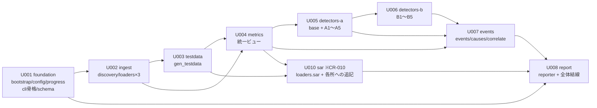

# P005 実装計画書 — s_anomaly

* 版: 初版
* 入力: `docs/P001-requirement.md`, `docs/P002-frontend-spec.md`, `docs/P003-backend-spec.md`, `docs/P004-traceability-matrix.md`
* 対象フェーズ: P005

## 1. 分割の方針

`SKILL-P005-impl-plan.md` の原則に対して、本アプリの事情を次のように適用した。

| 原則 | 適用 |
| --- | --- |
| 各スプリントのコード量を同じにする | 「実装するモジュール数 + 新規ファイル数」を目安とし、加えて技術的難易度を重みとした。10 個のアルゴリズムは 2 つのスプリント(観点1 / 観点2)に分けた(**※CR-005 で観点3 の ALG-C1 を追加し、現在は 11 個**) |
| 依存先が先行スプリントで実装済みである | P003 1.2 の依存グラフ(一方向)に従って順序を決めた |
| スプリントに閉じて単体テストができる | 各スプリントの成果物が、その時点で入手できる入力だけで検証できるように区切った。特に **U003(テストデータ生成)を早い段階に置き、U004 以降のテストが実データ相当の入力を使えるようにした** |
| 不確定要素の大きいものを前に | 最も不確定な 2 つ ——(a) 閉域配布のための `vendor/` 解決(P003 2章)と (b) jstat の 2 形式判別(P003 DS-05-01) —— を U001・U002 に置いた |
| ミドルウェア等が必要ならそのスプリントを作る | DuckDB の wheel 取得・`vendor/` 展開という**インフラ作業**を U001 の第 1 タスクとして明示した(2.1 参照) |

### 1.1 スプリント数

**8 スプリント(U001〜U008)** とする。

★ACCEPTED★ 検討: アルゴリズム 10 個を 1 スプリントにまとめ、7 スプリントとする案。**不採用**。10 個で新規ファイル 11 個・約 1,200 行となり、他スプリントの 2 倍以上の重さになるため。観点1(A系)と観点2(B系)は検知する現象も統計手法も独立しており、分割しても相互依存が生じない。残存リスク: `detectors/base.py` の共通インタフェースを U005 で定義し U006 が従うため、U006 の実装中に base の変更が必要になる可能性がある。この場合 U006 内で base を修正し、U005 のテストを再実行する。

---

## 2. 各スプリントの定義

### 2.1 U001 `foundation` — 起動基盤と設定

| 項目 | 内容 |
| --- | --- |
| 位置づけ | **最も不確定な要素(閉域配布)を最初に潰す。** 以降の全スプリントが動く土台を作る |
| 実装するモジュール | M14 `bootstrap`, M13 `progress`, M02 `config`, M01 `cli`(骨格のみ), `schema` |
| 新規ファイル | `s_anomaly.py`, `settings.properties`, `VERSION`, `src/s_anomaly/__init__.py`, `bootstrap.py`, `progress.py`, `config.py`, `cli.py`, `schema.py` |
| データモデル | `db_connection`, `jvm_gc`, `lsf_queue`, `load_error` の **DDL のみ**(P002 6.2)。データ投入は U002 |
| コマンド(画面相当) | C01 の引数解析とバリデーション(P002 1.2 UI-01-V01〜V04)、usage(P002 1.3) |
| 終了コード | 1(引数不正), 3(設定不正), 7(vendor 不一致) の 3 つを完成させる |
| インフラ作業 | **DuckDB の wheel を取得し `vendor/{tag}/` へ展開する。** 対象は Linux(x86_64) と Windows(AMD64)。開発環境では `pip install duckdb` 済みの環境へのフォールバック(P003 DS-14-02 項番2)で動作させ、`vendor/` の実体整備は P302 に委譲する ★FIXME★ (配布先の Python 版が未確定のため、この時点では wheel の版を確定できない。P001 3.1 の ★FIXME★ と同一の論点) |
| 完了条件 | `python s_anomaly.py` が usage を出して終了コード 1 を返す。不正な `settings.properties` で終了コード 3 を返す。DuckDB のインメモリ DB にスキーマが作られる |
| 難易度の重み | **高**(不確定要素が集中する) |

### 2.2 U002 `ingest` — ファイル探索と解析

| 項目 | 内容 |
| --- | --- |
| 位置づけ | 2 番目に不確定な jstat の形式判別を潰す。以降のスプリントに実データを供給する |
| 実装するモジュール | M03 `discovery`, M04 `loaders.dbconn`, M05 `loaders.jstat`, M06 `loaders.bqueues`, `loaders/__init__.py`(共通ユーティリティ) |
| 新規ファイル | `discovery.py`, `loaders/__init__.py`, `loaders/dbconn.py`, `loaders/jstat.py`, `loaders/bqueues.py` |
| データモデル | `db_connection`, `jvm_gc`, `lsf_queue`, `load_error` への**投入**と重複排除(P003 DS-LD-06) |
| 終了コード | 2(対象 0 件), 4(全解析失敗) を追加 |
| 依存 | U001(`schema`, `progress`, `config`) |
| 完了条件 | 3 形式のサンプルファイルを読み、正しい件数がテーブルに入る。`-gc` / `-gcutil` の両方を判別できる。破損行を読み飛ばして `load_error` に記録する |
| 難易度の重み | **高**(形式判別、横持ち→縦持ち、文字コード・改行の吸収) |

### 2.3 U003 `testdata` — テストデータ生成ツール

| 項目 | 内容 |
| --- | --- |
| 位置づけ | **U004 以降のすべてのテストの入力を作る。** 検知アルゴリズムの正解が分かっているデータが無いと、U005・U006 の単体テストが「動くこと」しか確認できない |
| 実装するモジュール | `tools/gen_testdata.py`(P001 FR-110〜FR-112, P002 8章) |
| 新規ファイル | `tools/gen_testdata.py` |
| データモデル | なし(ファイルを生成するのみ) |
| コマンド | `python tools/gen_testdata.py <出力先dir> [--broken]`(P002 8.1) |
| 依存 | U002(生成したファイルが実際に読めることを、U002 のローダで確認するため) |
| 完了条件 | 生成した `logs/` を U002 のローダが解析できる。`expected.json` が P002 8.3 の書式で出力される。同じ引数で 2 回実行して**バイト単位で同一**のファイル群が得られる |
| 難易度の重み | **中**(異常の埋め込みロジックは単純だが、正解の記述が正確である必要がある) |

### 2.4 U004 `metrics` — 統一ビューの構築

| 項目 | 内容 |
| --- | --- |
| 位置づけ | 3 種のテーブルを、アルゴリズムが一様に扱える形へ変換する |
| 実装するモジュール | M07 `metrics` |
| 新規ファイル | `metrics.py` |
| データモデル | `metrics` テーブル(P002 6.2.4)。`segment` の算出、累積値の差分、`*_pct` の導出、サンプリング間隔の推定 |
| 依存 | U002(3 テーブルにデータがあること), U003(検証用データ) |
| 完了条件 | `metrics` に 11 種のメトリクスが載る。JVM 再起動をまたぐデータで `segment` が分かれ、差分が NULL になる。`-gc` / `-gcutil` の双方で `ou_pct` が 0〜100 になる |
| 難易度の重み | **中**(SQL 窓関数が中心。ロジックは局所的) |

### 2.5 U005 `detectors-a` — 観点1(瞬間的な外れ値)

| 項目 | 内容 |
| --- | --- |
| 位置づけ | 検知の中核その 1。`Detection` と `Detector` の共通契約もここで確定する |
| 実装するモジュール | M08 のうち `base`, ALG-A1〜A5 |
| 新規ファイル | `detectors/__init__.py`, `detectors/base.py`, `a1_ma_sigma.py`, `a2_hampel.py`, `a3_tukey.py`, `a4_ewma.py`, `a5_seasonal.py` |
| 依存 | U004(`metrics`), U003(正解付きデータ) |
| 完了条件 | 既知の位置にスパイクを埋め込んだ人工系列に対し、A1〜A3 がその位置を検知する。平常な系列に対して検知が 0 件である。`effective_sigma`(P003 DS-08-03)が全アルゴリズムで効く |
| 難易度の重み | **高**(5 アルゴリズム + 共通基盤) |

### 2.6 U006 `detectors-b` — 観点2(持続的な増加)

| 項目 | 内容 |
| --- | --- |
| 位置づけ | 検知の中核その 2。メモリリーク検出(ALG-B3)を含む |
| 実装するモジュール | M08 のうち ALG-B1〜B5 |
| 新規ファイル | `b1_ma_cross.py`, `b2_mann_kendall.py`, `b3_rolling_min.py`, `b4_cusum.py`, `b5_regression.py` |
| 依存 | U005(`detectors/base.py` の契約) |
| 完了条件 | 下限が切り上がる人工系列に対し B3 が検知する。既知の傾きを持つ系列に対し B5 の推定勾配が理論値と一致する。B2 の p 値が、傾向のない系列で 0.05 を上回る |
| 難易度の重み | **高**(Mann-Kendall・CUSUM の実装、O(n²) 対策) |

### 2.7 U007 `events` — 統合・脅威度・原因候補・同時アノマリー ※CR-002により改称

| 項目 | 内容 |
| --- | --- |
| 位置づけ | 検知点を、レポートに載せられる「イベント」に仕立てる |
| 実装するモジュール | M09 `events`, M10 `causes`, M11 `co_anomaly` ※CR-002により `correlate` から改称 |
| 新規ファイル | `events.py`, `causes.py`, `co_anomaly.py` ※CR-002 |
| 依存 | U005, U006(`Detection` が得られること)。**※CR-002により U004(`metrics`)への依存が消えた** — 同時アノマリーの判定はイベント同士の突き合わせのみで行うため |
| 完了条件 | 同一箇所の複数検知が 1 イベントに統合される。P003 DS-09-05 の SEVERE 条件が、使用率 90% 超のデータで発火する。CR-01〜CR-09 の各ルールが、それぞれを発火させる人工データで引き当てられる |
| 難易度の重み | **高**(統合・優先順位・9 個のルール・同時アノマリーの突き合わせが絡む。実行順序が S7→S7'(採番)→S8→S8' と入り組む(P003 DS-11-06)) |

### 2.8 U008 `report` — レポート生成と全体結線

| 項目 | 内容 |
| --- | --- |
| 位置づけ | 全体を 1 本のパイプラインとして完成させる |
| 実装するモジュール | M12 `reporter`, M01 `cli`(骨格 → 完成) |
| 新規ファイル | `reporter.py` |
| 依存 | U001〜U007 のすべて |
| 終了コード | 0, 5(書き込み失敗), 6(DuckDB エラー), 99(想定外) を追加して**全 9 種を完成**させる |
| 完了条件 | `python s_anomaly.py <dir>` が最初から最後まで通り、**`report_{HOST}_{yyyymm}.md` と `report_summary_{yyyymm}.md` が P002 4章の構成で出力される** ※CR-001・CR-004。終了コード 9 種すべてが再現できる |
| 難易度の重み | **中→高** ※CR-001・CR-004により上方修正(ファイル分割・集計章・サマリの生成が加わる。結線と終了コードの網羅も従来どおり必要) |

### 2.9 U010 `sar` — sar(sysstat)の取り込み ※CR-010により新設

| 項目 | 内容 |
| --- | --- |
| 位置づけ | **入力種別を 3 → 4 に増やす。** 既存のパイプライン(探索 → 取り込み → `metrics` → 検知 → レポート)に 1 本の経路を足すのであって、経路そのものは変えない |
| 実装するモジュール | **M16 `loaders.sar`(新設)**、M03 `discovery`(④ の追加)、M02 `config`(`[sar] activities` / `[timezone] sar`)、M07 `metrics`(`sar` の合流と `DETECTABLE_METRICS` の拡張)、M08 `detectors.c1`(`SELF_RATIO_METRICS`)、M09 `events`(`extract_host` の書式追加)、M12 `reporter`(和名)、`schema`(`sar` テーブル)、`tools/gen_testdata`(④ の生成) |
| 新規ファイル | `loaders/sar.py` のみ。**残りはすべて既存ファイルへの追加である** |
| データモデル | `sar` テーブルの新設(縦持ち)と `metrics` への合流 |
| 終了コード | **追加なし。** sar のファイルが 1 件も無くても、破損していても、既存の終了コード体系で扱える |
| 依存 | U001(`schema` / `config` / `progress`)、U002(`discovery` と `loaders/__init__` の共通ユーティリティ)、U003(テストデータ生成)、U004(`metrics`) |
| 完了条件 | **「sar 由来のイベントが実際に 1 件以上検知され、レポートに出る」ことを確認できること。** 例外が出ないことでは完了としない(下記) |
| 難易度の重み | **中**(既存の経路に載せるだけだが、見出し行の判別と版差の吸収がある) |

**★このスプリントの完了条件を「例外が出ないこと」にしない。★**
`metrics.DETECTABLE_METRICS` はハードコードの許可リストであり、**sar のメトリクスをここに入れ忘れると、
取り込みも `metrics` への合流も成功したまま、検知だけが 1 件も起きずに正常終了する**(P003 DS-07-07b)。
`docs/CLAUDE.md` が記録する再発型の欠陥(CR-002・CR-009 で 2 回発生)と同じ型である。

---

---

## 3. 対応表 — 実装漏れがないことの検証

### 3.1 モジュール × スプリント

| モジュール | 内容 | U001 | U002 | U003 | U004 | U005 | U006 | U007 | U008 | **U010** |
| --- | --- | :-: | :-: | :-: | :-: | :-: | :-: | :-: | :-: | :-: |
| M01 `cli` | 引数解析・全体制御・終了コード | ◯骨格 | | | | | | | ●完成 | |
| M02 `config` | 設定の読み込みと検証 | ● | | | | | | | | ◯追加 |
| M03 `discovery` | ファイル探索と種別判定 | | ● | | | | | | | ◯追加 |
| M04 `loaders.dbconn` | ① の解析 | | ● | | | | | | | |
| M05 `loaders.jstat` | ② の解析(形式判別) | | ● | | | | | | | |
| M06 `loaders.bqueues` | ③ の解析(横→縦) | | ● | | | | | | | |
| **M16 `loaders.sar`** ※CR-010 | ④ の解析(ブロック判別・横→縦) | | | | | | | | | **●** |
| M07 `metrics` | 統一ビュー構築 | | | | ● | | | | | ◯追加 |
| M08 `detectors` | 10 アルゴリズム(※CR-005 後は 11) | | | | | ●A1-A5 | ●B1-B5 | | | ◯C1 に追加 |
| M09 `events` | 統合・脅威度 | | | | | | | ● | | ◯追加 |
| M10 `causes` | 原因候補 | | | | | | | ● | | |
| M11 `correlate` | 相関情報 | | | | | | | ● | | |
| M12 `reporter` | `report.md` 生成 | | | | | | | | ● | ◯追加 |
| M13 `progress` | 進捗ログ | ● | | | | | | | | |
| M14 `bootstrap` | vendor 解決・DuckDB 初期化 | ● | | | | | | | | |
| M15 `charts` | SVG チャート(※CR-009) | | | | | | | | ● | |
| `errors` | 例外クラスと終了コードの対応 | ● | | | | | | | | |
| `schema` | DDL | ● | | | | | | | | ◯追加 |
| `tools/gen_testdata` | テストデータ生成 | | | ● | | | | | | ◯追加 |

**全 16 モジュール + `errors` + `schema` + 生成ツールが、いずれかのスプリントに割り当てられている。漏れなし。**
**`◯追加` は既存ファイルへの追記、`●` はそのスプリントで作りきることを表す。**

**※P012 #4**: **本表には U009(`detectors-c`)の列が無い。** CR-005〜CR-007 の時点で表が更新されなかったためである(反映漏れ)。U009 は **M08 `detectors`(ALG-C1 の新設)と M01 `cli`(S6 のループの向きとスレッド並列)**を対象とする。**表の再構成は行わない**(全 19 行の書き換えになり、CR-010 の差分が読めなくなるため)。スプリントの正は `docs/P007-impl-direction.md` の一覧である。

### 3.2 コマンド(画面相当) × スプリント

| ID | コマンド | 実装スプリント | 備考 |
| --- | --- | --- | --- |
| C01 | `s_anomaly.py <dir>` | U001(引数解析) → U008(全体完成) | 段階的に完成する唯一のコマンド |
| (補助) | `tools/gen_testdata.py <dir> [--broken]` | U003 | P001 FR-110。配布資産に含むが本体コマンドではない |

### 3.3 データモデル × スプリント

| テーブル | DDL | 投入 | 参照 |
| --- | --- | --- | --- |
| `db_connection` | U001 | U002 | U004 |
| `jvm_gc` | U001 | U002 | U004 |
| `lsf_queue` | U001 | U002 | U004 |
| `load_error` | U001 | U002 | U008(各ホスト別レポートの「実行時の注意事項」。※CR-001) |
| `metrics` | U004 | U004 | U005, U006, U007 |

### 3.4 アルゴリズム × スプリント

| ID | U005 | U006 |
| --- | :-: | :-: |
| ALG-A1 移動平均乖離率 | ● | |
| ALG-A2 Hampel フィルタ | ● | |
| ALG-A3 Tukey の外れ値境界 | ● | |
| ALG-A4 EWMA 管理図 | ● | |
| ALG-A5 曜日・時刻別ベースライン | ● | |
| ALG-B1 短期/長期移動平均クロス | | ● |
| ALG-B2 Mann-Kendall 傾向検定 | | ● |
| ALG-B3 ローリング最小値の単調増加 | | ● |
| ALG-B4 CUSUM | | ● |
| ALG-B5 線形回帰の傾き | | ● |

**10 アルゴリズムすべてが割り当てられている。漏れなし。**

★訂正 2026-09-05 / CR-005★ **ALG-C1(観点3)は Plan Loop の後に追加されたため本表に無い。**
実装指示は `docs/P007-impl-direction/U009-detectors-c.md` にある。

### 3.5 終了コード × スプリント

| コード | 意味 | 実装スプリント |
| --- | --- | --- |
| 0 | 正常終了 | U008 |
| 1 | 引数不正 | U001 |
| 2 | 対象ファイル 0 件 | U002 |
| 3 | 設定ファイル不正 | U001 |
| 4 | 全解析失敗 | U002 |
| 5 | レポート書き込み失敗 | U008 |
| 6 | メモリ不足・DuckDB エラー | U008 |
| 7 | vendor 不一致 | U001 |
| 99 | 想定外の例外 | U008 |

**9 種すべてが割り当てられている。漏れなし。**

### 3.6 要求 ID × スプリント (P004 との突き合わせ)

| 要求 ID 群 | 主たる実装スプリント |
| --- | --- |
| FR-001〜003(配布・起動) | U001 |
| FR-010〜015(入力の解析) | U002 |
| FR-020〜023(データモデル) | U001(DDL), U002(投入), U004(`metrics`) |
| FR-030〜033, FR-040(コマンド・進捗) | U001, U008 |
| FR-050〜054, ALG-A1〜B5(アルゴリズム) | U005, U006 |
| FR-060〜062(脅威度・統合) | U007 |
| FR-070〜077(出力) | U008 |
| FR-074〜076(原因候補・相関) | U007 |
| FR-080〜084(設定) | U001 |
| FR-090〜092(終了コード) | U001, U002, U008 |
| FR-100〜101(README) | **P302**(実装スプリントではない) |
| FR-110〜113(テストデータ) | U003, および P008/P009 のテスト |
| NFR-001〜011 | 全スプリントに分散。性能(NFR-001/002)は U002・U004 の実装方針、再現性(NFR-009)は U002・U006・U007 |

---

## 4. 依存関係と実行順序

**U010 は U004 の後・U008 の前に置く。** `metrics` の構築(U004)が出来ていないと合流先が無く、
レポート(U008)の前でないと**「sar 由来のイベントがレポートに出る」という完了条件を確認できない**ためである。
**※CR-010 の実施時点では U001〜U009 が完成済みであるため、実際には U010 のみを実行する。**

**U003 は U004 の前に置く。** U004 以降のスプリントは、正解の分かっているデータを入力にしないと「検知できているか」を確認できず、スプリント内で単体テストを完結させられないため。

---

## 5. 各スプリントの規模の見積り

| スプリント | 新規ファイル数 | 概算行数(テスト除く) | 難易度の重み | 総合 |
| --- | --- | --- | --- | --- |
| U001 foundation | 9 | 約 450 | 高 | ★★★ |
| U002 ingest | 5 | 約 500 | 高 | ★★★ |
| U003 testdata | 1 | 約 350 | 中 | ★★ |
| U004 metrics | 1 | 約 300 | 中 | ★★ |
| U005 detectors-a | 7 | 約 500 | 高 | ★★★ |
| U006 detectors-b | 5 | 約 450 | 高 | ★★★ |
| U007 events | 3 | 約 450 | 高 | ★★★ |
| U008 report | 1 + 結線 | 約 400 | 中 | ★★ |

★FIXME★ 行数はいずれも Agent の概算であり、実装の結果と乖離しうる。スプリントの完遂可否の判断には使わず、極端な偏りが生じていないことの確認にのみ用いる。

**総計: 約 3,400 行(テストコードを除く)。** ファイル数の偏り(U001 の 9 に対し U004・U008 の 1)は、U001 が小さなファイルの集合であるのに対し U004・U008 が単一の大きなモジュールであることによる。行数では均されている。

---

## 6. スプリント内で単体テストが完結することの確認

`SKILL-P005-impl-plan.md` の原則「各スプリントは、スプリントに閉じて単体テストができる」に対する確認。

| スプリント | 単体テストの入力をどこから得るか | 完結するか |
| --- | --- | --- |
| U001 | 引数の配列と、`settings.properties` の文字列を直接与える。DuckDB はインメモリで即座に作れる | ◯ |
| U002 | `tests/fixtures/` に手書きの小さなログファイル(各形式 3〜5 行)を置く。U003 に依存しない | ◯ |
| U003 | 生成結果を U002 のローダで読み、期待件数と突き合わせる | ◯(U002 に依存するが先行スプリント) |
| U004 | U002 のローダで `tests/fixtures/` を読み込んだ状態から `metrics` を作る | ◯ |
| U005 | **`metrics` に相当する DataFrame を SQL で直接 INSERT** して人工系列を作る。U003 の生成物も併用する | ◯ |
| U006 | 同上 | ◯ |
| U007 | `Detection` オブジェクトを直接組み立てて与える(検知器を動かさない) | ◯ |
| U008 | `Event` オブジェクトを直接組み立てて与え、生成された Markdown を検証する | ◯ |

**すべてのスプリントが、先行スプリントの成果物のみで単体テストを完結できる。**

---

## 7. インフラ・ミドルウェアに関する作業

`SKILL-P005-impl-plan.md` の「実装の他に、計算機やミドルウェア、データベースが必要な場合には、そのスプリントも作成する」に対する対応。

| 作業 | 内容 | 割り当て |
| --- | --- | --- |
| DuckDB の導入 | 開発・検証環境への `pip install duckdb`。**実施済み**(Windows: Python 3.14.2 / Linux WSL2 Ubuntu: Python 3.10.12、いずれも DuckDB 1.5.5) | 準備済み |
| `vendor/` の整備 | 閉域配布用に、対象プラットフォームの wheel を取得して展開する | **U001 のインフラ作業**として着手し、実体の整備は **P302** に委譲(★FIXME★ 配布先の Python 版が未確定のため) |
| Linux 検証環境 | WSL2 上の Ubuntu。**利用可能であることを確認済み** | 準備済み。P009 が両 OS でのテストに使う |
| データベースサーバ | **不要**。DuckDB はインメモリで動作し、サーバプロセスを持たない | — |

★ACCEPTED★ 検討: `vendor/` の整備だけを独立したスプリントにする案。**不採用**。作業内容が「wheel をダウンロードして展開する」だけであり、他のスプリントと比べて著しく小さいこと、および `bootstrap` の実装と一体で検証する必要があること(展開したものを本当に読めるかは `bootstrap` が無いと確認できない)による。残存リスク: U001 の完了条件に「開発環境のフォールバック経路で動くこと」までしか含められず、`vendor/` からの読み込みの実証が P302 まで先送りになる。P302 の実行前チェックで必ず確認する。

---

## P012 による修正履歴

`docs/P010-design-review.md`(1 回目)が検出した矛盾点にもとづき、本書を次のとおり修正した。

| 矛盾点 | 修正内容 | 根拠 |
| --- | --- | --- |
| #7 | 3.1 のモジュール × スプリント表に `errors` の行を追加した(U001 に割り当て) | `docs/P011-impact-analysis.md` 2.7 |
