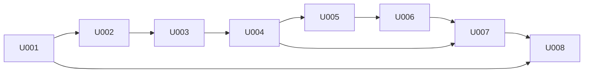

# P007 プログラム実装定義 兼 プログラミング指示書 — 目次

* 版: 初版
* 入力: `docs/P002-frontend-spec.md`, `docs/P003-backend-spec.md`, `docs/P005-impl-plan.md`, `docs/P006-test-plan.md`
* 対象フェーズ: P007

## 1. この目次の使い方

* 本目次は OKF 形式である。状態は `[ ]`(未着手) / `[~]`(進行中) / `[x]`(完了) の 3 種類。
* **1 項目 = 1 スプリント**である。スプリント内部のタスク(`U0NN-Txx`)は、各スプリントファイル冒頭の「タスク一覧」で 1 段細かく追跡する。
* Executor(P102)は、スプリントの全タスクが完了した時点で該当行を `[x]` に更新する。
* **全スプリントが `[x]` になって初めて、フェーズ P007 は完了する。**

## 2. スプリント一覧

- [x] U001 [foundation — 起動基盤と設定](./P007-impl-direction/U001-foundation.md) — vendor 解決・DuckDB 初期化・設定検証・進捗ログ・引数解析・スキーマ
- [x] U002 [ingest — ファイル探索と解析](./P007-impl-direction/U002-ingest.md) — 再帰探索と 3 形式のローダ、重複排除
- [x] U003 [testdata — テストデータ生成ツール](./P007-impl-direction/U003-testdata.md) — 既知の異常を埋め込んだログと正解ファイルの生成
- [x] U004 [metrics — 統一ビューの構築](./P007-impl-direction/U004-metrics.md) — 縦持ち変換・系列分割・累積値の差分・使用率の導出
- [x] U005 [detectors-a — 観点1(瞬間的な外れ値)](./P007-impl-direction/U005-detectors-a.md) — 検知器の共通契約と ALG-A1〜A5
- [x] U006 [detectors-b — 観点2(持続的な増加)](./P007-impl-direction/U006-detectors-b.md) — ALG-B1〜B5
- [x] U009 [detectors-c — 観点3(上限への張り付き)](./P007-impl-direction/U009-detectors-c.md) — ALG-C1 と系列単位のキャッシュ、S6 の並列実行(※CR-005 / CR-006 / CR-007)
- [x] U007 [events — 統合・脅威度・原因候補・相関](./P007-impl-direction/U007-events.md) — 検知点をイベントに仕立てる
- [x] U008 [report — レポート生成と全体結線](./P007-impl-direction/U008-report.md) — report.md の生成と終了コードの完成
- [x] U010 [sar — sar(sysstat)の取り込み](./P007-impl-direction/U010-sar.md) — 入力種別を 3 → 4 に増やす(※CR-010)。**※CR-011 で活動種別を 8 → 10 に増やした(NFS / NFSD)**

## 3. 全スプリント共通の指示

### 3.1 コードの格納先

**すべてのコードは `app/` 配下に作成する。** `docs/` 配下のファイルは Executor が編集してよいのは、本目次と各スプリントファイルのチェックボックスのみである。

### 3.2 技術スタック

技術スタックは `docs/ADR.md` を参照すること。実装に直接効く決定は次のとおりである。

| ADR | 実装上の意味 |
| --- | --- |
| ADR-001 | DuckDB は `vendor/` から読む。無ければ環境の DuckDB へフォールバックし、その事実を必ずログと `report.md` に残す |
| ADR-002 | `duckdb` 以外の外部パッケージを import しない。テストも `unittest` を使う |
| ADR-003 | σ・MAD・IQR は必ず `effective_sigma` を通す。各アルゴリズムで個別実装しない |
| ADR-004 | jstat の形式はデータ行の列数を優先して判別する |
| ADR-005 | `*_pct` は検知対象に含めない。脅威度判定と原因候補の材料としてのみ使う |
| ADR-006 | テストハーネスはサブプロセス起動とし、ネットワークを介さない |
| ADR-007 | 原因候補の確度は高/中/低の 3 段階。百分率を出さない |
| ADR-008 | `Detector.run` は `Tuple[List[Detection], List[SkipInfo]]` を返す |
| ADR-009 | Python 3.9 で動く構文のみを使う(3.3 参照) |
| ADR-010 | `cli` は S7 → S8 → S7' の順で呼ぶ |

### 3.3 言語バージョンの制約 (全タスクで厳守)

`docs/P003-backend-spec.md` 1.0 節(DS-00-01)に従い、**Python 3.9 で動作する構文のみ**を使う。

| 使ってはいけない | 代わりに使う |
| --- | --- |
| `X \| None` 形式の型注釈 | `from typing import Optional` して `Optional[X]` |
| `match` 文 | `if` / `elif` |
| `tomllib` | `configparser` |
| `itertools.pairwise` | `zip(seq, seq[1:])` |
| `dataclasses` の `slots=True` | 指定しない |

**設計書のコード例に `Path | None` のような記法が現れた場合、実装では必ず `Optional[Path]` に読み替えること。**

### 3.4 依存パッケージ

**`duckdb` 以外の外部パッケージを import してはならない**(`docs/P001-requirement.md` FR-003)。特に `numpy` / `pandas` / `scipy` / `scikit-learn` / `statsmodels` / `pytest` を使わない。統計計算は DuckDB の SQL 窓関数と、標準ライブラリの `statistics` / `math` で行う。

また `socket` / `urllib` / `http` / `requests` を import してはならない(`docs/P001-requirement.md` NFR-008)。

### 3.5 仕様外の拡張の禁止

`docs/P002-frontend-spec.md` および `docs/P003-backend-spec.md` に無いコマンド・オプション・設定キー・メトリクス・アルゴリズム・出力項目を**勝手に追加してはならない**。特に次は明示的に禁止する。

* `--output` / `--from` / `--to` / `--config` などのオプション(`docs/P002-frontend-spec.md` 9.1 で「拡張しない」と決定済み)
* `docs/P001-requirement.md` FR-023 と `docs/P003-backend-spec.md` DS-07-06 にないメトリクス
* 10 個以外のアルゴリズム

不足や矛盾を見つけた場合は、実装で埋めずに本目次の 5 章「未解決事項」へ追記して報告すること。

### 3.6 現在時刻の扱い

**関数の内部で `datetime.now()` を暗黙に呼び出してはならない。** 「現在時刻」を必要とする処理(`report.md` の実行日時欄など)は、呼び出し側が計算した具体的な日時を引数で受け取るシグネチャにする。これは単体テストで日時を固定するために必要である(`docs/P006-test-plan.md` TP-11)。

### 3.7 テストの実行

テストフレームワークは標準ライブラリの `unittest` を使う(`docs/P006-test-plan.md` TP-09)。

```
# Windows
python -m unittest discover -s app/tests/unit -t app -v

# Linux (WSL)
python3 -m unittest discover -s app/tests/unit -t app -v

# 単一のテストモジュールだけを走らせる
python -m unittest discover -s app/tests/unit -t app -p "test_config.py" -v

# 単一のテストクラス / メソッド(app/ をカレントにして実行する)
cd app && python -m unittest tests.unit.test_config.TestConfig.test_range -v
```

**`-t app` の指定を省略しないこと。** 省略すると `tests` パッケージを import できず、テストが 0 件で静かに成功する。

**`python -m unittest app.tests.xxx` の形は使わない。** `app/` は配布単位のディレクトリであり Python パッケージではない(`app/__init__.py` を作らない)。テストから `app/src` を import できるようにするのは `app/tests/__init__.py` の `sys.path` ブートストラップの役割である(U001-T1)。

★FIXME★ 上記コマンドは P102(実装)で実際に実行して確認すること。0 件で成功していないか(`Ran N tests` の N が期待値と一致するか)を必ず目視すること。

### 3.8 再現性

**乱数を使ってはならない**(`docs/P001-requirement.md` NFR-009)。テストデータ生成ツール(U003)のみ `random` を使うが、シードを固定する。順序が結果に影響する箇所(ソート、重複排除)は、必ずタイブレーク用のキーを含めた安定ソートにする。

---

## 4. スプリント間の依存関係



**上記の順序どおりに実行すること。** 先行スプリントが未完了の状態で後続スプリントに着手してはならない。

---

## 5. 未解決事項

本フェーズで、設計書の不足・矛盾として検出した事項を記録する。**実装タスクには含めない。**

| # | 内容 | 影響 | 扱い |
| --- | --- | --- | --- |
| 1 | ~~`docs/P001-requirement.md` 7章の処理フロー図が S7 → S8 の順で、実装順序 S7 → S8 → S7' と食い違う~~ | — | **解決済**。P010(1 回目)の矛盾点 #4 として検出し、P012 で P001 7章の図と FR-031a を修正した。**実装は S7 → S8 → S7' の順で行うこと**(`docs/P003-backend-spec.md` DS-10-02) |
| 2 | `docs/P003-backend-spec.md` 1.1 のディレクトリ構成は、当初プロジェクトルート直下を起点としていた。`SKILL-P007-impl-direction.md` の規定(単一アプリの場合は `app/`)に合わせ、本フェーズの実行に先立って `app/` を起点とするよう P003 を更新した | 更新済みのため実装への影響なし | 記録のみ。P010 で P003 と他文書のパス表記の整合を確認する |
| 3 | `SKILL-P007-impl-direction.md` は Python の初期化に `uv` を前提とすることを目安として示しているが、本アプリは「配布資産をコピーすればそのまま動く」ことが要求(FR-001)であり、`pyproject.toml` によるプロジェクト定義とビルドツールを持たない | 初期化タスク(U001-T1)の書き方が目安と異なる | **意図的な逸脱**。U001-T1 に理由を明記した。P010 で確認する |
| 4 | `docs/P002-frontend-spec.md` 8.2 は、テストデータの出力先を `{出力先}/logs/` としているが、`expected.json` は `{出力先}/expected.json` に置く。`docs/P006-test-plan.md` TP-05 のベースライン定義と整合している | なし(整合している) | 記録のみ |
| 5 | `docs/P003-backend-spec.md` DS-08-B2-04 は ALG-B2 を増加傾向のみの検知としている。急減も運用上は異常でありうるが、`docs/P000-concept-analysis.md` の観点2 は「持続的な数値の増加」であるため仕様どおり | 仕様どおりだが、人間の確認待ち(★FIXME★) | **P302 で CR の起票候補として人間に引き渡す** |
| 6 | `vendor/` の実体(DuckDB の wheel)は、配布先の Python 版が未確定のため本フェーズでは用意できない。U001 では開発環境の DuckDB へのフォールバック経路(`docs/P003-backend-spec.md` DS-14-02 項番2)で動作させる | `vendor/` からの読み込み経路が実証されないまま P302 まで進む | **P302 の実行前チェックで必ず確認する**(`docs/P005-impl-plan.md` 7章の ★ACCEPTED★ に記載済み) |

---

## P012 による修正履歴

`docs/P010-design-review.md`(1 回目)が検出した矛盾点にもとづき、本書を次のとおり修正した。

| 矛盾点 | 修正内容 | 根拠 |
| --- | --- | --- |
| #2 | 3.7 に単一モジュール・単一メソッドの実行形を追記し、`python -m unittest app.tests.xxx` 形式を使わない旨を明記した | `docs/P011-impact-analysis.md` 2.2 |
| #4 | 5章 未解決事項 #1(処理フロー図の不一致)を「解決済」に更新した | `docs/P011-impact-analysis.md` 2.4 |
